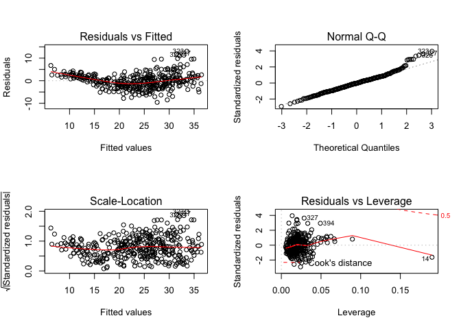
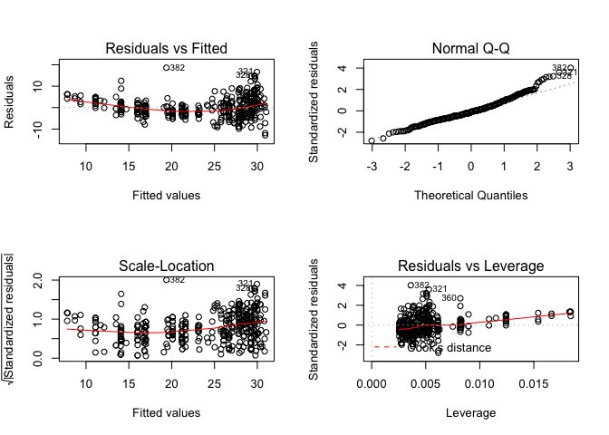
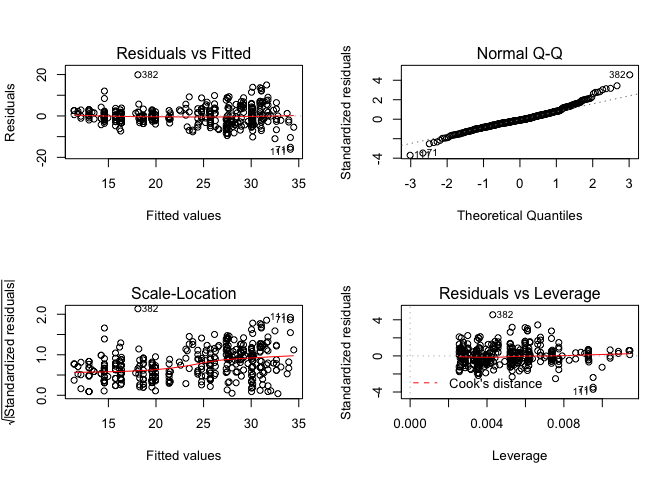
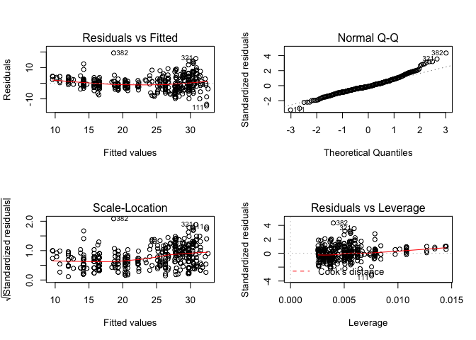
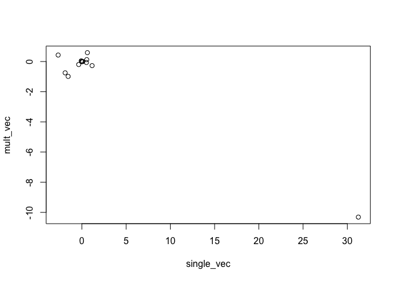

# Ch. 3 Exercises


```r
# Get the Auto dataset
library(ISLR)
data(Auto)
attach(Auto)
```
8.a Use the `lm()` function to perform a simple linear regression with mpg as the response and horsepower as the predictor. Use the `summary()` function to print the results. Comment on the output.


```r
fit <- lm(mpg ~ horsepower)
summary(fit)
```

```
## 
## Call:
## lm(formula = mpg ~ horsepower)
## 
## Residuals:
##      Min       1Q   Median       3Q      Max 
## -13.5710  -3.2592  -0.3435   2.7630  16.9240 
## 
## Coefficients:
##              Estimate Std. Error t value Pr(>|t|)    
## (Intercept) 39.935861   0.717499   55.66   <2e-16 ***
## horsepower  -0.157845   0.006446  -24.49   <2e-16 ***
## ---
## Signif. codes:  0 '***' 0.001 '**' 0.01 '*' 0.05 '.' 0.1 ' ' 1
## 
## Residual standard error: 4.906 on 390 degrees of freedom
## Multiple R-squared:  0.6059,	Adjusted R-squared:  0.6049 
## F-statistic: 599.7 on 1 and 390 DF,  p-value: < 2.2e-16
```
i. Is there a relationship between the predictor and the response?  
The F-statistic is quite large, and the p-value is extremely small. Together, these indicate that there is a relationship between the predictor and the response.

ii. How strong is the relationship between the predictor and the response?  
The R^2^ for this fit is 0.6049, which means that 60.49% of the variability in mpg can be explained by horsepower.

iii. Is the relationship between the predictor and the response positive or negative?  
The relationship is negative, because the intercept of horsepower is negative. 

iv. What is the predicted mpg associated with a horsepower of 98? What are the associated 95 % confidence and prediction intervals?  


```r
predict(fit, data.frame(horsepower = 98), interval="confidence")
```

```
##        fit      lwr      upr
## 1 24.46708 23.97308 24.96108
```

```r
predict(fit, data.frame(horsepower = 98), interval="prediction")
```

```
##        fit     lwr      upr
## 1 24.46708 14.8094 34.12476
```
8.b Plot the response and the predictor. Use the `abline()` function to display the least squares regression line.


```r
plot(horsepower, mpg, main="Mpg vs Horsepower")
abline(fit, col="red")
```

<!-- -->

8.c Use the `plot()` function to produce diagnostic plots of the least squares regression fit. Comment on any problems you see with the fit.


```r
par(mfrow=c(2,2))
plot(fit)
```

<!-- -->

There seems to be some non-linearity in the model (top left plot), as well as a few outliers.

9.a Produce a scatterplot matrix which includes all of the variables in the data set.


```r
pairs(Auto)
```

<!-- -->

b. Compute the matrix of correlations between the variables using the function `cor()`. You will need to exclude the name variable, which is qualitative.


```r
round(cor(Auto[ , -9]), 2)
```

```
##                mpg cylinders displacement horsepower weight acceleration
## mpg           1.00     -0.78        -0.81      -0.78  -0.83         0.42
## cylinders    -0.78      1.00         0.95       0.84   0.90        -0.50
## displacement -0.81      0.95         1.00       0.90   0.93        -0.54
## horsepower   -0.78      0.84         0.90       1.00   0.86        -0.69
## weight       -0.83      0.90         0.93       0.86   1.00        -0.42
## acceleration  0.42     -0.50        -0.54      -0.69  -0.42         1.00
## year          0.58     -0.35        -0.37      -0.42  -0.31         0.29
## origin        0.57     -0.57        -0.61      -0.46  -0.59         0.21
##               year origin
## mpg           0.58   0.57
## cylinders    -0.35  -0.57
## displacement -0.37  -0.61
## horsepower   -0.42  -0.46
## weight       -0.31  -0.59
## acceleration  0.29   0.21
## year          1.00   0.18
## origin        0.18   1.00
```

c. Use the `lm()` function to perform a multiple linear regression with mpg as the response and all other variables except name as the predictors. Use the `summary()` function to print the results. Comment on the output.


```r
fit_2 <- lm(mpg ~ .-name, data=Auto)
summary(fit_2)
```

```
## 
## Call:
## lm(formula = mpg ~ . - name, data = Auto)
## 
## Residuals:
##     Min      1Q  Median      3Q     Max 
## -9.5903 -2.1565 -0.1169  1.8690 13.0604 
## 
## Coefficients:
##                Estimate Std. Error t value Pr(>|t|)    
## (Intercept)  -17.218435   4.644294  -3.707  0.00024 ***
## cylinders     -0.493376   0.323282  -1.526  0.12780    
## displacement   0.019896   0.007515   2.647  0.00844 ** 
## horsepower    -0.016951   0.013787  -1.230  0.21963    
## weight        -0.006474   0.000652  -9.929  < 2e-16 ***
## acceleration   0.080576   0.098845   0.815  0.41548    
## year           0.750773   0.050973  14.729  < 2e-16 ***
## origin         1.426141   0.278136   5.127 4.67e-07 ***
## ---
## Signif. codes:  0 '***' 0.001 '**' 0.01 '*' 0.05 '.' 0.1 ' ' 1
## 
## Residual standard error: 3.328 on 384 degrees of freedom
## Multiple R-squared:  0.8215,	Adjusted R-squared:  0.8182 
## F-statistic: 252.4 on 7 and 384 DF,  p-value: < 2.2e-16
```
i. Is there a relationship between the predictors and the response?  
Yes, there's a relationship between mpg and the predictors. The F-statistic is quite large, and the p-value is extremely small (under 0.01 significance level).

ii. Which predictors appear to have a statistically significant relationship to the response?  
The predictors that have a statistically significant relationship to the response(mpg) are displacement, weight, year, and origin.

iii. What does the coefficient for the year variable suggest?  
The coefficient of the year variable suggests that the variables "year(of the car's model)" and mpg (miles per gallon) are positively correlated. With an increase of 0.75(year), the cars become more efficient by 1 mile per gallon. Basically, every 9 months, overall cars' efficiency increases by 1 mpg.

d. Use the `plot()` function to produce diagnostic plots of the linear regression fit. Comment on any problems you see with the fit. Do the residual plots suggest any unusually large outliers? Does the leverage plot identify any observations with unusually high leverage?


```r
par(mfrow=c(2, 2))
plot(fit_2)
```

<!-- -->

There's some non-linearity in the model, with a few outliers. The Residuals vs Leverage plot suggests a few outliers that have a significant effect on the model.

e. Use the * and : symbols to fit linear regression models with interaction effects. Do any interactions appear to be statistically significant?

```r
fit_3 <- lm(mpg ~. -name + displacement:horsepower, data=Auto)
summary(fit_3)
```

```
## 
## Call:
## lm(formula = mpg ~ . - name + displacement:horsepower, data = Auto)
## 
## Residuals:
##     Min      1Q  Median      3Q     Max 
## -8.7010 -1.6009 -0.0967  1.4119 12.6734 
## 
## Coefficients:
##                           Estimate Std. Error t value Pr(>|t|)    
## (Intercept)             -1.894e+00  4.302e+00  -0.440  0.66007    
## cylinders                6.466e-01  3.017e-01   2.143  0.03275 *  
## displacement            -7.487e-02  1.092e-02  -6.859 2.80e-11 ***
## horsepower              -1.975e-01  2.052e-02  -9.624  < 2e-16 ***
## weight                  -3.147e-03  6.475e-04  -4.861 1.71e-06 ***
## acceleration            -2.131e-01  9.062e-02  -2.351  0.01921 *  
## year                     7.379e-01  4.463e-02  16.534  < 2e-16 ***
## origin                   6.891e-01  2.527e-01   2.727  0.00668 ** 
## displacement:horsepower  5.236e-04  4.813e-05  10.878  < 2e-16 ***
## ---
## Signif. codes:  0 '***' 0.001 '**' 0.01 '*' 0.05 '.' 0.1 ' ' 1
## 
## Residual standard error: 2.912 on 383 degrees of freedom
## Multiple R-squared:  0.8636,	Adjusted R-squared:  0.8608 
## F-statistic: 303.1 on 8 and 383 DF,  p-value: < 2.2e-16
```
In the first model, I added the Interaction between Displacement and Horsepower. The R^2^ increased from 0.8215 to 0.8636, which added a few % to help explain variability in the model. The p-value is extremely small, indicating that the interaction between displacement and horsepower is statistically significant.

```r
fit_4 <- lm(mpg ~ -name + displacement*cylinders + weight*acceleration + horsepower, data=Auto)
summary(fit_4)
```

```
## 
## Call:
## lm(formula = mpg ~ -name + displacement * cylinders + weight * 
##     acceleration + horsepower, data = Auto)
## 
## Residuals:
##      Min       1Q   Median       3Q      Max 
## -13.6032  -2.3777  -0.4371   1.9955  16.2640 
## 
## Coefficients:
##                          Estimate Std. Error t value Pr(>|t|)    
## (Intercept)            51.6550984  7.6291421   6.771 4.82e-11 ***
## displacement           -0.0887001  0.0178811  -4.961 1.06e-06 ***
## cylinders              -2.4454891  0.6027644  -4.057 6.02e-05 ***
## weight                 -0.0007054  0.0023181  -0.304    0.761    
## acceleration            0.4072987  0.3598548   1.132    0.258    
## horsepower             -0.0909323  0.0170375  -5.337 1.62e-07 ***
## displacement:cylinders  0.0125998  0.0025668   4.909 1.36e-06 ***
## weight:acceleration    -0.0001733  0.0001273  -1.361    0.174    
## ---
## Signif. codes:  0 '***' 0.001 '**' 0.01 '*' 0.05 '.' 0.1 ' ' 1
## 
## Residual standard error: 4.005 on 384 degrees of freedom
## Multiple R-squared:  0.7414,	Adjusted R-squared:  0.7366 
## F-statistic: 157.2 on 7 and 384 DF,  p-value: < 2.2e-16
```
In this model, the variables cylinders and displacement are statistically significant, as well as an interaction between them. On the other hand, both weight and acceleration are not significant, nor is an interaction between them.

f. Try a few different transformations of the variables, such as log(X), √X, X2.

```r
d.fit <- lm(mpg ~ displacement)
d.fit_2 <- lm(mpg ~ I(displacement^2))
anova(d.fit, d.fit_2)
```

```
## Analysis of Variance Table
## 
## Model 1: mpg ~ displacement
## Model 2: mpg ~ I(displacement^2)
##   Res.Df     RSS Df Sum of Sq F Pr(>F)
## 1    390  8378.8                      
## 2    390 10336.6  0   -1957.7
```

```r
summary(d.fit)
```

```
## 
## Call:
## lm(formula = mpg ~ displacement)
## 
## Residuals:
##      Min       1Q   Median       3Q      Max 
## -12.9170  -3.0243  -0.5021   2.3512  18.6128 
## 
## Coefficients:
##              Estimate Std. Error t value Pr(>|t|)    
## (Intercept)  35.12064    0.49443   71.03   <2e-16 ***
## displacement -0.06005    0.00224  -26.81   <2e-16 ***
## ---
## Signif. codes:  0 '***' 0.001 '**' 0.01 '*' 0.05 '.' 0.1 ' ' 1
## 
## Residual standard error: 4.635 on 390 degrees of freedom
## Multiple R-squared:  0.6482,	Adjusted R-squared:  0.6473 
## F-statistic: 718.7 on 1 and 390 DF,  p-value: < 2.2e-16
```

```r
summary(d.fit_2)
```

```
## 
## Call:
## lm(formula = mpg ~ I(displacement^2))
## 
## Residuals:
##      Min       1Q   Median       3Q      Max 
## -10.6731  -3.6875  -0.9388   2.9963  18.2246 
## 
## Coefficients:
##                     Estimate Std. Error t value Pr(>|t|)    
## (Intercept)        2.926e+01  3.661e-01   79.92   <2e-16 ***
## I(displacement^2) -1.193e-04  5.289e-06  -22.55   <2e-16 ***
## ---
## Signif. codes:  0 '***' 0.001 '**' 0.01 '*' 0.05 '.' 0.1 ' ' 1
## 
## Residual standard error: 5.148 on 390 degrees of freedom
## Multiple R-squared:  0.566,	Adjusted R-squared:  0.5649 
## F-statistic: 508.7 on 1 and 390 DF,  p-value: < 2.2e-16
```
The linear fit is better than quadratic with the variable Displacement.


```r
l.fit <- lm(mpg ~ log(displacement))
anova(d.fit, l.fit)
```

```
## Analysis of Variance Table
## 
## Model 1: mpg ~ displacement
## Model 2: mpg ~ log(displacement)
##   Res.Df    RSS Df Sum of Sq F Pr(>F)
## 1    390 8378.8                      
## 2    390 7471.2  0    907.63
```

```r
summary(d.fit)
```

```
## 
## Call:
## lm(formula = mpg ~ displacement)
## 
## Residuals:
##      Min       1Q   Median       3Q      Max 
## -12.9170  -3.0243  -0.5021   2.3512  18.6128 
## 
## Coefficients:
##              Estimate Std. Error t value Pr(>|t|)    
## (Intercept)  35.12064    0.49443   71.03   <2e-16 ***
## displacement -0.06005    0.00224  -26.81   <2e-16 ***
## ---
## Signif. codes:  0 '***' 0.001 '**' 0.01 '*' 0.05 '.' 0.1 ' ' 1
## 
## Residual standard error: 4.635 on 390 degrees of freedom
## Multiple R-squared:  0.6482,	Adjusted R-squared:  0.6473 
## F-statistic: 718.7 on 1 and 390 DF,  p-value: < 2.2e-16
```

```r
summary(l.fit)
```

```
## 
## Call:
## lm(formula = mpg ~ log(displacement))
## 
## Residuals:
##      Min       1Q   Median       3Q      Max 
## -16.1204  -2.5843  -0.4217   2.1979  19.9005 
## 
## Coefficients:
##                   Estimate Std. Error t value Pr(>|t|)    
## (Intercept)        85.6906     2.1422   40.00   <2e-16 ***
## log(displacement) -12.1385     0.4155  -29.21   <2e-16 ***
## ---
## Signif. codes:  0 '***' 0.001 '**' 0.01 '*' 0.05 '.' 0.1 ' ' 1
## 
## Residual standard error: 4.377 on 390 degrees of freedom
## Multiple R-squared:  0.6863,	Adjusted R-squared:  0.6855 
## F-statistic: 853.4 on 1 and 390 DF,  p-value: < 2.2e-16
```

```r
s.fit <- lm(mpg ~ sqrt(displacement))
anova(d.fit, s.fit)
```

```
## Analysis of Variance Table
## 
## Model 1: mpg ~ displacement
## Model 2: mpg ~ sqrt(displacement)
##   Res.Df    RSS Df Sum of Sq F Pr(>F)
## 1    390 8378.8                      
## 2    390 7751.1  0    627.77
```

```r
summary(d.fit)
```

```
## 
## Call:
## lm(formula = mpg ~ displacement)
## 
## Residuals:
##      Min       1Q   Median       3Q      Max 
## -12.9170  -3.0243  -0.5021   2.3512  18.6128 
## 
## Coefficients:
##              Estimate Std. Error t value Pr(>|t|)    
## (Intercept)  35.12064    0.49443   71.03   <2e-16 ***
## displacement -0.06005    0.00224  -26.81   <2e-16 ***
## ---
## Signif. codes:  0 '***' 0.001 '**' 0.01 '*' 0.05 '.' 0.1 ' ' 1
## 
## Residual standard error: 4.635 on 390 degrees of freedom
## Multiple R-squared:  0.6482,	Adjusted R-squared:  0.6473 
## F-statistic: 718.7 on 1 and 390 DF,  p-value: < 2.2e-16
```

```r
summary(s.fit)
```

```
## 
## Call:
## lm(formula = mpg ~ sqrt(displacement))
## 
## Residuals:
##      Min       1Q   Median       3Q      Max 
## -14.4034  -2.7367  -0.4956   2.3207  19.3499 
## 
## Coefficients:
##                    Estimate Std. Error t value Pr(>|t|)    
## (Intercept)        47.11839    0.86246   54.63   <2e-16 ***
## sqrt(displacement) -1.75878    0.06186  -28.43   <2e-16 ***
## ---
## Signif. codes:  0 '***' 0.001 '**' 0.01 '*' 0.05 '.' 0.1 ' ' 1
## 
## Residual standard error: 4.458 on 390 degrees of freedom
## Multiple R-squared:  0.6746,	Adjusted R-squared:  0.6738 
## F-statistic: 808.5 on 1 and 390 DF,  p-value: < 2.2e-16
```
The square root transformation is also better than linear model.

Plot all 3 fits.

```r
par(mfrow=c(2,2))
plot(d.fit)
```

<!-- -->

```r
plot(l.fit)
```

<!-- -->

```r
plot(s.fit)
```

<!-- -->

The log transformation seems to give the most linear model out of the three transformations.

10.a Fit a multiple regression model to predict Sales using Price, Urban, and US (Carseats dataset).

```r
data("Carseats")
attach(Carseats)
```


```r
fit <- lm(Sales ~ Price + Urban + US)
summary(fit)
```

```
## 
## Call:
## lm(formula = Sales ~ Price + Urban + US)
## 
## Residuals:
##     Min      1Q  Median      3Q     Max 
## -6.9206 -1.6220 -0.0564  1.5786  7.0581 
## 
## Coefficients:
##              Estimate Std. Error t value Pr(>|t|)    
## (Intercept) 13.043469   0.651012  20.036  < 2e-16 ***
## Price       -0.054459   0.005242 -10.389  < 2e-16 ***
## UrbanYes    -0.021916   0.271650  -0.081    0.936    
## USYes        1.200573   0.259042   4.635 4.86e-06 ***
## ---
## Signif. codes:  0 '***' 0.001 '**' 0.01 '*' 0.05 '.' 0.1 ' ' 1
## 
## Residual standard error: 2.472 on 396 degrees of freedom
## Multiple R-squared:  0.2393,	Adjusted R-squared:  0.2335 
## F-statistic: 41.52 on 3 and 396 DF,  p-value: < 2.2e-16
```
b. Provide an interpretation of each coefficient in the model. Be careful—some of the variables in the model are qualitative!

A negative coefficient for the Price variable suggests that an increase of 1 dollar per carseat would results in a decrease of 54.459 units in sales.
A negative coefficient for the Urban variable indicates that the sales decrease for Urban areas. However the p-value is not significant in this case.
A positive coefficient for the US variable suggests that sales in the US correspond to 1200.573 more sales as opposed to sales abroad.

c. Write out the model in equation form, being careful to handle the qualitative variables properly.

Sales = 13.043469 + (-0.054459) x Price + (-0.021916) x Urban + 1.200573 x US + ε  

Urban (1 for yes, 0 for no)  
US (1 for yes, 0 for no)

d. For which of the predictors can you reject the null hypothesis H0 :βj =0?
I can reject the null hypothesis for the "Price" and "US" predictors.

e. On the basis of your response to the previous question, fit a smaller model that only uses the predictors for which there is evidence of association with the outcome.

```r
fit2 <- lm(Sales ~ Price + US)
summary(fit2)
```

```
## 
## Call:
## lm(formula = Sales ~ Price + US)
## 
## Residuals:
##     Min      1Q  Median      3Q     Max 
## -6.9269 -1.6286 -0.0574  1.5766  7.0515 
## 
## Coefficients:
##             Estimate Std. Error t value Pr(>|t|)    
## (Intercept) 13.03079    0.63098  20.652  < 2e-16 ***
## Price       -0.05448    0.00523 -10.416  < 2e-16 ***
## USYes        1.19964    0.25846   4.641 4.71e-06 ***
## ---
## Signif. codes:  0 '***' 0.001 '**' 0.01 '*' 0.05 '.' 0.1 ' ' 1
## 
## Residual standard error: 2.469 on 397 degrees of freedom
## Multiple R-squared:  0.2393,	Adjusted R-squared:  0.2354 
## F-statistic: 62.43 on 2 and 397 DF,  p-value: < 2.2e-16
```
f. How well do the models in (a) and (e) fit the data?
The second model fits the data slightly better (The R^2^ increased by 0.0019). 

g. Using the model from (e), obtain 95% confidence intervals for the coefficient(s).

```r
confint(fit2)
```

```
##                   2.5 %      97.5 %
## (Intercept) 11.79032020 14.27126531
## Price       -0.06475984 -0.04419543
## USYes        0.69151957  1.70776632
```
h. Is there evidence of outliers or high leverage observations in the model from (e)?

```r
par(mfrow=c(2,2))
plot(fit2)
```

<!-- -->

Yes, there are a few outliers in the dataset, and a high leverage point, as shown on the plot "Residuals vs Leverage".

11. In this problem we will investigate the t-statistic for the null hypoth- esis H0 : β = 0 in simple linear regression without an intercept. To begin, we generate a predictor x and a response y as follows.

```r
set.seed(1)
x <- rnorm(100)
y <- 2*x+rnorm(100)
```
11. a Perform a simple linear regression of y onto x, without an intercept. Report the coefficient estimate $\widehat{\beta}$, the standard error of this coefficient estimate, and the t-statistic and p-value associated with the null hypothesis H0 : β = 0. Comment on these results. (You can perform regression without an intercept using the command lm(y∼x+0).)

```r
fit <- lm(y ~ x + 0)
summary(fit)
```

```
## 
## Call:
## lm(formula = y ~ x + 0)
## 
## Residuals:
##     Min      1Q  Median      3Q     Max 
## -1.9154 -0.6472 -0.1771  0.5056  2.3109 
## 
## Coefficients:
##   Estimate Std. Error t value Pr(>|t|)    
## x   1.9939     0.1065   18.73   <2e-16 ***
## ---
## Signif. codes:  0 '***' 0.001 '**' 0.01 '*' 0.05 '.' 0.1 ' ' 1
## 
## Residual standard error: 0.9586 on 99 degrees of freedom
## Multiple R-squared:  0.7798,	Adjusted R-squared:  0.7776 
## F-statistic: 350.7 on 1 and 99 DF,  p-value: < 2.2e-16
```
The coefficient $\widehat{\beta}$ is 1.9939, which means for every increase in 1 of x, y increases by 1.9939.  
The standard error is 0.1065.  
The t-statistic is 18.73.  
The p-value is <2e-16.  
The large t-statistic and R^2^, and small p-value indicate that there is a significant relationship between predictor x and response y (therefore we can reject $H_{0}$).

b. Now perform a simple linear regression of x onto y without an intercept, and report the coefficient estimate, its standard error, and the corresponding t-statistic and p-values associated with the null hypothesis $H_{0}$ : β = 0. Comment on these results.

```r
fit2 <- lm(x ~ y + 0)
summary(fit2)
```

```
## 
## Call:
## lm(formula = x ~ y + 0)
## 
## Residuals:
##     Min      1Q  Median      3Q     Max 
## -0.8699 -0.2368  0.1030  0.2858  0.8938 
## 
## Coefficients:
##   Estimate Std. Error t value Pr(>|t|)    
## y  0.39111    0.02089   18.73   <2e-16 ***
## ---
## Signif. codes:  0 '***' 0.001 '**' 0.01 '*' 0.05 '.' 0.1 ' ' 1
## 
## Residual standard error: 0.4246 on 99 degrees of freedom
## Multiple R-squared:  0.7798,	Adjusted R-squared:  0.7776 
## F-statistic: 350.7 on 1 and 99 DF,  p-value: < 2.2e-16
```
The coefficient $\widehat{\beta}$ is 0.39111, which means that in every increase of 1 in y, the response x increases by 0.39111.  
The standard error is 0.02089.  
The t-statistic is 18.73.   
The p-value is <2e-16.  
There is a significant relationship between the predictor y and response x, as indicated by the small p-value. Therefore, we can reject $H_{0}$.

c. What is the relationship between the results obtained in (a) and (b)?
Both results (a) and (b) show the same t-statistic and p-value. The relationship between both results is y = 2(x) + ε.

d. 
e.
f. In R, show that when regression is performed with an intercept, the t-statistic for H0 : β1 = 0 is the same for the regression of y onto x as it is for the regression of x onto y.

```r
fit3 <- lm(y ~ x)
summary(fit3)
```

```
## 
## Call:
## lm(formula = y ~ x)
## 
## Residuals:
##     Min      1Q  Median      3Q     Max 
## -1.8768 -0.6138 -0.1395  0.5394  2.3462 
## 
## Coefficients:
##             Estimate Std. Error t value Pr(>|t|)    
## (Intercept) -0.03769    0.09699  -0.389    0.698    
## x            1.99894    0.10773  18.556   <2e-16 ***
## ---
## Signif. codes:  0 '***' 0.001 '**' 0.01 '*' 0.05 '.' 0.1 ' ' 1
## 
## Residual standard error: 0.9628 on 98 degrees of freedom
## Multiple R-squared:  0.7784,	Adjusted R-squared:  0.7762 
## F-statistic: 344.3 on 1 and 98 DF,  p-value: < 2.2e-16
```

```r
fit4 <- lm(x ~ y)
summary(fit3)
```

```
## 
## Call:
## lm(formula = y ~ x)
## 
## Residuals:
##     Min      1Q  Median      3Q     Max 
## -1.8768 -0.6138 -0.1395  0.5394  2.3462 
## 
## Coefficients:
##             Estimate Std. Error t value Pr(>|t|)    
## (Intercept) -0.03769    0.09699  -0.389    0.698    
## x            1.99894    0.10773  18.556   <2e-16 ***
## ---
## Signif. codes:  0 '***' 0.001 '**' 0.01 '*' 0.05 '.' 0.1 ' ' 1
## 
## Residual standard error: 0.9628 on 98 degrees of freedom
## Multiple R-squared:  0.7784,	Adjusted R-squared:  0.7762 
## F-statistic: 344.3 on 1 and 98 DF,  p-value: < 2.2e-16
```
The t-statistic is the same in both fits.

12-14

15. This problem involves the Boston data set, which we saw in the lab for this chapter. We will now try to predict per capita crime rate using the other variables in this data set. In other words, per capita crime rate is the response, and the other variables are the predictors. 

```r
library(MASS)
data(Boston)
attach(Boston)
```
a. For each predictor, fit a simple linear regression model to predict the response. Describe your results. In which of the models is there a statistically significant association between the predictor and the response? Create some plots to back up your assertions.

```r
str(Boston)
```

```
## 'data.frame':	506 obs. of  14 variables:
##  $ crim   : num  0.00632 0.02731 0.02729 0.03237 0.06905 ...
##  $ zn     : num  18 0 0 0 0 0 12.5 12.5 12.5 12.5 ...
##  $ indus  : num  2.31 7.07 7.07 2.18 2.18 2.18 7.87 7.87 7.87 7.87 ...
##  $ chas   : int  0 0 0 0 0 0 0 0 0 0 ...
##  $ nox    : num  0.538 0.469 0.469 0.458 0.458 0.458 0.524 0.524 0.524 0.524 ...
##  $ rm     : num  6.58 6.42 7.18 7 7.15 ...
##  $ age    : num  65.2 78.9 61.1 45.8 54.2 58.7 66.6 96.1 100 85.9 ...
##  $ dis    : num  4.09 4.97 4.97 6.06 6.06 ...
##  $ rad    : int  1 2 2 3 3 3 5 5 5 5 ...
##  $ tax    : num  296 242 242 222 222 222 311 311 311 311 ...
##  $ ptratio: num  15.3 17.8 17.8 18.7 18.7 18.7 15.2 15.2 15.2 15.2 ...
##  $ black  : num  397 397 393 395 397 ...
##  $ lstat  : num  4.98 9.14 4.03 2.94 5.33 ...
##  $ medv   : num  24 21.6 34.7 33.4 36.2 28.7 22.9 27.1 16.5 18.9 ...
```


```r
# Crime vs proportion of residential land zoned for lots over 25,000 sq.ft.
fit_1 <- lm(crim ~ zn)
summary(fit_1)
```

```
## 
## Call:
## lm(formula = crim ~ zn)
## 
## Residuals:
##    Min     1Q Median     3Q    Max 
## -4.429 -4.222 -2.620  1.250 84.523 
## 
## Coefficients:
##             Estimate Std. Error t value Pr(>|t|)    
## (Intercept)  4.45369    0.41722  10.675  < 2e-16 ***
## zn          -0.07393    0.01609  -4.594 5.51e-06 ***
## ---
## Signif. codes:  0 '***' 0.001 '**' 0.01 '*' 0.05 '.' 0.1 ' ' 1
## 
## Residual standard error: 8.435 on 504 degrees of freedom
## Multiple R-squared:  0.04019,	Adjusted R-squared:  0.03828 
## F-statistic:  21.1 on 1 and 504 DF,  p-value: 5.506e-06
```

```r
# Crime vs proportion of non-retail business acres per town
fit_2 <- lm(crim ~ indus)
summary(fit_2)
```

```
## 
## Call:
## lm(formula = crim ~ indus)
## 
## Residuals:
##     Min      1Q  Median      3Q     Max 
## -11.972  -2.698  -0.736   0.712  81.813 
## 
## Coefficients:
##             Estimate Std. Error t value Pr(>|t|)    
## (Intercept) -2.06374    0.66723  -3.093  0.00209 ** 
## indus        0.50978    0.05102   9.991  < 2e-16 ***
## ---
## Signif. codes:  0 '***' 0.001 '**' 0.01 '*' 0.05 '.' 0.1 ' ' 1
## 
## Residual standard error: 7.866 on 504 degrees of freedom
## Multiple R-squared:  0.1653,	Adjusted R-squared:  0.1637 
## F-statistic: 99.82 on 1 and 504 DF,  p-value: < 2.2e-16
```

```r
# Crime vs Charles River dummy variable (= 1 if tract bounds river; 0 otherwise).
Boston$chas <- as.factor(Boston$chas)
fit_3 <- lm(crim ~ chas)
summary(fit_3)
```

```
## 
## Call:
## lm(formula = crim ~ chas)
## 
## Residuals:
##    Min     1Q Median     3Q    Max 
## -3.738 -3.661 -3.435  0.018 85.232 
## 
## Coefficients:
##             Estimate Std. Error t value Pr(>|t|)    
## (Intercept)   3.7444     0.3961   9.453   <2e-16 ***
## chas         -1.8928     1.5061  -1.257    0.209    
## ---
## Signif. codes:  0 '***' 0.001 '**' 0.01 '*' 0.05 '.' 0.1 ' ' 1
## 
## Residual standard error: 8.597 on 504 degrees of freedom
## Multiple R-squared:  0.003124,	Adjusted R-squared:  0.001146 
## F-statistic: 1.579 on 1 and 504 DF,  p-value: 0.2094
```

```r
# Crime vs nitrogen oxides concentration (parts per 10 million).
fit_4 <- lm(crim ~ nox)
summary(fit_4)
```

```
## 
## Call:
## lm(formula = crim ~ nox)
## 
## Residuals:
##     Min      1Q  Median      3Q     Max 
## -12.371  -2.738  -0.974   0.559  81.728 
## 
## Coefficients:
##             Estimate Std. Error t value Pr(>|t|)    
## (Intercept)  -13.720      1.699  -8.073 5.08e-15 ***
## nox           31.249      2.999  10.419  < 2e-16 ***
## ---
## Signif. codes:  0 '***' 0.001 '**' 0.01 '*' 0.05 '.' 0.1 ' ' 1
## 
## Residual standard error: 7.81 on 504 degrees of freedom
## Multiple R-squared:  0.1772,	Adjusted R-squared:  0.1756 
## F-statistic: 108.6 on 1 and 504 DF,  p-value: < 2.2e-16
```

```r
# Crime vs average number of rooms per dwelling.
fit_5 <- lm(crim ~ rm)
summary(fit_5)
```

```
## 
## Call:
## lm(formula = crim ~ rm)
## 
## Residuals:
##    Min     1Q Median     3Q    Max 
## -6.604 -3.952 -2.654  0.989 87.197 
## 
## Coefficients:
##             Estimate Std. Error t value Pr(>|t|)    
## (Intercept)   20.482      3.365   6.088 2.27e-09 ***
## rm            -2.684      0.532  -5.045 6.35e-07 ***
## ---
## Signif. codes:  0 '***' 0.001 '**' 0.01 '*' 0.05 '.' 0.1 ' ' 1
## 
## Residual standard error: 8.401 on 504 degrees of freedom
## Multiple R-squared:  0.04807,	Adjusted R-squared:  0.04618 
## F-statistic: 25.45 on 1 and 504 DF,  p-value: 6.347e-07
```

```r
# Crime vs proportion of owner-occupied units built prior to 1940.
fit_6 <- lm(crim ~ age)
summary(fit_6)
```

```
## 
## Call:
## lm(formula = crim ~ age)
## 
## Residuals:
##    Min     1Q Median     3Q    Max 
## -6.789 -4.257 -1.230  1.527 82.849 
## 
## Coefficients:
##             Estimate Std. Error t value Pr(>|t|)    
## (Intercept) -3.77791    0.94398  -4.002 7.22e-05 ***
## age          0.10779    0.01274   8.463 2.85e-16 ***
## ---
## Signif. codes:  0 '***' 0.001 '**' 0.01 '*' 0.05 '.' 0.1 ' ' 1
## 
## Residual standard error: 8.057 on 504 degrees of freedom
## Multiple R-squared:  0.1244,	Adjusted R-squared:  0.1227 
## F-statistic: 71.62 on 1 and 504 DF,  p-value: 2.855e-16
```

```r
# Crime vs weighted mean of distances to five Boston employment centres.
fit_7 <- lm(crim ~ dis)
summary(fit_7)
```

```
## 
## Call:
## lm(formula = crim ~ dis)
## 
## Residuals:
##    Min     1Q Median     3Q    Max 
## -6.708 -4.134 -1.527  1.516 81.674 
## 
## Coefficients:
##             Estimate Std. Error t value Pr(>|t|)    
## (Intercept)   9.4993     0.7304  13.006   <2e-16 ***
## dis          -1.5509     0.1683  -9.213   <2e-16 ***
## ---
## Signif. codes:  0 '***' 0.001 '**' 0.01 '*' 0.05 '.' 0.1 ' ' 1
## 
## Residual standard error: 7.965 on 504 degrees of freedom
## Multiple R-squared:  0.1441,	Adjusted R-squared:  0.1425 
## F-statistic: 84.89 on 1 and 504 DF,  p-value: < 2.2e-16
```

```r
# Crime vs index of accessibility to radial highways.
Boston$rad <- as.integer(Boston$rad)
fit_8 <- lm(crim ~ rad)
summary(fit_8)
```

```
## 
## Call:
## lm(formula = crim ~ rad)
## 
## Residuals:
##     Min      1Q  Median      3Q     Max 
## -10.164  -1.381  -0.141   0.660  76.433 
## 
## Coefficients:
##             Estimate Std. Error t value Pr(>|t|)    
## (Intercept) -2.28716    0.44348  -5.157 3.61e-07 ***
## rad          0.61791    0.03433  17.998  < 2e-16 ***
## ---
## Signif. codes:  0 '***' 0.001 '**' 0.01 '*' 0.05 '.' 0.1 ' ' 1
## 
## Residual standard error: 6.718 on 504 degrees of freedom
## Multiple R-squared:  0.3913,	Adjusted R-squared:   0.39 
## F-statistic: 323.9 on 1 and 504 DF,  p-value: < 2.2e-16
```

```r
# Crime vs full-value property-tax rate per \$10,000.
fit_9 <- lm(crim ~ tax)
summary(fit_9)
```

```
## 
## Call:
## lm(formula = crim ~ tax)
## 
## Residuals:
##     Min      1Q  Median      3Q     Max 
## -12.513  -2.738  -0.194   1.065  77.696 
## 
## Coefficients:
##              Estimate Std. Error t value Pr(>|t|)    
## (Intercept) -8.528369   0.815809  -10.45   <2e-16 ***
## tax          0.029742   0.001847   16.10   <2e-16 ***
## ---
## Signif. codes:  0 '***' 0.001 '**' 0.01 '*' 0.05 '.' 0.1 ' ' 1
## 
## Residual standard error: 6.997 on 504 degrees of freedom
## Multiple R-squared:  0.3396,	Adjusted R-squared:  0.3383 
## F-statistic: 259.2 on 1 and 504 DF,  p-value: < 2.2e-16
```

```r
# Crime vs pupil-teacher ratio by town.
fit_10 <- lm(crim ~ ptratio)
summary(fit_10)
```

```
## 
## Call:
## lm(formula = crim ~ ptratio)
## 
## Residuals:
##    Min     1Q Median     3Q    Max 
## -7.654 -3.985 -1.912  1.825 83.353 
## 
## Coefficients:
##             Estimate Std. Error t value Pr(>|t|)    
## (Intercept) -17.6469     3.1473  -5.607 3.40e-08 ***
## ptratio       1.1520     0.1694   6.801 2.94e-11 ***
## ---
## Signif. codes:  0 '***' 0.001 '**' 0.01 '*' 0.05 '.' 0.1 ' ' 1
## 
## Residual standard error: 8.24 on 504 degrees of freedom
## Multiple R-squared:  0.08407,	Adjusted R-squared:  0.08225 
## F-statistic: 46.26 on 1 and 504 DF,  p-value: 2.943e-11
```

```r
# Crime vs 1000(Bk - 0.63)^2 where Bk is the proportion of blacks by town.
fit_11 <- lm(crim ~ black)
summary(fit_11)
```

```
## 
## Call:
## lm(formula = crim ~ black)
## 
## Residuals:
##     Min      1Q  Median      3Q     Max 
## -13.756  -2.299  -2.095  -1.296  86.822 
## 
## Coefficients:
##              Estimate Std. Error t value Pr(>|t|)    
## (Intercept) 16.553529   1.425903  11.609   <2e-16 ***
## black       -0.036280   0.003873  -9.367   <2e-16 ***
## ---
## Signif. codes:  0 '***' 0.001 '**' 0.01 '*' 0.05 '.' 0.1 ' ' 1
## 
## Residual standard error: 7.946 on 504 degrees of freedom
## Multiple R-squared:  0.1483,	Adjusted R-squared:  0.1466 
## F-statistic: 87.74 on 1 and 504 DF,  p-value: < 2.2e-16
```

```r
# Crime vs lower status of the population (percent).
fit_12 <- lm(crim ~ lstat)
summary(fit_12)
```

```
## 
## Call:
## lm(formula = crim ~ lstat)
## 
## Residuals:
##     Min      1Q  Median      3Q     Max 
## -13.925  -2.822  -0.664   1.079  82.862 
## 
## Coefficients:
##             Estimate Std. Error t value Pr(>|t|)    
## (Intercept) -3.33054    0.69376  -4.801 2.09e-06 ***
## lstat        0.54880    0.04776  11.491  < 2e-16 ***
## ---
## Signif. codes:  0 '***' 0.001 '**' 0.01 '*' 0.05 '.' 0.1 ' ' 1
## 
## Residual standard error: 7.664 on 504 degrees of freedom
## Multiple R-squared:  0.2076,	Adjusted R-squared:  0.206 
## F-statistic:   132 on 1 and 504 DF,  p-value: < 2.2e-16
```

```r
# Crime vs median value of owner-occupied homes in \$1000s.
fit_13 <- lm(crim ~ medv)
summary(fit_13)
```

```
## 
## Call:
## lm(formula = crim ~ medv)
## 
## Residuals:
##    Min     1Q Median     3Q    Max 
## -9.071 -4.022 -2.343  1.298 80.957 
## 
## Coefficients:
##             Estimate Std. Error t value Pr(>|t|)    
## (Intercept) 11.79654    0.93419   12.63   <2e-16 ***
## medv        -0.36316    0.03839   -9.46   <2e-16 ***
## ---
## Signif. codes:  0 '***' 0.001 '**' 0.01 '*' 0.05 '.' 0.1 ' ' 1
## 
## Residual standard error: 7.934 on 504 degrees of freedom
## Multiple R-squared:  0.1508,	Adjusted R-squared:  0.1491 
## F-statistic: 89.49 on 1 and 504 DF,  p-value: < 2.2e-16
```
Predictors which are statistically significant: all except chas.

b. Fit a multiple regression model to predict the response using all of the predictors. Describe your results. For which predictors can we reject the null hypothesis H0 : βj = 0?

```r
fit <- lm(crim ~., data=Boston)
summary(fit)
```

```
## 
## Call:
## lm(formula = crim ~ ., data = Boston)
## 
## Residuals:
##    Min     1Q Median     3Q    Max 
## -9.924 -2.120 -0.353  1.019 75.051 
## 
## Coefficients:
##               Estimate Std. Error t value Pr(>|t|)    
## (Intercept)  17.033228   7.234903   2.354 0.018949 *  
## zn            0.044855   0.018734   2.394 0.017025 *  
## indus        -0.063855   0.083407  -0.766 0.444294    
## chas1        -0.749134   1.180147  -0.635 0.525867    
## nox         -10.313535   5.275536  -1.955 0.051152 .  
## rm            0.430131   0.612830   0.702 0.483089    
## age           0.001452   0.017925   0.081 0.935488    
## dis          -0.987176   0.281817  -3.503 0.000502 ***
## rad           0.588209   0.088049   6.680 6.46e-11 ***
## tax          -0.003780   0.005156  -0.733 0.463793    
## ptratio      -0.271081   0.186450  -1.454 0.146611    
## black        -0.007538   0.003673  -2.052 0.040702 *  
## lstat         0.126211   0.075725   1.667 0.096208 .  
## medv         -0.198887   0.060516  -3.287 0.001087 ** 
## ---
## Signif. codes:  0 '***' 0.001 '**' 0.01 '*' 0.05 '.' 0.1 ' ' 1
## 
## Residual standard error: 6.439 on 492 degrees of freedom
## Multiple R-squared:  0.454,	Adjusted R-squared:  0.4396 
## F-statistic: 31.47 on 13 and 492 DF,  p-value: < 2.2e-16
```
We can reject null hypothesis for zn, dis, rad, tax, black, lstat and medv (on a 0.05 significance level.

c. How do your results from (a) compare to your results from (b)? Create a plot displaying the univariate regression coefficients from (a) on the x-axis, and the multiple regression coefficients from (b) on the y-axis. That is, each predictor is displayed as a single point in the plot. Its coefficient in a simple linear regression model is shown on the x-axis, and its coefficient estimate in the multiple linear regression model is shown on the y-axis.


```r
single_vec <- vector()
single_vec <- c(single_vec, fit_1$coefficients[2])
single_vec <- c(single_vec, fit_2$coefficients[2])
single_vec <- c(single_vec, fit_3$coefficients[2])
single_vec <- c(single_vec, fit_4$coefficients[2])
single_vec <- c(single_vec, fit_5$coefficients[2])
single_vec <- c(single_vec, fit_6$coefficients[2])
single_vec <- c(single_vec, fit_7$coefficients[2])
single_vec <- c(single_vec, fit_8$coefficients[2])
single_vec <- c(single_vec, fit_9$coefficients[2])
single_vec <- c(single_vec, fit_10$coefficients[2])
single_vec <- c(single_vec, fit_11$coefficients[2])
single_vec <- c(single_vec, fit_12$coefficients[2])
single_vec <- c(single_vec, fit_13$coefficients[2])

mult_vec <- fit$coefficients[-1]

plot(single_vec, mult_vec)
```

<!-- -->

There is a difference between the coefficients, t-statistic, and p-values between the two models, because in a linear regression model the other without including other variables. In a multiple regression model, each predictor is estimated while all others are held fixed. 

d. Is there evidence of non-linear association between any of the predictors and the response? To answer this question, for each predictor X, fit a model of the form
Y = $β_{0}$ +$β_{1}$X + $β_{2}$X^2^ +$β_{3}$X^3^ +ε


```r
# Crime vs zn
fit_1 <- lm(crim ~ poly(zn,3))
summary(fit_1)
```

```
## 
## Call:
## lm(formula = crim ~ poly(zn, 3))
## 
## Residuals:
##    Min     1Q Median     3Q    Max 
## -4.821 -4.614 -1.294  0.473 84.130 
## 
## Coefficients:
##              Estimate Std. Error t value Pr(>|t|)    
## (Intercept)    3.6135     0.3722   9.709  < 2e-16 ***
## poly(zn, 3)1 -38.7498     8.3722  -4.628  4.7e-06 ***
## poly(zn, 3)2  23.9398     8.3722   2.859  0.00442 ** 
## poly(zn, 3)3 -10.0719     8.3722  -1.203  0.22954    
## ---
## Signif. codes:  0 '***' 0.001 '**' 0.01 '*' 0.05 '.' 0.1 ' ' 1
## 
## Residual standard error: 8.372 on 502 degrees of freedom
## Multiple R-squared:  0.05824,	Adjusted R-squared:  0.05261 
## F-statistic: 10.35 on 3 and 502 DF,  p-value: 1.281e-06
```

```r
# Crime vs indus
fit_2 <- lm(crim ~ poly(indus,3))
summary(fit_2)
```

```
## 
## Call:
## lm(formula = crim ~ poly(indus, 3))
## 
## Residuals:
##    Min     1Q Median     3Q    Max 
## -8.278 -2.514  0.054  0.764 79.713 
## 
## Coefficients:
##                 Estimate Std. Error t value Pr(>|t|)    
## (Intercept)        3.614      0.330  10.950  < 2e-16 ***
## poly(indus, 3)1   78.591      7.423  10.587  < 2e-16 ***
## poly(indus, 3)2  -24.395      7.423  -3.286  0.00109 ** 
## poly(indus, 3)3  -54.130      7.423  -7.292  1.2e-12 ***
## ---
## Signif. codes:  0 '***' 0.001 '**' 0.01 '*' 0.05 '.' 0.1 ' ' 1
## 
## Residual standard error: 7.423 on 502 degrees of freedom
## Multiple R-squared:  0.2597,	Adjusted R-squared:  0.2552 
## F-statistic: 58.69 on 3 and 502 DF,  p-value: < 2.2e-16
```

```r
# Crime vs nox
fit_3 <- lm(crim ~ poly(nox,3))
summary(fit_3)
```

```
## 
## Call:
## lm(formula = crim ~ poly(nox, 3))
## 
## Residuals:
##    Min     1Q Median     3Q    Max 
## -9.110 -2.068 -0.255  0.739 78.302 
## 
## Coefficients:
##               Estimate Std. Error t value Pr(>|t|)    
## (Intercept)     3.6135     0.3216  11.237  < 2e-16 ***
## poly(nox, 3)1  81.3720     7.2336  11.249  < 2e-16 ***
## poly(nox, 3)2 -28.8286     7.2336  -3.985 7.74e-05 ***
## poly(nox, 3)3 -60.3619     7.2336  -8.345 6.96e-16 ***
## ---
## Signif. codes:  0 '***' 0.001 '**' 0.01 '*' 0.05 '.' 0.1 ' ' 1
## 
## Residual standard error: 7.234 on 502 degrees of freedom
## Multiple R-squared:  0.297,	Adjusted R-squared:  0.2928 
## F-statistic: 70.69 on 3 and 502 DF,  p-value: < 2.2e-16
```

```r
# Crime vs rm
fit_4 <- lm(crim ~ poly(rm,3))
summary(fit_4)
```

```
## 
## Call:
## lm(formula = crim ~ poly(rm, 3))
## 
## Residuals:
##     Min      1Q  Median      3Q     Max 
## -18.485  -3.468  -2.221  -0.015  87.219 
## 
## Coefficients:
##              Estimate Std. Error t value Pr(>|t|)    
## (Intercept)    3.6135     0.3703   9.758  < 2e-16 ***
## poly(rm, 3)1 -42.3794     8.3297  -5.088 5.13e-07 ***
## poly(rm, 3)2  26.5768     8.3297   3.191  0.00151 ** 
## poly(rm, 3)3  -5.5103     8.3297  -0.662  0.50858    
## ---
## Signif. codes:  0 '***' 0.001 '**' 0.01 '*' 0.05 '.' 0.1 ' ' 1
## 
## Residual standard error: 8.33 on 502 degrees of freedom
## Multiple R-squared:  0.06779,	Adjusted R-squared:  0.06222 
## F-statistic: 12.17 on 3 and 502 DF,  p-value: 1.067e-07
```

```r
# Crime vs age
fit_5 <- lm(crim ~ poly(age,3))
summary(fit_5)
```

```
## 
## Call:
## lm(formula = crim ~ poly(age, 3))
## 
## Residuals:
##    Min     1Q Median     3Q    Max 
## -9.762 -2.673 -0.516  0.019 82.842 
## 
## Coefficients:
##               Estimate Std. Error t value Pr(>|t|)    
## (Intercept)     3.6135     0.3485  10.368  < 2e-16 ***
## poly(age, 3)1  68.1820     7.8397   8.697  < 2e-16 ***
## poly(age, 3)2  37.4845     7.8397   4.781 2.29e-06 ***
## poly(age, 3)3  21.3532     7.8397   2.724  0.00668 ** 
## ---
## Signif. codes:  0 '***' 0.001 '**' 0.01 '*' 0.05 '.' 0.1 ' ' 1
## 
## Residual standard error: 7.84 on 502 degrees of freedom
## Multiple R-squared:  0.1742,	Adjusted R-squared:  0.1693 
## F-statistic: 35.31 on 3 and 502 DF,  p-value: < 2.2e-16
```

```r
# Crime vs dis
fit_6 <- lm(crim ~ poly(dis,3))
summary(fit_6)
```

```
## 
## Call:
## lm(formula = crim ~ poly(dis, 3))
## 
## Residuals:
##     Min      1Q  Median      3Q     Max 
## -10.757  -2.588   0.031   1.267  76.378 
## 
## Coefficients:
##               Estimate Std. Error t value Pr(>|t|)    
## (Intercept)     3.6135     0.3259  11.087  < 2e-16 ***
## poly(dis, 3)1 -73.3886     7.3315 -10.010  < 2e-16 ***
## poly(dis, 3)2  56.3730     7.3315   7.689 7.87e-14 ***
## poly(dis, 3)3 -42.6219     7.3315  -5.814 1.09e-08 ***
## ---
## Signif. codes:  0 '***' 0.001 '**' 0.01 '*' 0.05 '.' 0.1 ' ' 1
## 
## Residual standard error: 7.331 on 502 degrees of freedom
## Multiple R-squared:  0.2778,	Adjusted R-squared:  0.2735 
## F-statistic: 64.37 on 3 and 502 DF,  p-value: < 2.2e-16
```

```r
# Crime vs rad
fit_7 <- lm(crim ~ poly(rad,3))
summary(fit_7)
```

```
## 
## Call:
## lm(formula = crim ~ poly(rad, 3))
## 
## Residuals:
##     Min      1Q  Median      3Q     Max 
## -10.381  -0.412  -0.269   0.179  76.217 
## 
## Coefficients:
##               Estimate Std. Error t value Pr(>|t|)    
## (Intercept)     3.6135     0.2971  12.164  < 2e-16 ***
## poly(rad, 3)1 120.9074     6.6824  18.093  < 2e-16 ***
## poly(rad, 3)2  17.4923     6.6824   2.618  0.00912 ** 
## poly(rad, 3)3   4.6985     6.6824   0.703  0.48231    
## ---
## Signif. codes:  0 '***' 0.001 '**' 0.01 '*' 0.05 '.' 0.1 ' ' 1
## 
## Residual standard error: 6.682 on 502 degrees of freedom
## Multiple R-squared:    0.4,	Adjusted R-squared:  0.3965 
## F-statistic: 111.6 on 3 and 502 DF,  p-value: < 2.2e-16
```

```r
# Crime vs tax
fit_8 <- lm(crim ~ poly(tax,3))
summary(fit_8)
```

```
## 
## Call:
## lm(formula = crim ~ poly(tax, 3))
## 
## Residuals:
##     Min      1Q  Median      3Q     Max 
## -13.273  -1.389   0.046   0.536  76.950 
## 
## Coefficients:
##               Estimate Std. Error t value Pr(>|t|)    
## (Intercept)     3.6135     0.3047  11.860  < 2e-16 ***
## poly(tax, 3)1 112.6458     6.8537  16.436  < 2e-16 ***
## poly(tax, 3)2  32.0873     6.8537   4.682 3.67e-06 ***
## poly(tax, 3)3  -7.9968     6.8537  -1.167    0.244    
## ---
## Signif. codes:  0 '***' 0.001 '**' 0.01 '*' 0.05 '.' 0.1 ' ' 1
## 
## Residual standard error: 6.854 on 502 degrees of freedom
## Multiple R-squared:  0.3689,	Adjusted R-squared:  0.3651 
## F-statistic:  97.8 on 3 and 502 DF,  p-value: < 2.2e-16
```

```r
# Crime vs ptratio
fit_9 <- lm(crim ~ poly(ptratio,3))
summary(fit_9)
```

```
## 
## Call:
## lm(formula = crim ~ poly(ptratio, 3))
## 
## Residuals:
##    Min     1Q Median     3Q    Max 
## -6.833 -4.146 -1.655  1.408 82.697 
## 
## Coefficients:
##                   Estimate Std. Error t value Pr(>|t|)    
## (Intercept)          3.614      0.361  10.008  < 2e-16 ***
## poly(ptratio, 3)1   56.045      8.122   6.901 1.57e-11 ***
## poly(ptratio, 3)2   24.775      8.122   3.050  0.00241 ** 
## poly(ptratio, 3)3  -22.280      8.122  -2.743  0.00630 ** 
## ---
## Signif. codes:  0 '***' 0.001 '**' 0.01 '*' 0.05 '.' 0.1 ' ' 1
## 
## Residual standard error: 8.122 on 502 degrees of freedom
## Multiple R-squared:  0.1138,	Adjusted R-squared:  0.1085 
## F-statistic: 21.48 on 3 and 502 DF,  p-value: 4.171e-13
```

```r
# Crime vs black
fit_10 <- lm(crim ~ poly(black,3))
summary(fit_10)
```

```
## 
## Call:
## lm(formula = crim ~ poly(black, 3))
## 
## Residuals:
##     Min      1Q  Median      3Q     Max 
## -13.096  -2.343  -2.128  -1.439  86.790 
## 
## Coefficients:
##                 Estimate Std. Error t value Pr(>|t|)    
## (Intercept)       3.6135     0.3536  10.218   <2e-16 ***
## poly(black, 3)1 -74.4312     7.9546  -9.357   <2e-16 ***
## poly(black, 3)2   5.9264     7.9546   0.745    0.457    
## poly(black, 3)3  -4.8346     7.9546  -0.608    0.544    
## ---
## Signif. codes:  0 '***' 0.001 '**' 0.01 '*' 0.05 '.' 0.1 ' ' 1
## 
## Residual standard error: 7.955 on 502 degrees of freedom
## Multiple R-squared:  0.1498,	Adjusted R-squared:  0.1448 
## F-statistic: 29.49 on 3 and 502 DF,  p-value: < 2.2e-16
```

```r
# Crime vs lstat
fit_11 <- lm(crim ~ poly(lstat,3))
summary(fit_11)
```

```
## 
## Call:
## lm(formula = crim ~ poly(lstat, 3))
## 
## Residuals:
##     Min      1Q  Median      3Q     Max 
## -15.234  -2.151  -0.486   0.066  83.353 
## 
## Coefficients:
##                 Estimate Std. Error t value Pr(>|t|)    
## (Intercept)       3.6135     0.3392  10.654   <2e-16 ***
## poly(lstat, 3)1  88.0697     7.6294  11.543   <2e-16 ***
## poly(lstat, 3)2  15.8882     7.6294   2.082   0.0378 *  
## poly(lstat, 3)3 -11.5740     7.6294  -1.517   0.1299    
## ---
## Signif. codes:  0 '***' 0.001 '**' 0.01 '*' 0.05 '.' 0.1 ' ' 1
## 
## Residual standard error: 7.629 on 502 degrees of freedom
## Multiple R-squared:  0.2179,	Adjusted R-squared:  0.2133 
## F-statistic: 46.63 on 3 and 502 DF,  p-value: < 2.2e-16
```

```r
# Crim evs medv
fit_12 <- lm(crim ~ poly(medv,3))
summary(fit_12)
```

```
## 
## Call:
## lm(formula = crim ~ poly(medv, 3))
## 
## Residuals:
##     Min      1Q  Median      3Q     Max 
## -24.427  -1.976  -0.437   0.439  73.655 
## 
## Coefficients:
##                Estimate Std. Error t value Pr(>|t|)    
## (Intercept)       3.614      0.292  12.374  < 2e-16 ***
## poly(medv, 3)1  -75.058      6.569 -11.426  < 2e-16 ***
## poly(medv, 3)2   88.086      6.569  13.409  < 2e-16 ***
## poly(medv, 3)3  -48.033      6.569  -7.312 1.05e-12 ***
## ---
## Signif. codes:  0 '***' 0.001 '**' 0.01 '*' 0.05 '.' 0.1 ' ' 1
## 
## Residual standard error: 6.569 on 502 degrees of freedom
## Multiple R-squared:  0.4202,	Adjusted R-squared:  0.4167 
## F-statistic: 121.3 on 3 and 502 DF,  p-value: < 2.2e-16
```

There is evidence of non-linearity in the "zn", "indus", "nox", "age", "dis", "ptratio" and "medv", where both the quadratic and cubit fits are statistically sinificant. There is also evidence of non-linearity in the "rm", "rad", "tax", "lstat", where the quadratic fit is statistically significant. The only variable that's showing no non-linearity is "black".


