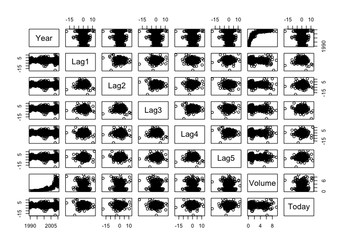
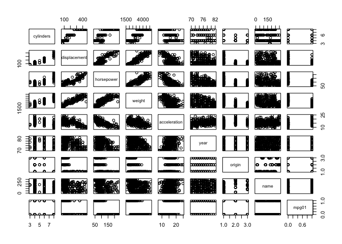
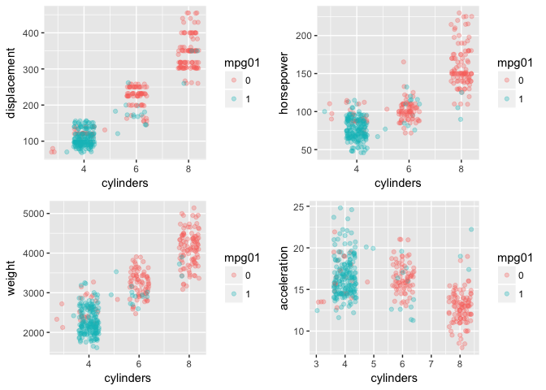
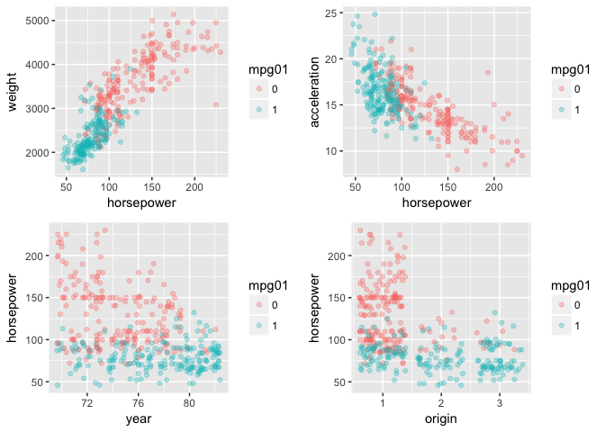
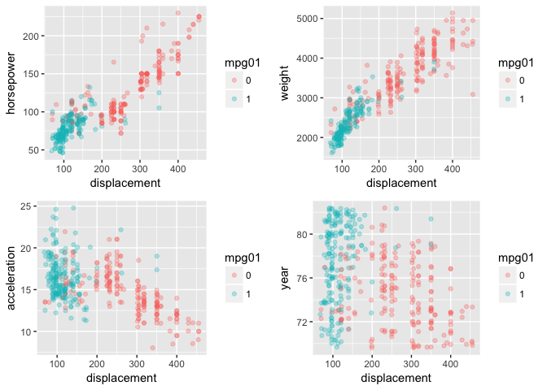
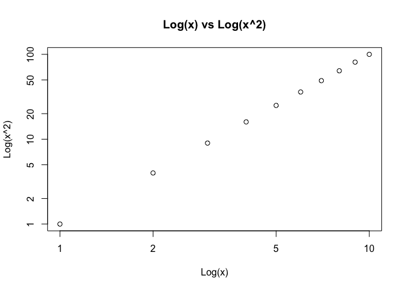
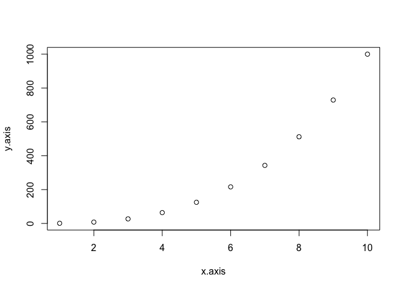
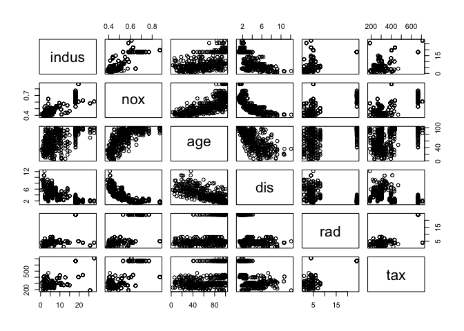

# Ch. 4 Exercises


10. This question should be answered using the Weekly data set, which is part of the ISLR package. This data is similar in nature to the Smarket data from this chapter’s lab, except that it contains 1,089 weekly returns for 21 years, from the beginning of 1990 to the end of 2010.

```r
library(ISLR)
data("Weekly")
attach(Weekly)
```
(a) Produce some numerical and graphical summaries of the Weekly data. Do there appear to be any patterns?

```r
dim(Weekly)
```

```
## [1] 1089    9
```

```r
names(Weekly)
```

```
## [1] "Year"      "Lag1"      "Lag2"      "Lag3"      "Lag4"      "Lag5"     
## [7] "Volume"    "Today"     "Direction"
```

```r
summary(Weekly)
```

```
##       Year           Lag1               Lag2               Lag3         
##  Min.   :1990   Min.   :-18.1950   Min.   :-18.1950   Min.   :-18.1950  
##  1st Qu.:1995   1st Qu.: -1.1540   1st Qu.: -1.1540   1st Qu.: -1.1580  
##  Median :2000   Median :  0.2410   Median :  0.2410   Median :  0.2410  
##  Mean   :2000   Mean   :  0.1506   Mean   :  0.1511   Mean   :  0.1472  
##  3rd Qu.:2005   3rd Qu.:  1.4050   3rd Qu.:  1.4090   3rd Qu.:  1.4090  
##  Max.   :2010   Max.   : 12.0260   Max.   : 12.0260   Max.   : 12.0260  
##       Lag4               Lag5              Volume       
##  Min.   :-18.1950   Min.   :-18.1950   Min.   :0.08747  
##  1st Qu.: -1.1580   1st Qu.: -1.1660   1st Qu.:0.33202  
##  Median :  0.2380   Median :  0.2340   Median :1.00268  
##  Mean   :  0.1458   Mean   :  0.1399   Mean   :1.57462  
##  3rd Qu.:  1.4090   3rd Qu.:  1.4050   3rd Qu.:2.05373  
##  Max.   : 12.0260   Max.   : 12.0260   Max.   :9.32821  
##      Today          Direction 
##  Min.   :-18.1950   Down:484  
##  1st Qu.: -1.1540   Up  :605  
##  Median :  0.2410             
##  Mean   :  0.1499             
##  3rd Qu.:  1.4050             
##  Max.   : 12.0260
```

```r
pairs(Weekly[, -9])
```

<!-- -->

```r
round(cor(Weekly[, -9]), 4)
```

```
##           Year    Lag1    Lag2    Lag3    Lag4    Lag5  Volume   Today
## Year    1.0000 -0.0323 -0.0334 -0.0300 -0.0311 -0.0305  0.8419 -0.0325
## Lag1   -0.0323  1.0000 -0.0749  0.0586 -0.0713 -0.0082 -0.0650 -0.0750
## Lag2   -0.0334 -0.0749  1.0000 -0.0757  0.0584 -0.0725 -0.0855  0.0592
## Lag3   -0.0300  0.0586 -0.0757  1.0000 -0.0754  0.0607 -0.0693 -0.0712
## Lag4   -0.0311 -0.0713  0.0584 -0.0754  1.0000 -0.0757 -0.0611 -0.0078
## Lag5   -0.0305 -0.0082 -0.0725  0.0607 -0.0757  1.0000 -0.0585  0.0110
## Volume  0.8419 -0.0650 -0.0855 -0.0693 -0.0611 -0.0585  1.0000 -0.0331
## Today  -0.0325 -0.0750  0.0592 -0.0712 -0.0078  0.0110 -0.0331  1.0000
```

There seems to be a positive relationship between Volume and Year. The correlation index is 0.8419, which is pretty high, and we can also see the relationship from the paired scatterplots (although the relationship doesn't seem to be linear).

(b) Use the full data set to perform a logistic regression with Direction as the response and the five lag variables plus Volume as predictors. Use the summary function to print the results. Do any of the predictors appear to be statistically significant? If so, which ones?

```r
glm.fit <- glm(Direction ~ Lag1+Lag2+Lag3+Lag4+Lag5+Volume, data=Weekly, family=binomial)
summary(glm.fit)
```

```
## 
## Call:
## glm(formula = Direction ~ Lag1 + Lag2 + Lag3 + Lag4 + Lag5 + 
##     Volume, family = binomial, data = Weekly)
## 
## Deviance Residuals: 
##     Min       1Q   Median       3Q      Max  
## -1.6949  -1.2565   0.9913   1.0849   1.4579  
## 
## Coefficients:
##             Estimate Std. Error z value Pr(>|z|)   
## (Intercept)  0.26686    0.08593   3.106   0.0019 **
## Lag1        -0.04127    0.02641  -1.563   0.1181   
## Lag2         0.05844    0.02686   2.175   0.0296 * 
## Lag3        -0.01606    0.02666  -0.602   0.5469   
## Lag4        -0.02779    0.02646  -1.050   0.2937   
## Lag5        -0.01447    0.02638  -0.549   0.5833   
## Volume      -0.02274    0.03690  -0.616   0.5377   
## ---
## Signif. codes:  0 '***' 0.001 '**' 0.01 '*' 0.05 '.' 0.1 ' ' 1
## 
## (Dispersion parameter for binomial family taken to be 1)
## 
##     Null deviance: 1496.2  on 1088  degrees of freedom
## Residual deviance: 1486.4  on 1082  degrees of freedom
## AIC: 1500.4
## 
## Number of Fisher Scoring iterations: 4
```
The Lag2 variable seems to be statistically significant on a 0.05 significance level with a p-value of 0.0296.

(c) Compute the confusion matrix and overall fraction of correct predictions. Explain what the confusion matrix is telling you about the types of mistakes made by logistic regression.

```r
glm.probs <- predict(glm.fit, type="response")
glm.pred <- ifelse(glm.probs>0.5, "Up", "Down")
table(glm.pred, Direction)
```

```
##         Direction
## glm.pred Down  Up
##     Down   54  48
##     Up    430 557
```

```r
# Overall fraction of correct predictions
(54+557)/1089
```

```
## [1] 0.5610652
```

```r
# Fraction of false positives
430/(430+557)
```

```
## [1] 0.4356636
```

```r
# Fraction of false negatives
48/(54+48)
```

```
## [1] 0.4705882
```

```r
# When market is "Up"
557/(557+48)
```

```
## [1] 0.9206612
```

```r
# When market is "Down"
54/(54+430)
```

```
## [1] 0.1115702
```
When market is "Up", logistic regression predicts correctly 92% of the time, while when the market is "Down", it predicts correctly only 11% of the time.

(d) Now fit the logistic regression model using a training data period from 1990 to 2008, with Lag2 as the only predictor. Compute the confusion matrix and the overall fraction of correct predictions for the held out data (that is, the data from 2009 and 2010).

```r
train <- (Year<=2008)
test <- Weekly[!train, ]
test.Direction <- Direction[!train]

glm.fit_1 <- glm(Direction ~ Lag2, data=Weekly, family=binomial, subset = train)
glm.probs_1 <- predict(glm.fit_1, test, type="response")
glm.pred_1 <- ifelse(glm.probs_1>0.5, "Up", "Down")
table(glm.pred_1, test.Direction)
```

```
##           test.Direction
## glm.pred_1 Down Up
##       Down    9  5
##       Up     34 56
```


```r
# Overall fraction of correct predicitons
(9+56)/104
```

```
## [1] 0.625
```
The results are much better than before. The % of correct predictions increased to 62.5%, while using train and test datasets to account for overfitting.  

```r
# When market is up
56/(56+5)
```

```
## [1] 0.9180328
```

```r
# When market is down
9/(9+34)
```

```
## [1] 0.2093023
```

When the market is up, the algorithm predicts correctly 91.8% of the time.
When the market is down, that number goes down to 20.9% of the time.

(e) Repeat (d) using LDA.

```r
library(MASS)
lda.fit <- lda(Direction ~ Lag2, data=Weekly, subset=train)
lda.fit
```

```
## Call:
## lda(Direction ~ Lag2, data = Weekly, subset = train)
## 
## Prior probabilities of groups:
##      Down        Up 
## 0.4477157 0.5522843 
## 
## Group means:
##             Lag2
## Down -0.03568254
## Up    0.26036581
## 
## Coefficients of linear discriminants:
##            LD1
## Lag2 0.4414162
```

```r
lda.probs <- predict(lda.fit, test)
lda.class <- lda.probs$class
table(lda.class, test.Direction)
```

```
##          test.Direction
## lda.class Down Up
##      Down    9  5
##      Up     34 56
```
The results are the same as with logistic regression.

(f) Repeat (d) using QDA.  

```r
qda.fit <- qda(Direction ~ Lag2, data = Weekly, subset = train)
qda.fit
```

```
## Call:
## qda(Direction ~ Lag2, data = Weekly, subset = train)
## 
## Prior probabilities of groups:
##      Down        Up 
## 0.4477157 0.5522843 
## 
## Group means:
##             Lag2
## Down -0.03568254
## Up    0.26036581
```

```r
qda.class <- predict(qda.fit, test)$class
table(qda.class, test.Direction)
```

```
##          test.Direction
## qda.class Down Up
##      Down    0  0
##      Up     43 61
```

```r
# Overall fraction of correct predicitons
61/(61+43)
```

```
## [1] 0.5865385
```
Quadratic Discriminant Analysis model is correct 58.7% of the time, by predicting "Up" 100% of the time, and "Down" 0% of the time. 

(g) Repeat (d) using KNN with K = 1.


```r
library(class)
train.X <- as.matrix(Weekly[Weekly$Year <= '2008', 'Lag2'])
test.X <- as.matrix(Weekly[Weekly$Year > '2008', 'Lag2'])
train.Direction <- Direction[train]
```


```r
set.seed(1)
knn.pred <- knn(train.X, test.X, train.Direction, k=1)
table(knn.pred, test.Direction)
```

```
##         test.Direction
## knn.pred Down Up
##     Down   21 30
##     Up     22 31
```

```r
# Overall fraction of correct predicitons
(31+21)/104
```

```
## [1] 0.5
```
KNN is exactly as good as a random guess when k=1.

```r
# Fraction of false positives
22/(31+22)
```

```
## [1] 0.4150943
```

```r
# Fraction of false negatives
30/(30+21)
```

```
## [1] 0.5882353
```

```r
# When market is "Up"
31/(31+30)
```

```
## [1] 0.5081967
```

```r
# When market is "Down"
21/(21+22)
```

```
## [1] 0.4883721
```
Based on these percentages, KNN predicts about the same for when market is "Up" or "Down", which is as good as a random guess.  

(h) Which of these methods appears to provide the best results on
this data?
The best overall models are the logistic regression model and the LDA, which were correct 62.5% of the time.  

(i) Experiment with different combinations of predictors, including possible transformations and interactions, for each of the methods. Report the variables, method, and associated confusion matrix that appears to provide the best results on the held out data. Note that you should also experiment with values for K in the KNN classifier.

**KNN with k=3**

```r
train.X <- as.matrix(Weekly[Weekly$Year <= '2008', 'Lag2'])
test.X <- as.matrix(Weekly[Weekly$Year > '2008', 'Lag2'])
train.Direction <- Direction[train]
```


```r
set.seed(2)
knn.pred <- knn(train.X, test.X, train.Direction, k=3)
table(knn.pred, test.Direction)
```

```
##         test.Direction
## knn.pred Down Up
##     Down   15 19
##     Up     28 42
```

```r
# Overall fraction of correct predicitons
(42+15)/104
```

```
## [1] 0.5480769
```

```r
# When market is "Up"
42/(19+42)
```

```
## [1] 0.6885246
```

```r
# When market is "Down"
15/(15+28)
```

```
## [1] 0.3488372
```
When market is up, the algorithm predicts correctly 68.9% of the time.
When the market is down, 34.9% of the time.

```r
set.seed(3)
knn.pred <- knn(train.X, test.X, train.Direction, k=2)
table(knn.pred, test.Direction)
```

```
##         test.Direction
## knn.pred Down Up
##     Down   21 24
##     Up     22 37
```

```r
# Overall fraction of correct predicitons
(37+21)/104
```

```
## [1] 0.5576923
```


```r
# When market is "Up"
37/(24+37)
```

```
## [1] 0.6065574
```

```r
# When market is "Down"
21/(21+22)
```

```
## [1] 0.4883721
```
The model is correct 55.8% of the time, classifying the variable "Up" correctly 60.7% of the time, and the variable "Down" 48.8% of the time.

Increasing the k value will increase the gap between the two variables - the percentage of correctly classified "Up" values will increase, and the percentage of "Down" values will decrease.

**Logistic regression**

Logistic regression with Lag1, Lag2, and Lag4

```r
glm.fit2 <- glm(Direction ~ Lag1 + Lag2 + Lag4, family=binomial, data=Weekly, subset=train)
summary(glm.fit2)
```

```
## 
## Call:
## glm(formula = Direction ~ Lag1 + Lag2 + Lag4, family = binomial, 
##     data = Weekly, subset = train)
## 
## Deviance Residuals: 
##     Min       1Q   Median       3Q      Max  
## -1.5819  -1.2522   0.9952   1.0878   1.5026  
## 
## Coefficients:
##             Estimate Std. Error z value Pr(>|z|)    
## (Intercept)  0.21393    0.06471   3.306 0.000946 ***
## Lag1        -0.05551    0.02891  -1.920 0.054848 .  
## Lag2         0.05530    0.02913   1.898 0.057676 .  
## Lag4        -0.02094    0.02866  -0.731 0.464886    
## ---
## Signif. codes:  0 '***' 0.001 '**' 0.01 '*' 0.05 '.' 0.1 ' ' 1
## 
## (Dispersion parameter for binomial family taken to be 1)
## 
##     Null deviance: 1354.7  on 984  degrees of freedom
## Residual deviance: 1346.4  on 981  degrees of freedom
## AIC: 1354.4
## 
## Number of Fisher Scoring iterations: 4
```

```r
glm.probs2 <- predict(glm.fit2, test, type="response")
glm.pred2 <- ifelse(glm.probs2>0.5, "Up", "Down")
table(glm.pred2, test.Direction)
```

```
##          test.Direction
## glm.pred2 Down Up
##      Down    9  7
##      Up     34 54
```

```r
(54+9)/104
```

```
## [1] 0.6057692
```

```r
# When market is "Up"
54/(54+7)
```

```
## [1] 0.8852459
```

```r
# When market is "Down"
9/(9+34)
```

```
## [1] 0.2093023
```

Logistic regression with Lag1, Lag2, and an interaction between the two variables

```r
glm.fit.int <- glm(Direction ~ Lag1*Lag2, data=Weekly, family=binomial, subset=train)
summary(glm.fit.int)
```

```
## 
## Call:
## glm(formula = Direction ~ Lag1 * Lag2, family = binomial, data = Weekly, 
##     subset = train)
## 
## Deviance Residuals: 
##    Min      1Q  Median      3Q     Max  
## -1.573  -1.259   1.003   1.086   1.596  
## 
## Coefficients:
##              Estimate Std. Error z value Pr(>|z|)   
## (Intercept)  0.211419   0.064589   3.273  0.00106 **
## Lag1        -0.051505   0.030727  -1.676  0.09370 . 
## Lag2         0.053471   0.029193   1.832  0.06700 . 
## Lag1:Lag2    0.001921   0.007460   0.257  0.79680   
## ---
## Signif. codes:  0 '***' 0.001 '**' 0.01 '*' 0.05 '.' 0.1 ' ' 1
## 
## (Dispersion parameter for binomial family taken to be 1)
## 
##     Null deviance: 1354.7  on 984  degrees of freedom
## Residual deviance: 1346.9  on 981  degrees of freedom
## AIC: 1354.9
## 
## Number of Fisher Scoring iterations: 4
```

```r
glm.probs.int <- predict(glm.fit.int, test, type="response")
glm.pred.int <- ifelse(glm.probs.int>0.5, "Up", "Down")
table(glm.pred.int, test.Direction)
```

```
##             test.Direction
## glm.pred.int Down Up
##         Down    7  8
##         Up     36 53
```

```r
(53+7)/104
```

```
## [1] 0.5769231
```

```r
# When market is "Up"
53/(53+8)
```

```
## [1] 0.8688525
```

```r
# When market is "Down"
7/(7+36)
```

```
## [1] 0.1627907
```

Logistic regression with an interaction between Lag1 and Lag2

```r
glm.fit.int2 <- glm(Direction ~ Lag1:Lag2, data=Weekly, family=binomial, subset=train)
summary(glm.fit.int2)
```

```
## 
## Call:
## glm(formula = Direction ~ Lag1:Lag2, family = binomial, data = Weekly, 
##     subset = train)
## 
## Deviance Residuals: 
##    Min      1Q  Median      3Q     Max  
## -1.368  -1.269   1.077   1.089   1.353  
## 
## Coefficients:
##             Estimate Std. Error z value Pr(>|z|)    
## (Intercept)  0.21333    0.06421   3.322 0.000893 ***
## Lag1:Lag2    0.00717    0.00697   1.029 0.303649    
## ---
## Signif. codes:  0 '***' 0.001 '**' 0.01 '*' 0.05 '.' 0.1 ' ' 1
## 
## (Dispersion parameter for binomial family taken to be 1)
## 
##     Null deviance: 1354.7  on 984  degrees of freedom
## Residual deviance: 1353.6  on 983  degrees of freedom
## AIC: 1357.6
## 
## Number of Fisher Scoring iterations: 4
```

```r
glm.probs.int2 <- predict(glm.fit.int2, test, type="response")
glm.pred.int2 <- ifelse(glm.probs.int2>0.5, "Up", "Down")
table(glm.pred.int2, test.Direction)
```

```
##              test.Direction
## glm.pred.int2 Down Up
##          Down    1  1
##          Up     42 60
```

```r
61/104
```

```
## [1] 0.5865385
```

```r
# When market is "Up"
60/61
```

```
## [1] 0.9836066
```

```r
# When market is "down"
1/43
```

```
## [1] 0.02325581
```

Logistic regression with Lag2, Volume and an interaction between the two variables

```r
glm.fit.vol <- glm(Direction ~ Lag2*Volume, data=Weekly, family=binomial, subset=train)
summary(glm.fit.vol)
```

```
## 
## Call:
## glm(formula = Direction ~ Lag2 * Volume, family = binomial, data = Weekly, 
##     subset = train)
## 
## Deviance Residuals: 
##    Min      1Q  Median      3Q     Max  
## -1.438  -1.263   1.022   1.086   1.521  
## 
## Coefficients:
##             Estimate Std. Error z value Pr(>|z|)   
## (Intercept)  0.27007    0.09024   2.993  0.00277 **
## Lag2         0.05036    0.03998   1.260  0.20781   
## Volume      -0.05436    0.05279  -1.030  0.30317   
## Lag2:Volume  0.00151    0.01328   0.114  0.90945   
## ---
## Signif. codes:  0 '***' 0.001 '**' 0.01 '*' 0.05 '.' 0.1 ' ' 1
## 
## (Dispersion parameter for binomial family taken to be 1)
## 
##     Null deviance: 1354.7  on 984  degrees of freedom
## Residual deviance: 1349.4  on 981  degrees of freedom
## AIC: 1357.4
## 
## Number of Fisher Scoring iterations: 4
```

```r
glm.probs.vol <- predict(glm.fit.vol, test, type="response")
glm.pred.vol <- ifelse(glm.probs.vol>0.5, "Up", "Down")
table(glm.pred.vol, test.Direction)
```

```
##             test.Direction
## glm.pred.vol Down Up
##         Down   20 25
##         Up     23 36
```

```r
(36+20)/104
```

```
## [1] 0.5384615
```

```r
# When market is "Up"
36/(36+25)
```

```
## [1] 0.5901639
```

```r
# When market is "down"
20/(20+23)
```

```
## [1] 0.4651163
```

Logistic regression with Lag2 transformed

```r
glm.fit.sq <- glm(Direction ~ poly(Lag2, 3), data=Weekly, family=binomial, subset=train)
summary(glm.fit.sq)
```

```
## 
## Call:
## glm(formula = Direction ~ poly(Lag2, 3), family = binomial, data = Weekly, 
##     subset = train)
## 
## Deviance Residuals: 
##    Min      1Q  Median      3Q     Max  
## -2.194  -1.245   1.008   1.108   1.142  
## 
## Coefficients:
##                Estimate Std. Error z value Pr(>|z|)    
## (Intercept)     0.21943    0.06469   3.392 0.000694 ***
## poly(Lag2, 3)1  5.09925    2.36604   2.155 0.031147 *  
## poly(Lag2, 3)2  3.15291    2.59211   1.216 0.223852    
## poly(Lag2, 3)3  2.57598    2.75450   0.935 0.349691    
## ---
## Signif. codes:  0 '***' 0.001 '**' 0.01 '*' 0.05 '.' 0.1 ' ' 1
## 
## (Dispersion parameter for binomial family taken to be 1)
## 
##     Null deviance: 1354.7  on 984  degrees of freedom
## Residual deviance: 1348.5  on 981  degrees of freedom
## AIC: 1356.5
## 
## Number of Fisher Scoring iterations: 4
```


```r
glm.probs.sq <- predict(glm.fit.sq, test, type="response")
glm.pred.sq <- ifelse(glm.probs.sq>0.5, "Up", "Down")
table(glm.pred.sq, test.Direction)
```

```
##            test.Direction
## glm.pred.sq Down Up
##          Up   43 61
```


```r
# Overall percentage of correct predictions
61/104
```

```
## [1] 0.5865385
```
Predicts 100% correctly when market is up, but 0% when it's down.

**LDA**   
LDA with Lag1, Lag2, and Lag4

```r
lda.fit2 <- lda(Direction ~ Lag1 + Lag2 + Lag4, data=Weekly, subset=train)
lda.fit2
```

```
## Call:
## lda(Direction ~ Lag1 + Lag2 + Lag4, data = Weekly, subset = train)
## 
## Prior probabilities of groups:
##      Down        Up 
## 0.4477157 0.5522843 
## 
## Group means:
##              Lag1        Lag2       Lag4
## Down  0.289444444 -0.03568254 0.15925624
## Up   -0.009213235  0.26036581 0.09220956
## 
## Coefficients of linear discriminants:
##             LD1
## Lag1 -0.2984478
## Lag2  0.2960224
## Lag4 -0.1113485
```

```r
lda.probs2 <- predict(lda.fit2, test)
lda.class2 <- lda.probs2$class
table(lda.class2, test.Direction)
```

```
##           test.Direction
## lda.class2 Down Up
##       Down    9  7
##       Up     34 54
```

```r
# Overall correctness
(54+9)/104
```

```
## [1] 0.6057692
```

```r
# When market is up
54/(54+7)
```

```
## [1] 0.8852459
```

```r
# When market is down
9/(9+43)
```

```
## [1] 0.1730769
```

LDA with Lag1, Lag2, and an interaction between the two variables

```r
lda.fit.int <- lda(Direction ~ Lag1*Lag2, data=Weekly, subset=train)
lda.fit.int
```

```
## Call:
## lda(Direction ~ Lag1 * Lag2, data = Weekly, subset = train)
## 
## Prior probabilities of groups:
##      Down        Up 
## 0.4477157 0.5522843 
## 
## Group means:
##              Lag1        Lag2  Lag1:Lag2
## Down  0.289444444 -0.03568254 -0.8014495
## Up   -0.009213235  0.26036581 -0.1393632
## 
## Coefficients of linear discriminants:
##                    LD1
## Lag1      -0.285484602
## Lag2       0.295080109
## Lag1:Lag2  0.009629381
```

```r
lda.probs.int <- predict(lda.fit.int, test)
lda.class.int <- lda.probs.int$class
table(lda.class.int, test.Direction)
```

```
##              test.Direction
## lda.class.int Down Up
##          Down    7  8
##          Up     36 53
```

```r
# Overall correctness
(53+7)/104
```

```
## [1] 0.5769231
```

```r
# When market is up
53/(53+8)
```

```
## [1] 0.8688525
```

```r
# Down
7/(7+36)
```

```
## [1] 0.1627907
```

LDA with an interaction between Lag1 and Lag2

```r
lda.fit.int2 <- lda(Direction ~ Lag1:Lag2, data=Weekly, subset=train)
lda.fit.int2
```

```
## Call:
## lda(Direction ~ Lag1:Lag2, data = Weekly, subset = train)
## 
## Prior probabilities of groups:
##      Down        Up 
## 0.4477157 0.5522843 
## 
## Group means:
##       Lag1:Lag2
## Down -0.8014495
## Up   -0.1393632
## 
## Coefficients of linear discriminants:
##                 LD1
## Lag1:Lag2 0.1013404
```

```r
lda.probs.int2 <- predict(lda.fit.int2, test)
lda.class.int2 <- lda.probs.int2$class
table(lda.class.int2, test.Direction)
```

```
##               test.Direction
## lda.class.int2 Down Up
##           Down    0  1
##           Up     43 60
```

```r
# Overall correctness
60/104
```

```
## [1] 0.5769231
```

```r
# When market is up
60/61
```

```
## [1] 0.9836066
```

```r
# When market is down
0/43
```

```
## [1] 0
```

LDA with Lag2, Volume and an interaction between the two variables


```r
lda.fit.vol <- lda(Direction ~ Lag2*Volume, data=Weekly, subset=train)
lda.fit.vol
```

```
## Call:
## lda(Direction ~ Lag2 * Volume, data = Weekly, subset = train)
## 
## Prior probabilities of groups:
##      Down        Up 
## 0.4477157 0.5522843 
## 
## Group means:
##             Lag2   Volume Lag2:Volume
## Down -0.03568254 1.266966 -0.70124208
## Up    0.26036581 1.156529  0.06257301
## 
## Coefficients of linear discriminants:
##                      LD1
## Lag2         0.343334406
## Volume      -0.369489705
## Lag2:Volume  0.007130365
```

```r
lda.probs.vol <- predict(lda.fit.vol, test)
lda.class.vol <- lda.probs.vol$class
table(lda.class.vol, test.Direction)
```

```
##              test.Direction
## lda.class.vol Down Up
##          Down   20 25
##          Up     23 36
```

```r
# Overall correctness
(36+20)/104
```

```
## [1] 0.5384615
```

```r
# When market is up
36/(36+25)
```

```
## [1] 0.5901639
```

```r
# When market is down
20/(20+23)
```

```
## [1] 0.4651163
```

**QDA**  
QDA with Lag1, Lag2, and Lag4

```r
qda.fit2 <- qda(Direction ~ Lag1 + Lag2 + Lag4, data=Weekly, subset=train)
qda.fit2
```

```
## Call:
## qda(Direction ~ Lag1 + Lag2 + Lag4, data = Weekly, subset = train)
## 
## Prior probabilities of groups:
##      Down        Up 
## 0.4477157 0.5522843 
## 
## Group means:
##              Lag1        Lag2       Lag4
## Down  0.289444444 -0.03568254 0.15925624
## Up   -0.009213235  0.26036581 0.09220956
```

```r
qda.class2 <- predict(qda.fit2, test)$class
table(qda.class2, test.Direction)
```

```
##           test.Direction
## qda.class2 Down Up
##       Down    9 20
##       Up     34 41
```

```r
# Overall correctness
(41+9)/104
```

```
## [1] 0.4807692
```

```r
# When market is up
41/(41+20)
```

```
## [1] 0.6721311
```

```r
# When market is down
9/(9+34)
```

```
## [1] 0.2093023
```

QDA with Lag1, Lag2, and an interaction between the two variables

```r
qda.fit.int <- qda(Direction ~ Lag1*Lag2, data=Weekly, subset=train)
qda.fit.int
```

```
## Call:
## qda(Direction ~ Lag1 * Lag2, data = Weekly, subset = train)
## 
## Prior probabilities of groups:
##      Down        Up 
## 0.4477157 0.5522843 
## 
## Group means:
##              Lag1        Lag2  Lag1:Lag2
## Down  0.289444444 -0.03568254 -0.8014495
## Up   -0.009213235  0.26036581 -0.1393632
```

```r
qda.class.int <- predict(qda.fit.int, test)$class
table(qda.class.int, test.Direction)
```

```
##              test.Direction
## qda.class.int Down Up
##          Down   23 36
##          Up     20 25
```

```r
# Overall correctness
(25+23)/104
```

```
## [1] 0.4615385
```

```r
# When market is up
25/(25+36)
```

```
## [1] 0.4098361
```

```r
# When market is down
23/(23+20)
```

```
## [1] 0.5348837
```

QDA with an interaction between Lag1 and Lag2

```r
qda.fit.int2 <- qda(Direction ~ Lag1:Lag2, data=Weekly, subset=train)
qda.fit.int2
```

```
## Call:
## qda(Direction ~ Lag1:Lag2, data = Weekly, subset = train)
## 
## Prior probabilities of groups:
##      Down        Up 
## 0.4477157 0.5522843 
## 
## Group means:
##       Lag1:Lag2
## Down -0.8014495
## Up   -0.1393632
```

```r
qda.class.int2 <- predict(qda.fit.int2, test)$class
table(qda.class.int2, test.Direction)
```

```
##               test.Direction
## qda.class.int2 Down Up
##           Down   16 32
##           Up     27 29
```

```r
# Overall correctness
(29+16)/104
```

```
## [1] 0.4326923
```

```r
# When market is up
29/(29+32)
```

```
## [1] 0.4754098
```

```r
# When market is down
16/(27+16)
```

```
## [1] 0.372093
```

QDA with Lag2, Volume and an interaction between the two variables

```r
qda.fit.vol <- qda(Direction ~ Lag2*Volume, data=Weekly, subset=train)
qda.fit.vol
```

```
## Call:
## qda(Direction ~ Lag2 * Volume, data = Weekly, subset = train)
## 
## Prior probabilities of groups:
##      Down        Up 
## 0.4477157 0.5522843 
## 
## Group means:
##             Lag2   Volume Lag2:Volume
## Down -0.03568254 1.266966 -0.70124208
## Up    0.26036581 1.156529  0.06257301
```

```r
qda.class.vol <- predict(qda.fit.vol, test)$class
table(qda.class.vol, test.Direction)
```

```
##              test.Direction
## qda.class.vol Down Up
##          Down   37 49
##          Up      6 12
```

```r
# Overall correctness
(12+37)/104
```

```
## [1] 0.4711538
```

```r
# When market is up
12/(49+12)
```

```
## [1] 0.1967213
```

```r
# When market is down
37/(37+6)
```

```
## [1] 0.8604651
```

QDA with Lag2 transformed

```r
qda.fit.sq <- qda(Direction ~ poly(Lag2, 3), data=Weekly, subset=train)
qda.fit.sq
```

```
## Call:
## qda(Direction ~ poly(Lag2, 3), data = Weekly, subset = train)
## 
## Prior probabilities of groups:
##      Down        Up 
## 0.4477157 0.5522843 
## 
## Group means:
##      poly(Lag2, 3)1 poly(Lag2, 3)2 poly(Lag2, 3)3
## Down   -0.002401964  -0.0018033874  -0.0013275674
## Up      0.001405552  -0.0001094245  -0.0001364639
```


```r
qda.class.sq <- predict(qda.fit.sq, test)$class
table(qda.class.sq, test.Direction)
```

```
##             test.Direction
## qda.class.sq Down Up
##         Down    0  0
##         Up     43 61
```

```r
# Overall correctness 
61/104
```

```
## [1] 0.5865385
```
When market is up, the model predicts correctly 100% of the time; when the market is down, it predicts correctly 0% of the time.

QDA with $\sqrt{Log2}$

```r
qda.fit.sqrt <- qda(Direction ~ sqrt(abs(Lag2)), data=Weekly, subset=train)
qda.fit.sqrt
```

```
## Call:
## qda(Direction ~ sqrt(abs(Lag2)), data = Weekly, subset = train)
## 
## Prior probabilities of groups:
##      Down        Up 
## 0.4477157 0.5522843 
## 
## Group means:
##      sqrt(abs(Lag2))
## Down        1.140078
## Up          1.169635
```


```r
qda.class.sqrt <- predict(qda.fit.sqrt, test)$class
table(qda.class.sqrt, test.Direction)
```

```
##               test.Direction
## qda.class.sqrt Down Up
##           Down    0  0
##           Up     43 61
```

QDA with log(Lag2)

```r
qda.fit.log <- qda(Direction ~ log(abs(Lag2)), data=Weekly, subset=train)
qda.fit.log
```

```
## Call:
## qda(Direction ~ log(abs(Lag2)), data = Weekly, subset = train)
## 
## Prior probabilities of groups:
##      Down        Up 
## 0.4477157 0.5522843 
## 
## Group means:
##      log(abs(Lag2))
## Down    0.006442608
## Up      0.043712035
```


```r
qda.class.log <- predict(qda.fit.log, test)$class
table(qda.class.log, test.Direction)
```

```
##              test.Direction
## qda.class.log Down Up
##          Down    0  0
##          Up     43 61
```


| Method             | Variables     | Overall correct % | Up %  | Down % |
| -------------------|--------------:| -----------------:|------:|-------:|
| Logistic regression| Lag2          |           62.5    | 91.8  | 20.9   |
| LDA                | Lag2          |             62.5  | 91.8  | 20.9   |
| QDA                | Lag2          |              58.7 | 100   | 0      |
| KNN (k=1)          | Lag2          |             50.0  | 50.8  | 48.8   |
| KNN (k=2)          | Lag2          |            55.8   | 60.7  | 48.4   |
| KNN (k=3)          | Lag2          |             54.8  | 68.9  | 34.9   |
| Logistic regression| Lag1, 2, 4    |             60.6  | 88.5  | 20.9   |
| Logistic regression| Lag1*Lag2     |             57.7  | 86.9  | 16.3   |
| Logistic regression| Lag1:Lag2     |             58.7  | 98.4  | 2.3    |
| Logistic regression| Lag2*Volume   |             53.8  | 59.0  | 46.5   |
| Logistic regression| poly(Lag2,3)  |             58.7  | 100   | 0      |
| LDA                | Lag1, 2, 4    |             60.6  | 88.5  | 17.3   |
| LDA                | Lag1*Lag2     |             57.7  | 86.9  | 16.3   |
| LDA                | Lag1:Lag2     |             57.7  | 98.4  | 0      |
| LDA                | Lag2*Volume   |             53.8  | 59.0  | 46.5   |
| QDA                | Lag1, 2, 4    |             48.1  | 67.2  | 20.9   |
| QDA                | Lag1*Lag2     |             46.2  | 41.0  | 53.5   |
| QDA                | Lag1:Lag2     |             43.3  | 47.5  | 37.2   |
| QDA                | Lag2*Volume   |             47.1  | 19.7  | 86.0   |
| QDA                | poly(Lag2,3)  |             58.7  | 100   | 0      |
| QDA                | sqrt(Lag2)    |             58.7  | 100   | 0      |
| QDA                | log(Lag2)     |             58.7  | 100   | 0      |

The best overall result was obtained with the logistic regression and LDA methods, using only the Lag2 variable. The overall correctness of those methods is 62.5. When the market is up, they predict correctly 91.8% of the time, and when the market is down, 20.9% of the time.

11. In this problem, you will develop a model to predict whether a given car gets high or low gas mileage based on the Auto data set.

```r
data(Auto)
attach(Auto)
```

(a) Create a binary variable, `mpg01`, that contains a 1 if mpg contains a value above its median, and a 0 if mpg contains a value below its median. You can compute the median using the `median()` function. Note you may find it helpful to use the `data.frame()` function to create a single data set containing both `mpg01` and the other `Auto` variables.

```r
Auto$mpg01 <- ifelse(Auto$mpg>median(mpg), 1, 0)
```

(b) Explore the data graphically in order to investigate the association between mpg01 and the other features. Which of the other features seem most likely to be useful in predicting mpg01? Scatterplots and boxplots may be useful tools to answer this question. Describe your findings.


```r
cor(Auto[, -9])
```

```
##                     mpg  cylinders displacement horsepower     weight
## mpg           1.0000000 -0.7776175   -0.8051269 -0.7784268 -0.8322442
## cylinders    -0.7776175  1.0000000    0.9508233  0.8429834  0.8975273
## displacement -0.8051269  0.9508233    1.0000000  0.8972570  0.9329944
## horsepower   -0.7784268  0.8429834    0.8972570  1.0000000  0.8645377
## weight       -0.8322442  0.8975273    0.9329944  0.8645377  1.0000000
## acceleration  0.4233285 -0.5046834   -0.5438005 -0.6891955 -0.4168392
## year          0.5805410 -0.3456474   -0.3698552 -0.4163615 -0.3091199
## origin        0.5652088 -0.5689316   -0.6145351 -0.4551715 -0.5850054
## mpg01         0.8369392 -0.7591939   -0.7534766 -0.6670526 -0.7577566
##              acceleration       year     origin      mpg01
## mpg             0.4233285  0.5805410  0.5652088  0.8369392
## cylinders      -0.5046834 -0.3456474 -0.5689316 -0.7591939
## displacement   -0.5438005 -0.3698552 -0.6145351 -0.7534766
## horsepower     -0.6891955 -0.4163615 -0.4551715 -0.6670526
## weight         -0.4168392 -0.3091199 -0.5850054 -0.7577566
## acceleration    1.0000000  0.2903161  0.2127458  0.3468215
## year            0.2903161  1.0000000  0.1815277  0.4299042
## origin          0.2127458  0.1815277  1.0000000  0.5136984
## mpg01           0.3468215  0.4299042  0.5136984  1.0000000
```


```r
pairs(Auto[-1])
```

<!-- -->


```r
library(ggplot2)
```

```
## 
## Attaching package: 'ggplot2'
```

```
## The following object is masked from 'Auto':
## 
##     mpg
```

```r
library(gridExtra)
Auto$mpg01 <- as.factor(Auto$mpg01)
plot1 <- ggplot(Auto, aes(x=cylinders, y=displacement, col=mpg01))+
  geom_jitter(alpha=0.3)
plot2 <- ggplot(Auto, aes(x=cylinders, y=horsepower, col=mpg01))+
  geom_jitter(alpha=0.3)
plot3 <- ggplot(Auto, aes(x=cylinders, y=weight, col=mpg01))+
  geom_jitter(alpha=0.3)
plot4 <- ggplot(Auto, aes(x=cylinders, y=acceleration, col=mpg01))+
  geom_jitter(alpha=0.3)
grid.arrange(plot1, plot2, plot3, plot4, ncol=2, nrow=2)
```

<!-- -->


```r
plot5 <- ggplot(Auto, aes(x=horsepower, y=weight, col=mpg01))+
  geom_jitter(alpha=0.3)
plot6 <- ggplot(Auto, aes(x=horsepower, y=acceleration, col=mpg01))+
  geom_jitter(alpha=0.3)
plot7 <- ggplot(Auto, aes(x=year, y=horsepower, col=mpg01))+
  geom_jitter(alpha=0.3)
plot8 <- ggplot(Auto, aes(x=origin, y=horsepower, col=mpg01))+
  geom_jitter(alpha=0.3)
grid.arrange(plot5, plot6, plot7, plot8, ncol=2, nrow=2)
```

<!-- -->


```r
plot9 <- ggplot(Auto, aes(x=displacement, y=horsepower, col=mpg01))+
  geom_jitter(alpha=0.3)
plot10 <- ggplot(Auto, aes(x=displacement, y=weight, col=mpg01))+
  geom_jitter(alpha=0.3)
plot11 <- ggplot(Auto, aes(x=displacement, y=acceleration, col=mpg01))+
  geom_jitter(alpha=0.3)
plot12 <- ggplot(Auto, aes(x=displacement, y=year, col=mpg01))+
  geom_jitter(alpha=0.3)
grid.arrange(plot9, plot10, plot11, plot12, ncol=2, nrow=2)
```

<!-- -->

The variables that could be used to predict mpg01 are "cylinders", "displacement", "horsepower", "weight", and "origin".


(c) Split the data into a training set and a test set.

```r
set.seed(3)
smp_size <- floor(nrow(Auto)*0.80)
train_ind <- sample(seq_len(nrow(Auto)), size = smp_size)

train <- Auto[train_ind, ]
test <- Auto[-train_ind, ]
test.mpg01 <- test$mpg01
```

(d) Perform LDA on the training data in order to predict mpg01 using the variables that seemed most associated with mpg01 in (b). What is the test error of the model obtained?


```r
lda.fit.auto <- lda(mpg01 ~ cylinders + displacement + horsepower + weight + origin, data=train)
lda.fit.auto
```

```
## Call:
## lda(mpg01 ~ cylinders + displacement + horsepower + weight + 
##     origin, data = train)
## 
## Prior probabilities of groups:
##        0        1 
## 0.485623 0.514377 
## 
## Group means:
##   cylinders displacement horsepower   weight   origin
## 0  6.842105     277.9605   131.7763 3659.026 1.144737
## 1  4.142857     114.2826    78.2795 2336.472 1.950311
## 
## Coefficients of linear discriminants:
##                        LD1
## cylinders    -0.5081370695
## displacement -0.0004210636
## horsepower    0.0012608057
## weight       -0.0008296759
## origin        0.1852623467
```


```r
lda.probs.auto <- predict(lda.fit.auto, test)
lda.class.auto <- lda.probs.auto$class
table(lda.class.auto, test.mpg01)
```

```
##               test.mpg01
## lda.class.auto  0  1
##              0 38  4
##              1  6 31
```

```r
# Test error %
mean(lda.probs.auto$class != test.mpg01)
```

```
## [1] 0.1265823
```

(e) Perform QDA on the training data in order to predict mpg01 using the variables that seemed most associated with mpg01 in (b). What is the test error of the model obtained?


```r
qda.fit.auto <- qda(mpg01 ~ cylinders + displacement + horsepower + weight + origin, data=train)
qda.fit.auto
```

```
## Call:
## qda(mpg01 ~ cylinders + displacement + horsepower + weight + 
##     origin, data = train)
## 
## Prior probabilities of groups:
##        0        1 
## 0.485623 0.514377 
## 
## Group means:
##   cylinders displacement horsepower   weight   origin
## 0  6.842105     277.9605   131.7763 3659.026 1.144737
## 1  4.142857     114.2826    78.2795 2336.472 1.950311
```

```r
qda.probs.auto <- predict(qda.fit.auto, test)
qda.class.auto <- qda.probs.auto$class
table(qda.class.auto, test.mpg01)
```

```
##               test.mpg01
## qda.class.auto  0  1
##              0 38  4
##              1  6 31
```

```r
# Test error %
mean(qda.class.auto != test.mpg01)
```

```
## [1] 0.1265823
```

(f) Perform logistic regression on the training data in order to predict mpg01 using the variables that seemed most associated with mpg01 in (b). What is the test error of the model obtained?


```r
glm.fit.auto <- glm(mpg01 ~ cylinders + displacement + horsepower + weight + origin, data=train, family=binomial)
summary(glm.fit.auto)
```

```
## 
## Call:
## glm(formula = mpg01 ~ cylinders + displacement + horsepower + 
##     weight + origin, family = binomial, data = train)
## 
## Deviance Residuals: 
##      Min        1Q    Median        3Q       Max  
## -2.54665  -0.07752   0.09256   0.32361   3.15633  
## 
## Coefficients:
##                Estimate Std. Error z value Pr(>|z|)    
## (Intercept)  12.0534832  2.0587909   5.855 4.78e-09 ***
## cylinders     0.1116485  0.4116845   0.271  0.78624    
## displacement -0.0180844  0.0119432  -1.514  0.12997    
## horsepower   -0.0534294  0.0172704  -3.094  0.00198 ** 
## weight       -0.0016388  0.0008578  -1.911  0.05607 .  
## origin        0.1232868  0.3454877   0.357  0.72121    
## ---
## Signif. codes:  0 '***' 0.001 '**' 0.01 '*' 0.05 '.' 0.1 ' ' 1
## 
## (Dispersion parameter for binomial family taken to be 1)
## 
##     Null deviance: 433.65  on 312  degrees of freedom
## Residual deviance: 151.31  on 307  degrees of freedom
## AIC: 163.31
## 
## Number of Fisher Scoring iterations: 7
```

```r
glm.probs.auto <- predict(glm.fit.auto, test, type="response")
glm.pred.auto <- ifelse(glm.probs.auto>0.5, 1, 0)
table(glm.pred.auto, test.mpg01)
```

```
##              test.mpg01
## glm.pred.auto  0  1
##             0 38  5
##             1  6 30
```

```r
mean(glm.pred.auto != test.mpg01)
```

```
## [1] 0.1392405
```

(g) Perform KNN on the training data, with several values of K, in order to predict mpg01. Use only the variables that seemed most associated with mpg01 in (b). What test errors do you obtain? Which value of K seems to perform the best on this data set?


```r
# KNN with k=1
train.X.auto <- as.matrix(train[, c(2:5, 8)])
test.X.auto <- as.matrix(test[, c(2:5, 8)])
train.mpg01 <- train$mpg01
```


```r
set.seed(4)
knn.pred.auto <- knn(train.X.auto, test.X.auto, train.mpg01, k=1)
table(knn.pred.auto, test.mpg01)
```

```
##              test.mpg01
## knn.pred.auto  0  1
##             0 36  5
##             1  8 30
```


```r
# Test error %
mean(knn.pred.auto != test.mpg01)
```

```
## [1] 0.164557
```


```r
# KNN with k=2
set.seed(4)
knn.pred.auto <- knn(train.X.auto, test.X.auto, train.mpg01, k=2)
table(knn.pred.auto, test.mpg01)
```

```
##              test.mpg01
## knn.pred.auto  0  1
##             0 37  7
##             1  7 28
```

```r
# Test error %
mean(knn.pred.auto != test.mpg01)
```

```
## [1] 0.1772152
```


```r
# KNN with k=3
set.seed(5)
knn.pred.auto <- knn(train.X.auto, test.X.auto, train.mpg01, k=3)
table(knn.pred.auto, test.mpg01)
```

```
##              test.mpg01
## knn.pred.auto  0  1
##             0 36  5
##             1  8 30
```

```r
# Test error %
mean(knn.pred.auto != test.mpg01)
```

```
## [1] 0.164557
```

```r
# KNN with k=4
set.seed(5)
knn.pred.auto <- knn(train.X.auto, test.X.auto, train.mpg01, k=4)
table(knn.pred.auto, test.mpg01)
```

```
##              test.mpg01
## knn.pred.auto  0  1
##             0 35  6
##             1  9 29
```

```r
# Test error %
mean(knn.pred.auto != test.mpg01)
```

```
## [1] 0.1898734
```

```r
# KNN with k=10
set.seed(5)
knn.pred.auto <- knn(train.X.auto, test.X.auto, train.mpg01, k=10)
table(knn.pred.auto, test.mpg01)
```

```
##              test.mpg01
## knn.pred.auto  0  1
##             0 35  5
##             1  9 30
```

```r
# Test error %
mean(knn.pred.auto != test.mpg01)
```

```
## [1] 0.1772152
```

```r
# KNN with k=25
set.seed(5)
knn.pred.auto <- knn(train.X.auto, test.X.auto, train.mpg01, k=25)
table(knn.pred.auto, test.mpg01)
```

```
##              test.mpg01
## knn.pred.auto  0  1
##             0 36  6
##             1  8 29
```

```r
# Test error %
mean(knn.pred.auto != test.mpg01)
```

```
## [1] 0.1772152
```
The values of k=1 and k=3 perform best on this dataset.

12. This problem involves writing functions.
(a) Write a function, `Power()`, that prints out the result of raising 2 to the 3rd power. In other words, your function should compute 2^3^ and print out the results.
Hint: Recall that x^a raises x to the power a. Use the `print()` function to output the result.


```r
Power <- function() {
  print(2^3)
}
```
(b) Create a new function, `Power2()`, that allows you to pass any two numbers, x and a, and prints out the value of x^a. You can do this by beginning your function with the line
Power2=function(x,a){
You should be able to call your function by entering, for instance,
Power2(3,8)
on the command line. This should output the value of 38, namely, 6, 561.

```r
Power2 <- function(x,a) {
  print(x^a)
}
```

(c) Using the Power2() function that you just wrote, compute 10^3^, 8^17^, and 131^3^.

```r
Power2(10,3)
```

```
## [1] 1000
```

```r
Power2(8,17)
```

```
## [1] 2.2518e+15
```

```r
Power2(131,3)
```

```
## [1] 2248091
```

(d) Now create a new function, `Power3()`, that actually returns the result x^a as an R object, rather than simply printing it to the screen. That is, if you store the value x^a in an object called result within your function, then you can simply `return()` this result, using the following line:
return(result)
The line above should be the last line in your function, before the } symbol.


```r
Power3 <- function(x,a) {
  result <- x^a
  return(result)
}
```
(e) Now using the `Power3()` function, create a plot of f(x) = x^2^. The x-axis should display a range of integers from 1 to 10, and the y-axis should display x^2^. Label the axes appropriately, and use an appropriate title for the figure. Consider displaying either the x-axis, the y-axis, or both on the log-scale. You can do this by using log=‘‘x’’, log=‘‘y’’, or log=‘‘xy’’ as arguments to the `plot()` function.


```r
x.axis <- seq(1:10)
y.axis <- Power3(x.axis,2)
plot(x.axis, y.axis, log='xy', main = 'Log(x) vs Log(x^2)', xlab='Log(x)', ylab='Log(x^2)')
```

<!-- -->

(f) Create a function, PlotPower(), that allows you to create a plot of x against x^a for a fixed a and for a range of values of x. For instance, if you call
PlotPower (1:10 ,3)
then a plot should be created with an x-axis taking on values 1,2,...,10, and a y-axis taking on values 1^3^,2^3^,...,10^3^.


```r
PlotPower <- function(x, a) {
  x.axis <- x
  y.axis <- x.axis^a
  plot(x.axis, y.axis)
}
```


```r
PlotPower(1:10, 3)
```

<!-- -->

13. Using the Boston data set, fit classification models in order to predict whether a given suburb has a crime rate above or below the median. Explore logistic regression, LDA, and KNN models using various subsets of the predictors. Describe your findings.


```r
data(Boston)
attach(Boston)
```


```r
Boston$crim01 <- ifelse(Boston$crim>median(crim), 1, 0)
```


```r
round(cor(Boston),2)
```

```
##          crim    zn indus  chas   nox    rm   age   dis   rad   tax
## crim     1.00 -0.20  0.41 -0.06  0.42 -0.22  0.35 -0.38  0.63  0.58
## zn      -0.20  1.00 -0.53 -0.04 -0.52  0.31 -0.57  0.66 -0.31 -0.31
## indus    0.41 -0.53  1.00  0.06  0.76 -0.39  0.64 -0.71  0.60  0.72
## chas    -0.06 -0.04  0.06  1.00  0.09  0.09  0.09 -0.10 -0.01 -0.04
## nox      0.42 -0.52  0.76  0.09  1.00 -0.30  0.73 -0.77  0.61  0.67
## rm      -0.22  0.31 -0.39  0.09 -0.30  1.00 -0.24  0.21 -0.21 -0.29
## age      0.35 -0.57  0.64  0.09  0.73 -0.24  1.00 -0.75  0.46  0.51
## dis     -0.38  0.66 -0.71 -0.10 -0.77  0.21 -0.75  1.00 -0.49 -0.53
## rad      0.63 -0.31  0.60 -0.01  0.61 -0.21  0.46 -0.49  1.00  0.91
## tax      0.58 -0.31  0.72 -0.04  0.67 -0.29  0.51 -0.53  0.91  1.00
## ptratio  0.29 -0.39  0.38 -0.12  0.19 -0.36  0.26 -0.23  0.46  0.46
## black   -0.39  0.18 -0.36  0.05 -0.38  0.13 -0.27  0.29 -0.44 -0.44
## lstat    0.46 -0.41  0.60 -0.05  0.59 -0.61  0.60 -0.50  0.49  0.54
## medv    -0.39  0.36 -0.48  0.18 -0.43  0.70 -0.38  0.25 -0.38 -0.47
## crim01   0.41 -0.44  0.60  0.07  0.72 -0.16  0.61 -0.62  0.62  0.61
##         ptratio black lstat  medv crim01
## crim       0.29 -0.39  0.46 -0.39   0.41
## zn        -0.39  0.18 -0.41  0.36  -0.44
## indus      0.38 -0.36  0.60 -0.48   0.60
## chas      -0.12  0.05 -0.05  0.18   0.07
## nox        0.19 -0.38  0.59 -0.43   0.72
## rm        -0.36  0.13 -0.61  0.70  -0.16
## age        0.26 -0.27  0.60 -0.38   0.61
## dis       -0.23  0.29 -0.50  0.25  -0.62
## rad        0.46 -0.44  0.49 -0.38   0.62
## tax        0.46 -0.44  0.54 -0.47   0.61
## ptratio    1.00 -0.18  0.37 -0.51   0.25
## black     -0.18  1.00 -0.37  0.33  -0.35
## lstat      0.37 -0.37  1.00 -0.74   0.45
## medv      -0.51  0.33 -0.74  1.00  -0.26
## crim01     0.25 -0.35  0.45 -0.26   1.00
```

```r
pairs(Boston[, c(3, 5, 7, 8, 9, 10)])
```

<!-- -->


```r
# Split into test and train datasets
set.seed(5)
smp_size <- floor(nrow(Boston)*0.80)
train_id <- sample(seq_len(nrow(Boston)), size=smp_size)

train <- Boston[train_id, ]
test <- Boston[-train_id, ]
test.crim01 <- test$crim01
```

**Logistic regression** 

```r
glm.fit.boston <- glm(crim01 ~ indus + nox + age + dis + rad + tax, data=train, family = binomial)
summary(glm.fit.boston)
```

```
## 
## Call:
## glm(formula = crim01 ~ indus + nox + age + dis + rad + tax, family = binomial, 
##     data = train)
## 
## Deviance Residuals: 
##      Min        1Q    Median        3Q       Max  
## -2.05117  -0.25608   0.00007   0.00394   2.68759  
## 
## Coefficients:
##               Estimate Std. Error z value Pr(>|z|)    
## (Intercept) -24.412665   4.217494  -5.788 7.10e-09 ***
## indus        -0.039347   0.051922  -0.758  0.44857    
## nox          42.906136   7.799401   5.501 3.77e-08 ***
## age           0.009047   0.009755   0.927  0.35369    
## dis           0.137382   0.166472   0.825  0.40923    
## rad           0.666303   0.129460   5.147 2.65e-07 ***
## tax          -0.008047   0.002643  -3.045  0.00233 ** 
## ---
## Signif. codes:  0 '***' 0.001 '**' 0.01 '*' 0.05 '.' 0.1 ' ' 1
## 
## (Dispersion parameter for binomial family taken to be 1)
## 
##     Null deviance: 560.05  on 403  degrees of freedom
## Residual deviance: 187.83  on 397  degrees of freedom
## AIC: 201.83
## 
## Number of Fisher Scoring iterations: 8
```


```r
glm.probs.boston <- predict(glm.fit.boston, test, type="response")
glm.pred.boston <- ifelse(glm.probs.boston>0.5, 1, 0)
table(glm.pred.boston, test.crim01)
```

```
##                test.crim01
## glm.pred.boston  0  1
##               0 37  6
##               1 15 44
```


```r
# Test error rate for logistic regression
mean(glm.pred.boston != test.crim01)
```

```
## [1] 0.2058824
```

**LDA** 

```r
lda.fit.boston <- lda(crim01 ~ indus + nox + age + dis + rad + tax, data=train)
lda.fit.boston
```

```
## Call:
## lda(crim01 ~ indus + nox + age + dis + rad + tax, data = train)
## 
## Prior probabilities of groups:
##         0         1 
## 0.4975248 0.5024752 
## 
## Group means:
##       indus       nox      age      dis       rad      tax
## 0  6.877711 0.4687741 50.50995 5.125711  4.099502 307.9502
## 1 15.022217 0.6364089 85.45222 2.505623 14.793103 505.9310
## 
## Coefficients of linear discriminants:
##                LD1
## indus  0.012854674
## nox    7.262967175
## age    0.011862314
## dis   -0.053144086
## rad    0.099981978
## tax   -0.002657359
```

```r
lda.probs.boston <- predict(lda.fit.boston, test)
lda.class.boston <- lda.probs.boston$class
table(lda.class.boston, test.crim01)
```

```
##                 test.crim01
## lda.class.boston  0  1
##                0 46 10
##                1  6 40
```

```r
# Test error rate for LDA
mean(lda.class.boston != test.crim01)
```

```
## [1] 0.1568627
```

**KNN**


```r
train.X <- as.matrix(train[, c(3, 5, 7:10)])
test.X <- as.matrix(test[, c(3, 5, 7:10)])
train.crim01 <- train$crim01
```


```r
set.seed(2)
knn.pred.boston <- knn(train.X, test.X, train.crim01, k=5)
table(knn.pred.boston, test.crim01)
```

```
##                test.crim01
## knn.pred.boston  0  1
##               0 47  2
##               1  5 48
```

```r
# Test error rate
mean(knn.pred.boston != test.crim01)
```

```
## [1] 0.06862745
```


```r
# KNN, k=10
set.seed(2)
knn.pred.boston <- knn(train.X, test.X, train.crim01, k=10)
table(knn.pred.boston, test.crim01)
```

```
##                test.crim01
## knn.pred.boston  0  1
##               0 46  2
##               1  6 48
```

```r
# Test error rate
mean(knn.pred.boston != test.crim01)
```

```
## [1] 0.07843137
```

KNN, with k=5 provides the best results out of all the models, with an error rate of 6.86%. 


