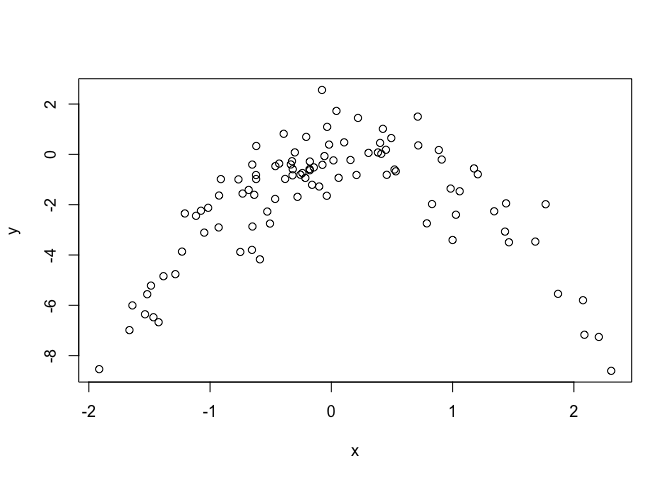

# Ch. 5 Exercises


5. In Chapter 4, we used logistic regression to predict the probability of default using income and balance on the Default data set. We will now estimate the test error of this logistic regression model using the validation set approach. Do not forget to set a random seed before beginning your analysis.

```r
require(ISLR)
```

```
## Loading required package: ISLR
```

```r
data("Default")
attach(Default)
```
(a) Fit a logistic regression model that uses income and balance to predict default.

```r
glm.fit <- glm(default ~ income + balance, data=Default, family = binomial)
summary(glm.fit)
```

```
## 
## Call:
## glm(formula = default ~ income + balance, family = binomial, 
##     data = Default)
## 
## Deviance Residuals: 
##     Min       1Q   Median       3Q      Max  
## -2.4725  -0.1444  -0.0574  -0.0211   3.7245  
## 
## Coefficients:
##               Estimate Std. Error z value Pr(>|z|)    
## (Intercept) -1.154e+01  4.348e-01 -26.545  < 2e-16 ***
## income       2.081e-05  4.985e-06   4.174 2.99e-05 ***
## balance      5.647e-03  2.274e-04  24.836  < 2e-16 ***
## ---
## Signif. codes:  0 '***' 0.001 '**' 0.01 '*' 0.05 '.' 0.1 ' ' 1
## 
## (Dispersion parameter for binomial family taken to be 1)
## 
##     Null deviance: 2920.6  on 9999  degrees of freedom
## Residual deviance: 1579.0  on 9997  degrees of freedom
## AIC: 1585
## 
## Number of Fisher Scoring iterations: 8
```

(b) Using the validation set approach, estimate the test error of this model. In order to do this, you must perform the following steps:
i. Split the sample set into a training set and a validation set.  

```r
set.seed(33)
train_id <- sample(10000, 5000)

train <- Default[train_id, ]
test <- Default[-train_id, ]
test.Default <- test$default
```

ii. Fit a multiple logistic regression model using only the training observations.  

```r
glm.fit.train <- glm(default ~ income + balance, data=train, family = binomial)
summary(glm.fit.train)
```

```
## 
## Call:
## glm(formula = default ~ income + balance, family = binomial, 
##     data = train)
## 
## Deviance Residuals: 
##     Min       1Q   Median       3Q      Max  
## -2.3612  -0.1411  -0.0579  -0.0216   3.7160  
## 
## Coefficients:
##               Estimate Std. Error z value Pr(>|z|)    
## (Intercept) -1.124e+01  6.049e-01 -18.588   <2e-16 ***
## income       1.523e-05  7.125e-06   2.137   0.0326 *  
## balance      5.522e-03  3.151e-04  17.524   <2e-16 ***
## ---
## Signif. codes:  0 '***' 0.001 '**' 0.01 '*' 0.05 '.' 0.1 ' ' 1
## 
## (Dispersion parameter for binomial family taken to be 1)
## 
##     Null deviance: 1436.67  on 4999  degrees of freedom
## Residual deviance:  769.94  on 4997  degrees of freedom
## AIC: 775.94
## 
## Number of Fisher Scoring iterations: 8
```

iii. Obtain a prediction of default status for each individual in the validation set by computing the posterior probability of default for that individual, and classifying the individual to the default category if the posterior probability is greater than 0.5.  

```r
glm.fit.prob <- predict(glm.fit.train, test, type = "response")
glm.fit.pred <- ifelse(glm.fit.prob>0.5, "Yes", "No")
table(glm.fit.pred, test.Default)
```

```
##             test.Default
## glm.fit.pred   No  Yes
##          No  4813  125
##          Yes   17   45
```

iv. Compute the validation set error, which is the fraction of the observations in the validation set that are misclassified.  

```r
mean(glm.fit.pred != test.Default)
```

```
## [1] 0.0284
```
The validation set error is 2.88% (misclassified observations).  

(c) Repeat the process in (b) three times, using three different splits of the observations into a training set and a validation set. Comment on the results obtained.  
Sample 1  

```r
set.seed(3)
train_id <- sample(10000, 5000)

train <- Default[train_id, ]
test <- Default[-train_id, ]
test.Default <- test$default
```


```r
glm.fit.1 <- glm(default ~ income + balance, data=train, family = binomial)
```


```r
glm.fit.prob <- predict(glm.fit.1, test, type = "response")
glm.fit.pred <- ifelse(glm.fit.prob>0.5, "Yes", "No")
table(glm.fit.pred, test.Default)
```

```
##             test.Default
## glm.fit.pred   No  Yes
##          No  4828  108
##          Yes   16   48
```

```r
mean(glm.fit.pred != test.Default)
```

```
## [1] 0.0248
```
The validation set error for the first sample is 2.48%.  

Sample 2

```r
set.seed(2)
train_id <- sample(10000, 5000)

train <- Default[train_id, ]
test <- Default[-train_id, ]
test.Default <- test$default
```

```r
glm.fit.2 <- glm(default ~ income + balance, data=train, family = binomial)
```

```r
glm.fit.prob <- predict(glm.fit.2, test, type = "response")
glm.fit.pred <- ifelse(glm.fit.prob>0.5, "Yes", "No")
table(glm.fit.pred, test.Default)
```

```
##             test.Default
## glm.fit.pred   No  Yes
##          No  4811  118
##          Yes   20   51
```

```r
mean(glm.fit.pred != test.Default)
```

```
## [1] 0.0276
```
The validation set error for the second sample is 2.76%.  

Sample 3 

```r
set.seed(1)
train_id <- sample(10000, 5000)

train <- Default[train_id, ]
test <- Default[-train_id, ]
test.Default <- test$default
```

```r
glm.fit.3 <- glm(default ~ income + balance, data=train, family = binomial)
```

```r
glm.fit.prob <- predict(glm.fit.3, test, type = "response")
glm.fit.pred <- ifelse(glm.fit.prob>0.5, "Yes", "No")
table(glm.fit.pred, test.Default)
```

```
##             test.Default
## glm.fit.pred   No  Yes
##          No  4805  115
##          Yes   28   52
```

```r
mean(glm.fit.pred != test.Default)
```

```
## [1] 0.0286
```
The validation set error for the third sample is 2.86%.   

(d) Now consider a logistic regression model that predicts the probability of default using income, balance, and a dummy variable for student. Estimate the test error for this model using the validation set approach. Comment on whether or not including a dummy variable for student leads to a reduction in the test error rate.


```r
set.seed(6)

train_id <- sample(10000, 5000)

train <- Default[train_id, ]
test <- Default[-train_id, ]
test.Default <- test$default
```


```r
glm.fit.4 <- glm(default ~ income + balance + student, data = train, family = binomial)
```


```r
glm.fit.prob <- predict(glm.fit.4, test, type = "response")
glm.fit.pred <- ifelse(glm.fit.prob>0.5, "Yes", "No")
table(glm.fit.pred, test.Default)
```

```
##             test.Default
## glm.fit.pred   No  Yes
##          No  4813  122
##          Yes   16   49
```

```r
mean(glm.fit.pred != test.Default)
```

```
## [1] 0.0276
```
The validation test error is 2.76%, therefore including the student variable did not reduce the test error.

6. We continue to consider the use of a logistic regression model to predict the probability of default using income and balance on the Default data set. In particular, we will now compute estimates for the standard errors of the income and balance logistic regression coefficients in two different ways: (1) using the bootstrap, and (2) using the standard formula for computing the standard errors in the `glm()` function. Do not forget to set a random seed before beginning your analysis.  

(a) Using the `summary()` and `glm()` functions, determine the estimated standard errors for the coefficients associated with income and balance in a multiple logistic regression model that uses both predictors.


```r
glm.fit.5 <- glm(default ~ income + balance, data = Default, family = binomial)
summary(glm.fit.5)
```

```
## 
## Call:
## glm(formula = default ~ income + balance, family = binomial, 
##     data = Default)
## 
## Deviance Residuals: 
##     Min       1Q   Median       3Q      Max  
## -2.4725  -0.1444  -0.0574  -0.0211   3.7245  
## 
## Coefficients:
##               Estimate Std. Error z value Pr(>|z|)    
## (Intercept) -1.154e+01  4.348e-01 -26.545  < 2e-16 ***
## income       2.081e-05  4.985e-06   4.174 2.99e-05 ***
## balance      5.647e-03  2.274e-04  24.836  < 2e-16 ***
## ---
## Signif. codes:  0 '***' 0.001 '**' 0.01 '*' 0.05 '.' 0.1 ' ' 1
## 
## (Dispersion parameter for binomial family taken to be 1)
## 
##     Null deviance: 2920.6  on 9999  degrees of freedom
## Residual deviance: 1579.0  on 9997  degrees of freedom
## AIC: 1585
## 
## Number of Fisher Scoring iterations: 8
```

(b) Write a function, `boot.fn()`, that takes as input the Default data set as well as an index of the observations, and that outputs the coefficient estimates for income and balance in the multiple logistic regression model.


```r
boot.fn <- function(data, index) {
  return(coef(glm(default ~ income + balance, data = data, family = binomial, 
           subset = index)))
}
```

(c) Use the `boot()` function together with your `boot.fn()` function to estimate the standard errors of the logistic regression coefficients for income and balance.


```r
library(boot)
set.seed(1)
boot(Default, boot.fn, R=1000)
```

```
## 
## ORDINARY NONPARAMETRIC BOOTSTRAP
## 
## 
## Call:
## boot(data = Default, statistic = boot.fn, R = 1000)
## 
## 
## Bootstrap Statistics :
##          original        bias     std. error
## t1* -1.154047e+01 -8.008379e-03 4.239273e-01
## t2*  2.080898e-05  5.870933e-08 4.582525e-06
## t3*  5.647103e-03  2.299970e-06 2.267955e-04
```

(d) Comment on the estimated standard errors obtained using the `glm()` function and using your bootstrap function.  

Standard errors obtained by the `glm()` function and by using bootstrap function are very similar.

7. In Sections 5.3.2 and 5.3.3, we saw that the `cv.glm()` function can be used in order to compute the LOOCV test error estimate. Alternatively, one could compute those quantities using just the `glm()` and `predict.glm()` functions, and a for loop. You will now take this approach in order to compute the LOOCV error for a simple logistic regression model on the Weekly data set. Recall that in the context of classification problems, the LOOCV error is given in (5.4).  

(a) Fit a logistic regression model that predicts Direction using Lag1 and Lag2.  

```r
data(Weekly)
attach(Weekly)
weekly_fit <- glm(Direction ~ Lag1 + Lag2, data=Weekly, family = binomial)
summary(weekly_fit)
```

```
## 
## Call:
## glm(formula = Direction ~ Lag1 + Lag2, family = binomial, data = Weekly)
## 
## Deviance Residuals: 
##    Min      1Q  Median      3Q     Max  
## -1.623  -1.261   1.001   1.083   1.506  
## 
## Coefficients:
##             Estimate Std. Error z value Pr(>|z|)    
## (Intercept)  0.22122    0.06147   3.599 0.000319 ***
## Lag1        -0.03872    0.02622  -1.477 0.139672    
## Lag2         0.06025    0.02655   2.270 0.023232 *  
## ---
## Signif. codes:  0 '***' 0.001 '**' 0.01 '*' 0.05 '.' 0.1 ' ' 1
## 
## (Dispersion parameter for binomial family taken to be 1)
## 
##     Null deviance: 1496.2  on 1088  degrees of freedom
## Residual deviance: 1488.2  on 1086  degrees of freedom
## AIC: 1494.2
## 
## Number of Fisher Scoring iterations: 4
```

(b) Fit a logistic regression model that predicts Direction using Lag1 and Lag2 using all but the first observation.  

```r
weekly_fit_1 <- glm(Direction ~ Lag1 + Lag2, data=Weekly[2:1089, ], family = binomial)
```

(c) Use the model from (b) to predict the direction of the first observation. You can do this by predicting that the first observation will go up if P(Direction="Up"|Lag1, Lag2) > 0.5. Was this observation correctly classified?


```r
pred <- predict(weekly_fit_1, Weekly[1, ], type="response")
pred
```

```
##         1 
## 0.5713923
```

```r
prob <- ifelse(pred > 0.5, "Up", "Down")
prob
```

```
##    1 
## "Up"
```

```r
Weekly$Direction[1]
```

```
## [1] Down
## Levels: Down Up
```
The prediction was incorrectly classified as "Up". The true value is "Down".


(d) Write a for loop from i=1 to i=n, where n is the number of observations in the data set, that performs each of the following steps:  

i. Fit a logistic regression model using all but the ith observation to predict Direction using Lag1 and Lag2.  
ii. Compute the posterior probability of the market moving up for the ith observation.  
iii. Use the posterior probability for the ith observation in order to predict whether or not the market moves up.  
iv. Determine whether or not an error was made in predicting the direction for the ith observation. If an error was made, then indicate this as a 1, and otherwise indicate it as a 0.  


```r
  errors <- c()
  for(i in 1:nrow(Weekly)) {
    glm.fit <- glm(Direction ~ Lag1 + Lag2, data=Weekly[-i,], family = binomial)
    pred <- predict(glm.fit, Weekly[i,], type = "response")
    prob <- ifelse(pred>0.5, "Up", "Down")
    if(prob == Weekly$Direction[i]) {
      errors <- c(errors, 0)
    } else {
      errors <- c(errors, 1)
    }
  }
```

(e) Take the average of the n numbers obtained in (d)iv in order to obtain the LOOCV estimate for the test error. Comment on the results.


```r
sum(errors)/length(errors)
```

```
## [1] 0.4499541
```

The error rate obtained by using the LOOCV method is 45%.  

8. We will now perform cross-validation on a simulated data set.
(a) Generate a simulated data set as follows:

```r
set.seed(1)
y=rnorm(100)
x=rnorm(100)
y=x-2*x^2+rnorm(100)
```
In this data set, what is n and what is p? Write out the model used to generate the data in equation form.  

In this dataset n = 100, p = 2. The model used to generate the data is y = x - 2* x^2^ + ε


```r
plot(x, y)
```

<!-- -->

The relationship of the x and y variables is curvilinear. 

(c) Set a random seed, and then compute the LOOCV errors that result from fitting the following four models using least squares:  
i. Y = ${\beta}_0$ + ${\beta}_1$X + ε  

```r
library(boot)
Xy <- data.frame(x, y)
set.seed(5)
fit_c_i <- glm(y ~ x)
cv.err_c_i <- cv.glm(Xy, fit_c_i)
cv.err_c_i$delta
```

```
## [1] 5.890979 5.888812
```
ii. Y = ${\beta}_0$ + ${\beta}_1$X + ${\beta}_2 X_2$ + ε  

```r
set.seed(5)
fit_c_ii <- glm(y ~ poly(x, 2))
cv.err_c_ii <- cv.glm(Xy, fit_c_ii)
cv.err_c_ii$delta
```

```
## [1] 1.086596 1.086326
```

iii. Y = ${\beta}_0$ +${\beta}_1$X +${\beta}_2 X_2$ +${\beta}_3 X_3$ +ε  

```r
set.seed(5)
fit_c_iii <- glm(y ~ poly(x, 3))
cv.err_c_iii <- cv.glm(Xy, fit_c_iii)
cv.err_c_iii$delta
```

```
## [1] 1.102585 1.102227
```

iv. Y = ${\beta}_0$ +${\beta}_1$X +${\beta}_2 X_2$ +${\beta}_3 X_3$ +${\beta}_4 X_4$ +ε.  

```r
set.seed(5)
fit_c_iv <- glm(y ~ poly(x, 4))
cv.err_c_iv <- cv.glm(Xy, fit_c_iv)
cv.err_c_iv$delta
```

```
## [1] 1.114772 1.114334
```

Note you may find it helpful to use the `data.frame()` function
to create a single data set containing both X and Y .

(d) Repeat (c) using another random seed, and report your results.
Are your results the same as what you got in (c)? Why?  

i. Y = ${\beta}_0$ + ${\beta}_1$X + ε  

```r
set.seed(10)
fit_d_i <- glm(y ~ x)
cv.err_d_i <- cv.glm(Xy, fit_d_i)
cv.err_d_i$delta
```

```
## [1] 5.890979 5.888812
```

ii. Y = ${\beta}_0$ + ${\beta}_1$X + ${\beta}_2 X_2$ + ε  

```r
set.seed(10)
fit_d_ii <- glm(y ~ poly(x, 2))
cv.err_d_ii <- cv.glm(Xy, fit_d_ii)
cv.err_d_ii$delta
```

```
## [1] 1.086596 1.086326
```

iii. Y = ${\beta}_0$ +${\beta}_1$X +${\beta}_2 X_2$ +${\beta}_3 X_3$ +ε  

```r
set.seed(10)
fit_d_iii <- glm(y ~ poly(x, 3))
cv.err_d_iii <- cv.glm(Xy, fit_d_iii)
cv.err_d_iii$delta
```

```
## [1] 1.102585 1.102227
```

iv. Y = ${\beta}_0$ +${\beta}_1$X +${\beta}_2 X_2$ +${\beta}_3 X_3$ +${\beta}_4 X_4$ +ε.  

```r
set.seed(10)
fit_d_iv <- glm(y ~ poly(x, 4))
cv.err_d_iv <- cv.glm(Xy, fit_d_iv)
cv.err_d_iv$delta
```

```
## [1] 1.114772 1.114334
```

Yes, the results are the same as before, because in LOOCV K=n, which means that each observation is a validation set, while the others are the training set.  

(e) Which of the models in (c) had the smallest LOOCV error? Is this what you expected? Explain your answer.  

The Y = ${\beta}_0$ +${\beta}_1$X +${\beta}_2 X_2$ +ε model had the smallest error of 1.086596. Since we knew from the scatterplot that the relationship is curvilinear, we should have expected that a quadratic equation will give the best result.  

(f) Comment on the statistical significance of the coefficient estimates that results from fitting each of the models in (c) using least squares. Do these results agree with the conclusions drawn based on the cross-validation results?  

```r
summary(fit_c_iv)
```

```
## 
## Call:
## glm(formula = y ~ poly(x, 4))
## 
## Deviance Residuals: 
##     Min       1Q   Median       3Q      Max  
## -2.8914  -0.5244   0.0749   0.5932   2.7796  
## 
## Coefficients:
##             Estimate Std. Error t value Pr(>|t|)    
## (Intercept)  -1.8277     0.1041 -17.549   <2e-16 ***
## poly(x, 4)1   2.3164     1.0415   2.224   0.0285 *  
## poly(x, 4)2 -21.0586     1.0415 -20.220   <2e-16 ***
## poly(x, 4)3  -0.3048     1.0415  -0.293   0.7704    
## poly(x, 4)4  -0.4926     1.0415  -0.473   0.6373    
## ---
## Signif. codes:  0 '***' 0.001 '**' 0.01 '*' 0.05 '.' 0.1 ' ' 1
## 
## (Dispersion parameter for gaussian family taken to be 1.084654)
## 
##     Null deviance: 552.21  on 99  degrees of freedom
## Residual deviance: 103.04  on 95  degrees of freedom
## AIC: 298.78
## 
## Number of Fisher Scoring iterations: 2
```

Only the p-values of the linear and quadratic models are statistically significant (linear on a 0.05 significance level, quadratic on a 0.001 significance level). These results agree with the conclusions based on the cross-validation results, because the linear and quadratic models had the lowest error rates (quadratic lower than linear).

9. We will now consider the Boston housing data set, from the MASS library.

```r
require(MASS)
```

```
## Loading required package: MASS
```

```r
data(Boston)
attach(Boston)
```

(a) Based on this data set, provide an estimate for the population mean of medv. Call this estimate $\widehat μ$.


```r
u.hat <- mean(medv)
u.hat
```

```
## [1] 22.53281
```
(b) Provide an estimate of the standard error of $\widehat μ$. Interpret this result.
Hint: We can compute the standard error of the sample mean by dividing the sample standard deviation by the square root of the number of observations.


```r
sd(medv)/sqrt(nrow(Boston))
```

```
## [1] 0.4088611
```
(c) Now estimate the standard error of $\widehat μ$ using the bootstrap. How does this compare to your answer from (b)?

```r
boot.fn=function(data,index) {
  return(mean(data[index]))
}
set.seed(5)
boot(Boston$medv, boot.fn, 1000)
```

```
## 
## ORDINARY NONPARAMETRIC BOOTSTRAP
## 
## 
## Call:
## boot(data = Boston$medv, statistic = boot.fn, R = 1000)
## 
## 
## Bootstrap Statistics :
##     original      bias    std. error
## t1* 22.53281 -0.01329545    0.412335
```
(d) Based on your bootstrap estimate from (c), provide a 95 % confidence interval for the mean of medv. Compare it to the results obtained using `t.test(Boston$medv)`. Hint: You can approximate a 95 % confidence interval using the formula [μˆ − 2SE(μˆ), μˆ + 2SE(μˆ)].

```r
t.test(Boston$medv)
```

```
## 
## 	One Sample t-test
## 
## data:  Boston$medv
## t = 55.111, df = 505, p-value < 2.2e-16
## alternative hypothesis: true mean is not equal to 0
## 95 percent confidence interval:
##  21.72953 23.33608
## sample estimates:
## mean of x 
##  22.53281
```

```r
u.hat - 2*0.412335 ; u.hat + 2*0.412335
```

```
## [1] 21.70814
```

```
## [1] 23.35748
```
The bootstrap 95% confidence interval is very close to the t-test confidence interval.

(e) Based on this dataset, provide an estimate, $\widehat μ_{med}$,for the median value of medv in the population. 

```r
med.hat <- median(medv)
med.hat
```

```
## [1] 21.2
```
(f) We now would like to estimate the standard error of $\widehat μ_{med}$. Unfortunately, there is no simple formula for computing the standard error of the median. Instead, estimate the standard error of the median using the bootstrap. Comment on your findings.


```r
boot.fn.med=function(data,index) {
  return(median(data[index]))
}
set.seed(5)
boot(Boston$medv, boot.fn.med, 1000)
```

```
## 
## ORDINARY NONPARAMETRIC BOOTSTRAP
## 
## 
## Call:
## boot(data = Boston$medv, statistic = boot.fn.med, R = 1000)
## 
## 
## Bootstrap Statistics :
##     original   bias    std. error
## t1*     21.2 -0.01255   0.3834932
```
We get the same value for the median when using bootstrap. The standard error for the median is smaller than the standard error for the mean.

(g) Based on this data set, provide an estimate for the tenth percentile of medv in Boston suburbs. Call this quantity $\widehat μ_{0.1}$. (You can use the `quantile()` function.)  

```r
u.0.1 <- quantile(medv, 0.1)
u.0.1
```

```
##   10% 
## 12.75
```

(h) Use the bootstrap to estimate the standard error of $\widehat μ_{0.1}$. Comment on your findings. 

```r
boot.fn.q=function(data,index) {
  u.0.1 <- quantile(data[index], c(0.1))
  return(u.0.1)
}
```

```r
set.seed(5)
boot(medv, boot.fn.q, 1000)
```

```
## 
## ORDINARY NONPARAMETRIC BOOTSTRAP
## 
## 
## Call:
## boot(data = medv, statistic = boot.fn.q, R = 1000)
## 
## 
## Bootstrap Statistics :
##     original  bias    std. error
## t1*    12.75  0.0086   0.5037855
```
The value for the 10% quantile is the same when using bootstrap. The standard error is 50.38%.


