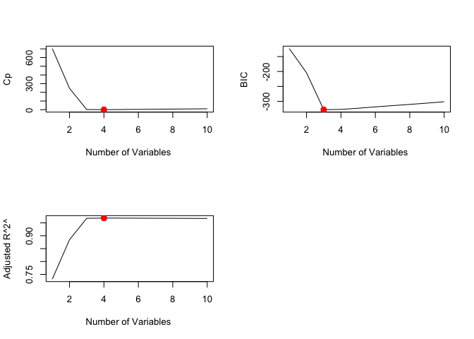
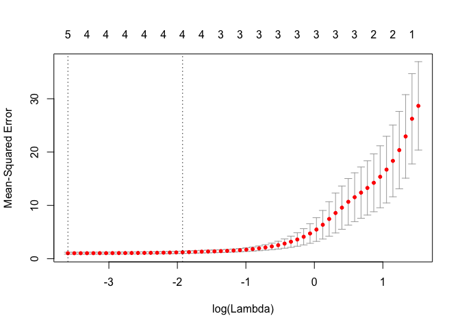
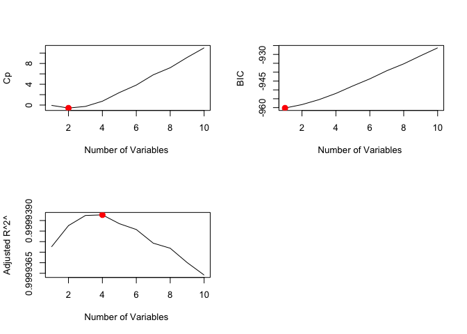
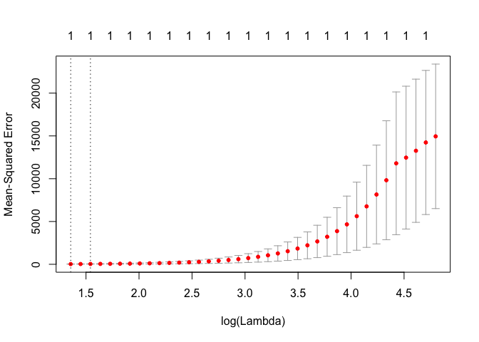
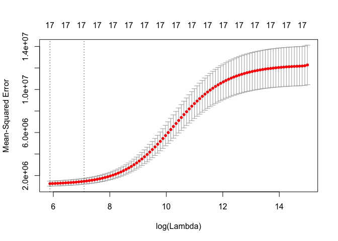
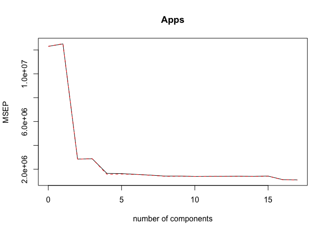
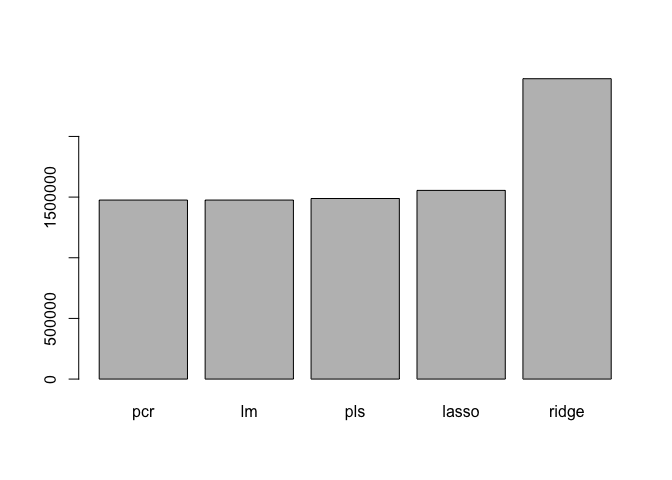

# Ch. 6 Exercises


8. In this exercise, we will generate simulated data, and will then use this data to perform best subset selection.  

(a) Use the `rnorm()` function to generate a predictor X of length n = 100, as well as a noise vector ε of length n = 100.


```r
set.seed(1)
X <- rnorm(100)
e <- rnorm(100)
```
(b) Generate a response vector Y of length n = 100 according to the model
Y = β0 +β1X +β2X2 +β3X3 +ε, where β0, β1, β2, and β3 are constants of your choice.

```r
B0 <- -4
B1 <- 3
B2 <- -2
B3 <- 1
Y <- B0 + B1*X + B2*X^2 + B3*X^3 + e
```

(c) Use the `regsubsets()` function to perform best subset selection in order to choose the best model containing the predictors X,X2,...,X10. What is the best model obtained according to Cp, BIC, and adjusted R2? Show some plots to provide evidence for your answer, and report the coefficients of the best model obtained. Note you will need to use the `data.frame()` function to create a single data set containing both X and Y .


```r
require(leaps)
```

```
## Loading required package: leaps
```

```r
Xy <- data.frame(y=Y, x=X)
reg.fit.full <- regsubsets(y ~ I(X) + I(X^2)+ I(X^3) + I(X^4) + I(X^5) + I(X^6) + I(X^7) + I(X^8) + I(X^9) + I(X^10), data=Xy, nvmax=10)
reg.fit.full.summary <- summary(reg.fit.full)
```

```r
names(reg.fit.full.summary)
```

```
## [1] "which"  "rsq"    "rss"    "adjr2"  "cp"     "bic"    "outmat" "obj"
```

```r
which.min(reg.fit.full.summary$cp)
```

```
## [1] 4
```

```r
reg.fit.full.summary$cp[4]
```

```
## [1] 0.6067483
```


```r
which.min(reg.fit.full.summary$bic)
```

```
## [1] 3
```

```r
reg.fit.full.summary$bic[3]
```

```
## [1] -327.9111
```


```r
which.max(reg.fit.full.summary$adjr2)
```

```
## [1] 4
```

```r
reg.fit.full.summary$adjr2[4]
```

```
## [1] 0.9685959
```


```r
par(mfrow=c(2,2))
plot(reg.fit.full.summary$cp ,xlab="Number of Variables ", ylab="Cp",
type="l")
points(which.min(reg.fit.full.summary$cp), reg.fit.full.summary$cp[which.min(reg.fit.full.summary$cp)], col="red", cex=2, pch=20)

plot(reg.fit.full.summary$bic ,xlab="Number of Variables ", 
ylab="BIC",type="l")
points(which.min(reg.fit.full.summary$bic), reg.fit.full.summary$bic[which.min(reg.fit.full.summary$bic)], col="red", cex=2, pch=20)

plot(reg.fit.full.summary$adjr2 ,xlab="Number of Variables ", 
ylab="Adjusted R^2^",type="l")
points(which.max(reg.fit.full.summary$adjr2), reg.fit.full.summary$adjr2[which.max(reg.fit.full.summary$adjr2)], col="red", cex=2, pch=20)
```

<!-- -->

The best model according to Cp and Adjusted R^2^ has 4 variables, and according to BIC 3 variables (BIC penalizes large models and therefore tends to choose smaller models).  


```r
coef(reg.fit.full, 4)
```

```
## (Intercept)        I(X)      I(X^2)      I(X^3)      I(X^5) 
## -3.92799225  3.38745596 -2.15424359  0.55797426  0.08072292
```

(d) Repeat (c), using forward stepwise selection and also using back- wards stepwise selection. How does your answer compare to the results in (c)?  

#### Forward Step Selection

```r
reg.fit.fwd <- regsubsets(y ~ I(X) + I(X^2)+ I(X^3) + I(X^4) + I(X^5) + I(X^6) + I(X^7) + I(X^8) + I(X^9) + I(X^10), data=Xy, nvmax=10, method ="forward")
reg.fit.fwd.summary <- summary(reg.fit.fwd)
```

```r
which.min(reg.fit.fwd.summary$cp)
```

```
## [1] 4
```

```r
which.min(reg.fit.fwd.summary$bic)
```

```
## [1] 3
```

```r
which.max(reg.fit.fwd.summary$adjr2)
```

```
## [1] 4
```

```r
coef(reg.fit.fwd, 4)
```

```
## (Intercept)        I(X)      I(X^2)      I(X^3)      I(X^5) 
## -3.92799225  3.38745596 -2.15424359  0.55797426  0.08072292
```

#### Backward Step Selection

```r
reg.fit.bwd <- regsubsets(y ~ I(X) + I(X^2)+ I(X^3) + I(X^4) + I(X^5) + I(X^6) + I(X^7) + I(X^8) + I(X^9) + I(X^10), data=Xy, nvmax=10, method ="backward")
reg.fit.bwd.summary <- summary(reg.fit.bwd)
```

```r
which.min(reg.fit.bwd.summary$cp)
```

```
## [1] 4
```

```r
which.min(reg.fit.bwd.summary$bic)
```

```
## [1] 3
```

```r
which.max(reg.fit.bwd.summary$adjr2)
```

```
## [1] 4
```

```r
coef(reg.fit.bwd, 4)
```

```
## (Intercept)        I(X)      I(X^2)      I(X^5)      I(X^7) 
## -3.93986035  3.70201369 -2.13582615  0.30330191 -0.02419389
```

All 3 methods selected a 4 variable model as the best model. Both best subset selection and forward selection chose the same variables - X, X^2^, X^3^ and X^5^. On the other hand, the backward selection method chose X, X^2^, X^5^ and X^7^ predictors.  

(e) Now fit a lasso model to the simulated data, again using X,X^2^, . . . , X^10^ as predictors. Use cross-validation to select the optimal value of λ. Create plots of the cross-validation error as a function of λ. Report the resulting coefficient estimates, and discuss the results obtained.


```r
library(glmnet)
```

```
## Warning: package 'glmnet' was built under R version 3.4.2
```

```
## Loading required package: Matrix
```

```
## Loading required package: foreach
```

```
## Loaded glmnet 2.0-13
```

```r
X <- model.matrix(y ~ x + I(x^2) + I(x^3) + I(x^4) + I(x^5) + I(x^6) + I(x^7) + I(x^8) + I(x^9) + I(x^10), data=Xy)[, -1]
Y <- Xy$y

set.seed(1)
cv.lasso.mod <- cv.glmnet(X,Y,alpha=1)
plot(cv.lasso.mod)
```

<!-- -->

```r
min.lambda <- cv.lasso.mod$lambda.min
min.lambda
```

```
## [1] 0.02737278
```
Refit the model with the optimal lambda value = 0.02737278.

```r
predict(cv.lasso.mod, s = min.lambda, type = "coefficients")[1:11, ]
```

```
##   (Intercept)             x        I(x^2)        I(x^3)        I(x^4) 
## -3.950369e+00  3.301907e+00 -2.119422e+00  6.280779e-01  0.000000e+00 
##        I(x^5)        I(x^6)        I(x^7)        I(x^8)        I(x^9) 
##  6.675650e-02  0.000000e+00  3.351028e-05  0.000000e+00  0.000000e+00 
##       I(x^10) 
##  0.000000e+00
```
The model chosen by the lambda selected with cross-validation contains 5 variables out of 10 present in the model. The method chose to include the following variables: X, X^2^, X^3^, X^5^, and X^7^. 
The lasso method has a substantial advantage, because it zeros out the variables that were not selected in the model, so we're able to see clearly which variables were actually used in the model.  

(f) Now generate a response vector Y according to the model Y = β0 + β7X7 + ε, and perform best subset selection and the lasso. Discuss the results obtained.

```r
set.seed(1)
X <- rnorm(100)
e <- rnorm(100)
B0 <- -4
B7 <- 2
Y <- B0 + B7*X^7 + e
```

#### Best Subset Selection

```r
require(leaps)

Xy <- data.frame(y=Y, x=X)
reg.fit.full <- regsubsets(y ~ I(X) + I(X^2)+ I(X^3) + I(X^4) + I(X^5) + I(X^6) + I(X^7) + I(X^8) + I(X^9) + I(X^10), data=Xy, nvmax=10)
reg.fit.full.summary <- summary(reg.fit.full)
```

```r
which.min(reg.fit.full.summary$cp)
```

```
## [1] 2
```

```r
reg.fit.full.summary$cp[2]
```

```
## [1] -0.5745758
```

```r
which.min(reg.fit.full.summary$bic)
```

```
## [1] 1
```

```r
reg.fit.full.summary$bic[1]
```

```
## [1] -960.2429
```

```r
which.max(reg.fit.full.summary$adjr2)
```

```
## [1] 4
```

```r
reg.fit.full.summary$adjr2[4]
```

```
## [1] 0.9999393
```

```r
par(mfrow=c(2,2))
plot(reg.fit.full.summary$cp ,xlab="Number of Variables ", ylab="Cp",
type="l")
points(which.min(reg.fit.full.summary$cp), reg.fit.full.summary$cp[which.min(reg.fit.full.summary$cp)], col="red", cex=2, pch=20)

plot(reg.fit.full.summary$bic ,xlab="Number of Variables ", 
ylab="BIC",type="l")
points(which.min(reg.fit.full.summary$bic), reg.fit.full.summary$bic[which.min(reg.fit.full.summary$bic)], col="red", cex=2, pch=20)

plot(reg.fit.full.summary$adjr2 ,xlab="Number of Variables ", 
ylab="Adjusted R^2^",type="l")
points(which.max(reg.fit.full.summary$adjr2), reg.fit.full.summary$adjr2[which.max(reg.fit.full.summary$adjr2)], col="red", cex=2, pch=20)
```

<!-- -->

We pick the 2 variable model with Cp, the 1 variable model with BIC, and the 4 variable model with Adjusted R^2^.


```r
coef(reg.fit.full, 1)
```

```
## (Intercept)      I(X^7) 
##    -4.04106     2.00077
```

```r
coef(reg.fit.full, 2)
```

```
## (Intercept)      I(X^2)      I(X^7) 
##  -3.9295096  -0.1417084   2.0015552
```

```r
coef(reg.fit.full, 4)
```

```
## (Intercept)        I(X)      I(X^2)      I(X^3)      I(X^7) 
##  -3.9237476   0.2914016  -0.1617671  -0.2526527   2.0091338
```

#### Lasso Regression

```r
require(glmnet)

X <- model.matrix(y ~ x + I(x^2) + I(x^3) + I(x^4) + I(x^5) + I(x^6) + I(x^7) + I(x^8) + I(x^9) + I(x^10), data=Xy)[, -1]
Y <- Xy$y

set.seed(2)
cv.lasso.mod <- cv.glmnet(X,Y,alpha=1)
plot(cv.lasso.mod)
```

<!-- -->


```r
min.lambda <- cv.lasso.mod$lambda.min
min.lambda
```

```
## [1] 3.879577
```


```r
predict(cv.lasso.mod, s = min.lambda, type = "coefficients")[1:11, ]
```

```
## (Intercept)           x      I(x^2)      I(x^3)      I(x^4)      I(x^5) 
##   -3.770915    0.000000    0.000000    0.000000    0.000000    0.000000 
##      I(x^6)      I(x^7)      I(x^8)      I(x^9)     I(x^10) 
##    0.000000    1.936760    0.000000    0.000000    0.000000
```

The lasso method chose the 1 variable model using only X^7^ variable.  

9. In this exercise, we will predict the number of applications received using the other variables in the `College` data set.

```r
require(ISLR)
```

```
## Loading required package: ISLR
```

```r
data(College)
attach(College)
```
(a) Split the data set into a training set and a test set.

```r
set.seed(2)
train <- sample(1:nrow(College), nrow(College)/2)
test <- -train
y.test <- Apps[test]
```
(b) Fit a linear model using least squares on the training set, and
report the test error obtained.

```r
lm.fit <- lm(Apps ~., data=College, subset = train)
summary(lm.fit)
```

```
## 
## Call:
## lm(formula = Apps ~ ., data = College, subset = train)
## 
## Residuals:
##     Min      1Q  Median      3Q     Max 
## -3017.4  -436.1   -18.8   333.2  6012.7 
## 
## Coefficients:
##               Estimate Std. Error t value Pr(>|t|)    
## (Intercept) -916.22473  526.31781  -1.741 0.082546 .  
## PrivateYes  -675.60526  186.94926  -3.614 0.000343 ***
## Accept         1.26474    0.07104  17.802  < 2e-16 ***
## Enroll        -0.56985    0.27919  -2.041 0.041955 *  
## Top10perc     52.77650    7.39394   7.138 5.05e-12 ***
## Top25perc    -16.97650    5.97766  -2.840 0.004761 ** 
## F.Undergrad    0.11134    0.04754   2.342 0.019718 *  
## P.Undergrad    0.01719    0.03721   0.462 0.644356    
## Outstate      -0.06523    0.02608  -2.501 0.012826 *  
## Room.Board     0.24869    0.06491   3.831 0.000150 ***
## Books         -0.21936    0.28501  -0.770 0.442007    
## Personal       0.06642    0.08017   0.828 0.407957    
## PhD           -8.30341    6.40247  -1.297 0.195471    
## Terminal      -4.76029    6.92470  -0.687 0.492238    
## S.F.Ratio     31.81493   16.15638   1.969 0.049677 *  
## perc.alumni    0.39704    5.44442   0.073 0.941905    
## Expend         0.08934    0.01642   5.442 9.59e-08 ***
## Grad.Rate      9.99603    4.24124   2.357 0.018950 *  
## ---
## Signif. codes:  0 '***' 0.001 '**' 0.01 '*' 0.05 '.' 0.1 ' ' 1
## 
## Residual standard error: 973.9 on 370 degrees of freedom
## Multiple R-squared:  0.9261,	Adjusted R-squared:  0.9227 
## F-statistic: 272.8 on 17 and 370 DF,  p-value: < 2.2e-16
```

```r
lm.pred <- predict(lm.fit, College[test,])
lm.error <- mean((lm.pred - y.test)^2)
lm.error
```

```
## [1] 1475528
```
The test MSE is 1475528.

(c) Fit a ridge regression model on the training set, with λ chosen
by cross-validation. Report the test error obtained.

```r
x <- model.matrix(Apps~., data=College)[, -1]
x.train <- x[train,]
y <- College$Apps
y.train <- y[train]
```


```r
set.seed(7)
require(glmnet)
ridge.fit <- glmnet(x.train,y.train,alpha=0)
cv.ridge.fit <- cv.glmnet(x.train,y.train,alpha=0)
plot(cv.ridge.fit)
```

<!-- -->

```r
bestlam <- cv.ridge.fit$lambda.min
bestlam
```

```
## [1] 357.5734
```
Best lambda chosen by cross-validation is 357.5734.


```r
ridge.pred <- predict(ridge.fit, s=bestlam, newx=x[test,]) 
ridge.error <- mean((ridge.pred-y.test)^2)
ridge.error
```

```
## [1] 2475678
```
The test MSE for ridge regression is 2475678, and is higher than linear regression.  

(d) Fit a lasso model on the training set, with λ chosen by cross-validation. Report the test error obtained, along with the number of non-zero coefficient estimates.

```r
set.seed(2)
lasso.fit <- glmnet(x.train,y.train,alpha=1)
cv.lasso.fit<- cv.glmnet(x.train,y.train,alpha=1)
bestlam.lasso <- cv.lasso.fit$lambda.min
bestlam.lasso
```

```
## [1] 12.26644
```
The best lambda value chosen using cross-validation for the lasso model is 12.26644.


```r
lasso.pred <- predict(lasso.fit, s=bestlam.lasso, newx=x[test,]) 
lasso.error <- mean((lasso.pred-y.test)^2)
lasso.error
```

```
## [1] 1555235
```
The test MSE for lasso regresison is 1555235, which is higher than ridge regression.


```r
lasso.c <- predict(lasso.fit,type="coefficients", s=bestlam)[1:17,]
length(lasso.c[lasso.c != 0])
```

```
## [1] 5
```
There are 5 non-zero coefficient estimates.

(e) Fit a PCR model on the training set, with M chosen by cross-validation. Report the test error obtained, along with the value of M selected by cross-validation.  


```r
require(pls)
```

```
## Loading required package: pls
```

```
## 
## Attaching package: 'pls'
```

```
## The following object is masked from 'package:stats':
## 
##     loadings
```

```r
set.seed(1)
pcr.fit <- pcr(Apps~., data=College, subset=train, scale=TRUE, validation ="CV")
summary(pcr.fit)
```

```
## Data: 	X dimension: 388 17 
## 	Y dimension: 388 1
## Fit method: svdpc
## Number of components considered: 17
## 
## VALIDATION: RMSEP
## Cross-validated using 10 random segments.
##        (Intercept)  1 comps  2 comps  3 comps  4 comps  5 comps  6 comps
## CV            3508     3536     1688     1696     1284     1279     1252
## adjCV         3508     3539     1685     1698     1252     1260     1249
##        7 comps  8 comps  9 comps  10 comps  11 comps  12 comps  13 comps
## CV        1226     1193     1193      1182      1185      1186      1189
## adjCV     1220     1185     1191      1178      1183      1182      1185
##        14 comps  15 comps  16 comps  17 comps
## CV         1185      1194      1061      1052
## adjCV      1181      1190      1056      1046
## 
## TRAINING: % variance explained
##       1 comps  2 comps  3 comps  4 comps  5 comps  6 comps  7 comps
## X     32.0511    57.98    65.49    71.19    76.33    81.22    84.72
## Apps   0.1403    77.35    77.35    87.55    87.66    88.04    88.71
##       8 comps  9 comps  10 comps  11 comps  12 comps  13 comps  14 comps
## X       88.00    91.06     93.47     95.34      97.2     98.21     98.98
## Apps    89.15    89.19     89.67     89.69      89.8     89.88     89.95
##       15 comps  16 comps  17 comps
## X        99.52     99.87    100.00
## Apps     89.96     92.23     92.61
```

```r
validationplot(pcr.fit,val.type="MSEP")
```

<!-- -->

We see that the lowest cross-validation error occurs when all 17 components are included.

```r
pcr.pred <- predict(pcr.fit,x[test,], ncomp=17) 
pcr.error <- mean((pcr.pred-y.test)^2)
pcr.error
```

```
## [1] 1475528
```
The test MSE is 1475528, which is higher than lasso regression.  

(f) Fit a PLS model on the training set, with M chosen by cross-validation. Report the test error obtained, along with the value of M selected by cross-validation.

```r
set.seed(1)
pls.fit <- plsr(Apps~., data=College, subset=train, scale=TRUE, validation="CV")
summary(pls.fit)
```

```
## Data: 	X dimension: 388 17 
## 	Y dimension: 388 1
## Fit method: kernelpls
## Number of components considered: 17
## 
## VALIDATION: RMSEP
## Cross-validated using 10 random segments.
##        (Intercept)  1 comps  2 comps  3 comps  4 comps  5 comps  6 comps
## CV            3508     1511     1197     1178     1149     1107     1081
## adjCV         3508     1508     1170     1177     1141     1087     1071
##        7 comps  8 comps  9 comps  10 comps  11 comps  12 comps  13 comps
## CV        1060     1055     1052      1049      1052      1051      1051
## adjCV     1054     1050     1047      1044      1047      1046      1045
##        14 comps  15 comps  16 comps  17 comps
## CV         1051      1052      1052      1052
## adjCV      1045      1046      1046      1046
## 
## TRAINING: % variance explained
##       1 comps  2 comps  3 comps  4 comps  5 comps  6 comps  7 comps
## X       25.81    32.40    63.00    66.40    68.58    73.09    77.67
## Apps    82.01    89.71    90.03    90.94    91.96    92.31    92.44
##       8 comps  9 comps  10 comps  11 comps  12 comps  13 comps  14 comps
## X       81.56    83.39     86.04     89.17      91.3     93.59     94.78
## Apps    92.49    92.53     92.56     92.58      92.6     92.61     92.61
##       15 comps  16 comps  17 comps
## X        97.58     98.19    100.00
## Apps     92.61     92.61     92.61
```
The lowest cross-validation error occurs with 10 components.

```r
validationplot(pls.fit, val.type="MSEP")
```

<!-- -->

```r
pls.pred <- predict(pls.fit,x[test,],ncomp=10) 
pls.error <- mean((pls.pred-y.test)^2)
pls.error
```

```
## [1] 1488374
```
The test MSE for PLS is 1488374, which is lower than PCR, but still higher than least squares, ridge, and lasso regressions.

(g) Comment on the results obtained. How accurately can we predict the number of college applications received? Is there much difference among the test errors resulting from these five approaches?


```r
errors <- c(lm.error, ridge.error, lasso.error, pcr.error, pls.error)
names(errors) <- c("lm", "ridge", "lasso", "pcr", "pls")
barplot(sort(errors))
```

<!-- -->

```r
print(sort(errors))
```

```
##     pcr      lm     pls   lasso   ridge 
## 1475528 1475528 1488374 1555235 2475678
```
Both PCR and LM methods have the lowest test error, followed by PLS, LASSO and then RIDGE regression. 
The first four have comparable test errors, while ridge regression produces significantly worse results.  


tbc


