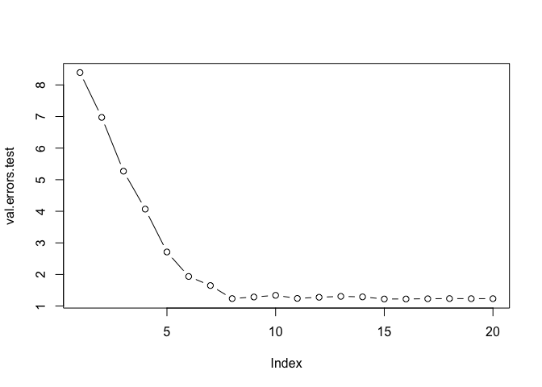

# Ch. 6 Exercises


8. In this exercise, we will generate simulated data, and will then use this data to perform best subset selection.  

(a) Use the `rnorm()` function to generate a predictor X of length n = 100, as well as a noise vector ε of length n = 100.


```r
set.seed(1)
X <- rnorm(100)
e <- rnorm(100)
```
(b) Generate a response vector Y of length n = 100 according to the model
Y = β0 +β1X +β2X2 +β3X3 +ε, where β0, β1, β2, and β3 are constants of your choice.

```r
B0 <- -4
B1 <- 3
B2 <- -2
B3 <- 1
Y <- B0 + B1*X + B2*X^2 + B3*X^3 + e
```

(c) Use the `regsubsets()` function to perform best subset selection in order to choose the best model containing the predictors X,X2,...,X10. What is the best model obtained according to Cp, BIC, and adjusted R2? Show some plots to provide evidence for your answer, and report the coefficients of the best model obtained. Note you will need to use the `data.frame()` function to create a single data set containing both X and Y .


```r
require(leaps)
```

```r
Xy <- data.frame(y=Y, x=X)
reg.fit.full <- regsubsets(y ~ I(X) + I(X^2)+ I(X^3) + I(X^4) + I(X^5) + I(X^6) + I(X^7) + I(X^8) + I(X^9) + I(X^10), data=Xy, nvmax=10)
reg.fit.full.summary <- summary(reg.fit.full)
```

```r
names(reg.fit.full.summary)
```

```
## [1] "which"  "rsq"    "rss"    "adjr2"  "cp"     "bic"    "outmat" "obj"
```

```r
which.min(reg.fit.full.summary$cp)
```

```
## [1] 4
```

```r
reg.fit.full.summary$cp[4]
```

```
## [1] 0.6067483
```


```r
which.min(reg.fit.full.summary$bic)
```

```
## [1] 3
```

```r
reg.fit.full.summary$bic[3]
```

```
## [1] -327.9111
```


```r
which.max(reg.fit.full.summary$adjr2)
```

```
## [1] 4
```

```r
reg.fit.full.summary$adjr2[4]
```

```
## [1] 0.9685959
```


```r
par(mfrow=c(2,2))
plot(reg.fit.full.summary$cp ,xlab="Number of Variables ", ylab="Cp",
type="l")
points(which.min(reg.fit.full.summary$cp), reg.fit.full.summary$cp[which.min(reg.fit.full.summary$cp)], col="red", cex=2, pch=20)

plot(reg.fit.full.summary$bic ,xlab="Number of Variables ", 
ylab="BIC",type="l")
points(which.min(reg.fit.full.summary$bic), reg.fit.full.summary$bic[which.min(reg.fit.full.summary$bic)], col="red", cex=2, pch=20)

plot(reg.fit.full.summary$adjr2 ,xlab="Number of Variables ", 
ylab="Adjusted R^2^",type="l")
points(which.max(reg.fit.full.summary$adjr2), reg.fit.full.summary$adjr2[which.max(reg.fit.full.summary$adjr2)], col="red", cex=2, pch=20)
```

<!-- -->

The best model according to Cp and Adjusted R^2^ has 4 variables, and according to BIC 3 variables (BIC penalizes large models and therefore tends to choose smaller models).  


```r
coef(reg.fit.full, 4)
```

```
## (Intercept)        I(X)      I(X^2)      I(X^3)      I(X^5) 
## -3.92799225  3.38745596 -2.15424359  0.55797426  0.08072292
```

(d) Repeat (c), using forward stepwise selection and also using back- wards stepwise selection. How does your answer compare to the results in (c)?  

#### Forward Step Selection

```r
reg.fit.fwd <- regsubsets(y ~ I(X) + I(X^2)+ I(X^3) + I(X^4) + I(X^5) + I(X^6) + I(X^7) + I(X^8) + I(X^9) + I(X^10), data=Xy, nvmax=10, method ="forward")
reg.fit.fwd.summary <- summary(reg.fit.fwd)
```

```r
which.min(reg.fit.fwd.summary$cp)
```

```
## [1] 4
```

```r
which.min(reg.fit.fwd.summary$bic)
```

```
## [1] 3
```

```r
which.max(reg.fit.fwd.summary$adjr2)
```

```
## [1] 4
```

```r
coef(reg.fit.fwd, 4)
```

```
## (Intercept)        I(X)      I(X^2)      I(X^3)      I(X^5) 
## -3.92799225  3.38745596 -2.15424359  0.55797426  0.08072292
```

#### Backward Step Selection

```r
reg.fit.bwd <- regsubsets(y ~ I(X) + I(X^2)+ I(X^3) + I(X^4) + I(X^5) + I(X^6) + I(X^7) + I(X^8) + I(X^9) + I(X^10), data=Xy, nvmax=10, method ="backward")
reg.fit.bwd.summary <- summary(reg.fit.bwd)
```

```r
which.min(reg.fit.bwd.summary$cp)
```

```
## [1] 4
```

```r
which.min(reg.fit.bwd.summary$bic)
```

```
## [1] 3
```

```r
which.max(reg.fit.bwd.summary$adjr2)
```

```
## [1] 4
```

```r
coef(reg.fit.bwd, 4)
```

```
## (Intercept)        I(X)      I(X^2)      I(X^5)      I(X^7) 
## -3.93986035  3.70201369 -2.13582615  0.30330191 -0.02419389
```

All 3 methods selected a 4 variable model as the best model. Both best subset selection and forward selection chose the same variables - X, X^2^, X^3^ and X^5^. On the other hand, the backward selection method chose X, X^2^, X^5^ and X^7^ predictors.  

(e) Now fit a lasso model to the simulated data, again using X,X^2^, . . . , X^10^ as predictors. Use cross-validation to select the optimal value of λ. Create plots of the cross-validation error as a function of λ. Report the resulting coefficient estimates, and discuss the results obtained.


```r
library(glmnet)
```

```
## Warning: package 'glmnet' was built under R version 3.4.2
```

```r
X <- model.matrix(y ~ x + I(x^2) + I(x^3) + I(x^4) + I(x^5) + I(x^6) + I(x^7) + I(x^8) + I(x^9) + I(x^10), data=Xy)[, -1]
Y <- Xy$y

set.seed(1)
cv.lasso.mod <- cv.glmnet(X,Y,alpha=1)
plot(cv.lasso.mod)
```

<!-- -->

```r
min.lambda <- cv.lasso.mod$lambda.min
min.lambda
```

```
## [1] 0.02737278
```
Refit the model with the optimal lambda value = 0.02737278.

```r
predict(cv.lasso.mod, s = min.lambda, type = "coefficients")[1:11, ]
```

```
##   (Intercept)             x        I(x^2)        I(x^3)        I(x^4) 
## -3.950369e+00  3.301907e+00 -2.119422e+00  6.280779e-01  0.000000e+00 
##        I(x^5)        I(x^6)        I(x^7)        I(x^8)        I(x^9) 
##  6.675650e-02  0.000000e+00  3.351028e-05  0.000000e+00  0.000000e+00 
##       I(x^10) 
##  0.000000e+00
```
The model chosen by the lambda selected with cross-validation contains 5 variables out of 10 present in the model. The method chose to include the following variables: X, X^2^, X^3^, X^5^, and X^7^. 
The lasso method has a substantial advantage, because it zeros out the variables that were not selected in the model, so we're able to see clearly which variables were actually used in the model.  

(f) Now generate a response vector Y according to the model Y = β0 + β7X7 + ε, and perform best subset selection and the lasso. Discuss the results obtained.

```r
set.seed(1)
X <- rnorm(100)
e <- rnorm(100)
B0 <- -4
B7 <- 2
Y <- B0 + B7*X^7 + e
```

#### Best Subset Selection

```r
require(leaps)

Xy <- data.frame(y=Y, x=X)
reg.fit.full <- regsubsets(y ~ I(X) + I(X^2)+ I(X^3) + I(X^4) + I(X^5) + I(X^6) + I(X^7) + I(X^8) + I(X^9) + I(X^10), data=Xy, nvmax=10)
reg.fit.full.summary <- summary(reg.fit.full)
```

```r
which.min(reg.fit.full.summary$cp)
```

```
## [1] 2
```

```r
reg.fit.full.summary$cp[2]
```

```
## [1] -0.5745758
```

```r
which.min(reg.fit.full.summary$bic)
```

```
## [1] 1
```

```r
reg.fit.full.summary$bic[1]
```

```
## [1] -960.2429
```

```r
which.max(reg.fit.full.summary$adjr2)
```

```
## [1] 4
```

```r
reg.fit.full.summary$adjr2[4]
```

```
## [1] 0.9999393
```

```r
par(mfrow=c(2,2))
plot(reg.fit.full.summary$cp ,xlab="Number of Variables ", ylab="Cp",
type="l")
points(which.min(reg.fit.full.summary$cp), reg.fit.full.summary$cp[which.min(reg.fit.full.summary$cp)], col="red", cex=2, pch=20)

plot(reg.fit.full.summary$bic ,xlab="Number of Variables ", 
ylab="BIC",type="l")
points(which.min(reg.fit.full.summary$bic), reg.fit.full.summary$bic[which.min(reg.fit.full.summary$bic)], col="red", cex=2, pch=20)

plot(reg.fit.full.summary$adjr2 ,xlab="Number of Variables ", 
ylab="Adjusted R^2^",type="l")
points(which.max(reg.fit.full.summary$adjr2), reg.fit.full.summary$adjr2[which.max(reg.fit.full.summary$adjr2)], col="red", cex=2, pch=20)
```

<!-- -->

We pick the 2 variable model with Cp, the 1 variable model with BIC, and the 4 variable model with Adjusted R^2^.


```r
coef(reg.fit.full, 1)
```

```
## (Intercept)      I(X^7) 
##    -4.04106     2.00077
```

```r
coef(reg.fit.full, 2)
```

```
## (Intercept)      I(X^2)      I(X^7) 
##  -3.9295096  -0.1417084   2.0015552
```

```r
coef(reg.fit.full, 4)
```

```
## (Intercept)        I(X)      I(X^2)      I(X^3)      I(X^7) 
##  -3.9237476   0.2914016  -0.1617671  -0.2526527   2.0091338
```

#### Lasso Regression

```r
require(glmnet)

X <- model.matrix(y ~ x + I(x^2) + I(x^3) + I(x^4) + I(x^5) + I(x^6) + I(x^7) + I(x^8) + I(x^9) + I(x^10), data=Xy)[, -1]
Y <- Xy$y

set.seed(2)
cv.lasso.mod <- cv.glmnet(X,Y,alpha=1)
plot(cv.lasso.mod)
```

<!-- -->


```r
min.lambda <- cv.lasso.mod$lambda.min
min.lambda
```

```
## [1] 3.879577
```


```r
predict(cv.lasso.mod, s = min.lambda, type = "coefficients")[1:11, ]
```

```
## (Intercept)           x      I(x^2)      I(x^3)      I(x^4)      I(x^5) 
##   -3.770915    0.000000    0.000000    0.000000    0.000000    0.000000 
##      I(x^6)      I(x^7)      I(x^8)      I(x^9)     I(x^10) 
##    0.000000    1.936760    0.000000    0.000000    0.000000
```

The lasso method chose the 1 variable model using only X^7^ variable.  

9. In this exercise, we will predict the number of applications received using the other variables in the `College` data set.

```r
require(ISLR)
data(College)
attach(College)
```
(a) Split the data set into a training set and a test set.

```r
set.seed(2)
train <- sample(1:nrow(College), nrow(College)/2)
test <- -train
y.test <- Apps[test]
```
(b) Fit a linear model using least squares on the training set, and
report the test error obtained.

```r
lm.fit <- lm(Apps ~., data=College, subset = train)
summary(lm.fit)
```

```
## 
## Call:
## lm(formula = Apps ~ ., data = College, subset = train)
## 
## Residuals:
##     Min      1Q  Median      3Q     Max 
## -3017.4  -436.1   -18.8   333.2  6012.7 
## 
## Coefficients:
##               Estimate Std. Error t value Pr(>|t|)    
## (Intercept) -916.22473  526.31781  -1.741 0.082546 .  
## PrivateYes  -675.60526  186.94926  -3.614 0.000343 ***
## Accept         1.26474    0.07104  17.802  < 2e-16 ***
## Enroll        -0.56985    0.27919  -2.041 0.041955 *  
## Top10perc     52.77650    7.39394   7.138 5.05e-12 ***
## Top25perc    -16.97650    5.97766  -2.840 0.004761 ** 
## F.Undergrad    0.11134    0.04754   2.342 0.019718 *  
## P.Undergrad    0.01719    0.03721   0.462 0.644356    
## Outstate      -0.06523    0.02608  -2.501 0.012826 *  
## Room.Board     0.24869    0.06491   3.831 0.000150 ***
## Books         -0.21936    0.28501  -0.770 0.442007    
## Personal       0.06642    0.08017   0.828 0.407957    
## PhD           -8.30341    6.40247  -1.297 0.195471    
## Terminal      -4.76029    6.92470  -0.687 0.492238    
## S.F.Ratio     31.81493   16.15638   1.969 0.049677 *  
## perc.alumni    0.39704    5.44442   0.073 0.941905    
## Expend         0.08934    0.01642   5.442 9.59e-08 ***
## Grad.Rate      9.99603    4.24124   2.357 0.018950 *  
## ---
## Signif. codes:  0 '***' 0.001 '**' 0.01 '*' 0.05 '.' 0.1 ' ' 1
## 
## Residual standard error: 973.9 on 370 degrees of freedom
## Multiple R-squared:  0.9261,	Adjusted R-squared:  0.9227 
## F-statistic: 272.8 on 17 and 370 DF,  p-value: < 2.2e-16
```

```r
lm.pred <- predict(lm.fit, College[test,])
lm.error <- mean((lm.pred - y.test)^2)
lm.error
```

```
## [1] 1475528
```
The test MSE is 1475528.

(c) Fit a ridge regression model on the training set, with λ chosen
by cross-validation. Report the test error obtained.

```r
x <- model.matrix(Apps~., data=College)[, -1]
x.train <- x[train,]
y <- College$Apps
y.train <- y[train]
```


```r
set.seed(7)
require(glmnet)
ridge.fit <- glmnet(x.train,y.train,alpha=0)
cv.ridge.fit <- cv.glmnet(x.train,y.train,alpha=0)
plot(cv.ridge.fit)
```

<!-- -->

```r
bestlam <- cv.ridge.fit$lambda.min
bestlam
```

```
## [1] 357.5734
```
Best lambda chosen by cross-validation is 357.5734.


```r
ridge.pred <- predict(ridge.fit, s=bestlam, newx=x[test,]) 
ridge.error <- mean((ridge.pred-y.test)^2)
ridge.error
```

```
## [1] 2475678
```
The test MSE for ridge regression is 2475678, and is higher than linear regression.  

(d) Fit a lasso model on the training set, with λ chosen by cross-validation. Report the test error obtained, along with the number of non-zero coefficient estimates.

```r
set.seed(2)
lasso.fit <- glmnet(x.train,y.train,alpha=1)
cv.lasso.fit<- cv.glmnet(x.train,y.train,alpha=1)
bestlam.lasso <- cv.lasso.fit$lambda.min
bestlam.lasso
```

```
## [1] 12.26644
```
The best lambda value chosen using cross-validation for the lasso model is 12.26644.


```r
lasso.pred <- predict(lasso.fit, s=bestlam.lasso, newx=x[test,]) 
lasso.error <- mean((lasso.pred-y.test)^2)
lasso.error
```

```
## [1] 1555235
```
The test MSE for lasso regresison is 1555235, which is higher than ridge regression.


```r
lasso.c <- predict(lasso.fit,type="coefficients", s=bestlam)[1:17,]
length(lasso.c[lasso.c != 0])
```

```
## [1] 5
```
There are 5 non-zero coefficient estimates.

(e) Fit a PCR model on the training set, with M chosen by cross-validation. Report the test error obtained, along with the value of M selected by cross-validation.  


```r
require(pls)
```

```r
set.seed(1)
pcr.fit <- pcr(Apps~., data=College, subset=train, scale=TRUE, validation ="CV")
summary(pcr.fit)
```

```
## Data: 	X dimension: 388 17 
## 	Y dimension: 388 1
## Fit method: svdpc
## Number of components considered: 17
## 
## VALIDATION: RMSEP
## Cross-validated using 10 random segments.
##        (Intercept)  1 comps  2 comps  3 comps  4 comps  5 comps  6 comps
## CV            3508     3536     1688     1696     1284     1279     1252
## adjCV         3508     3539     1685     1698     1252     1260     1249
##        7 comps  8 comps  9 comps  10 comps  11 comps  12 comps  13 comps
## CV        1226     1193     1193      1182      1185      1186      1189
## adjCV     1220     1185     1191      1178      1183      1182      1185
##        14 comps  15 comps  16 comps  17 comps
## CV         1185      1194      1061      1052
## adjCV      1181      1190      1056      1046
## 
## TRAINING: % variance explained
##       1 comps  2 comps  3 comps  4 comps  5 comps  6 comps  7 comps
## X     32.0511    57.98    65.49    71.19    76.33    81.22    84.72
## Apps   0.1403    77.35    77.35    87.55    87.66    88.04    88.71
##       8 comps  9 comps  10 comps  11 comps  12 comps  13 comps  14 comps
## X       88.00    91.06     93.47     95.34      97.2     98.21     98.98
## Apps    89.15    89.19     89.67     89.69      89.8     89.88     89.95
##       15 comps  16 comps  17 comps
## X        99.52     99.87    100.00
## Apps     89.96     92.23     92.61
```

```r
validationplot(pcr.fit,val.type="MSEP")
```

<!-- -->

We see that the lowest cross-validation error occurs when all 17 components are included.

```r
pcr.pred <- predict(pcr.fit,x[test,], ncomp=17) 
pcr.error <- mean((pcr.pred-y.test)^2)
pcr.error
```

```
## [1] 1475528
```
The test MSE is 1475528, which is higher than lasso regression.  

(f) Fit a PLS model on the training set, with M chosen by cross-validation. Report the test error obtained, along with the value of M selected by cross-validation.

```r
set.seed(1)
pls.fit <- plsr(Apps~., data=College, subset=train, scale=TRUE, validation="CV")
summary(pls.fit)
```

```
## Data: 	X dimension: 388 17 
## 	Y dimension: 388 1
## Fit method: kernelpls
## Number of components considered: 17
## 
## VALIDATION: RMSEP
## Cross-validated using 10 random segments.
##        (Intercept)  1 comps  2 comps  3 comps  4 comps  5 comps  6 comps
## CV            3508     1511     1197     1178     1149     1107     1081
## adjCV         3508     1508     1170     1177     1141     1087     1071
##        7 comps  8 comps  9 comps  10 comps  11 comps  12 comps  13 comps
## CV        1060     1055     1052      1049      1052      1051      1051
## adjCV     1054     1050     1047      1044      1047      1046      1045
##        14 comps  15 comps  16 comps  17 comps
## CV         1051      1052      1052      1052
## adjCV      1045      1046      1046      1046
## 
## TRAINING: % variance explained
##       1 comps  2 comps  3 comps  4 comps  5 comps  6 comps  7 comps
## X       25.81    32.40    63.00    66.40    68.58    73.09    77.67
## Apps    82.01    89.71    90.03    90.94    91.96    92.31    92.44
##       8 comps  9 comps  10 comps  11 comps  12 comps  13 comps  14 comps
## X       81.56    83.39     86.04     89.17      91.3     93.59     94.78
## Apps    92.49    92.53     92.56     92.58      92.6     92.61     92.61
##       15 comps  16 comps  17 comps
## X        97.58     98.19    100.00
## Apps     92.61     92.61     92.61
```
The lowest cross-validation error occurs with 10 components.

```r
validationplot(pls.fit, val.type="MSEP")
```

<!-- -->

```r
pls.pred <- predict(pls.fit,x[test,],ncomp=10) 
pls.error <- mean((pls.pred-y.test)^2)
pls.error
```

```
## [1] 1488374
```
The test MSE for PLS is 1488374, which is lower than PCR, but still higher than least squares, ridge, and lasso regressions.

(g) Comment on the results obtained. How accurately can we predict the number of college applications received? Is there much difference among the test errors resulting from these five approaches?


```r
errors <- c(lm.error, ridge.error, lasso.error, pcr.error, pls.error)
names(errors) <- c("lm", "ridge", "lasso", "pcr", "pls")
barplot(sort(errors))
```

<!-- -->

```r
print(sort(errors))
```

```
##     pcr      lm     pls   lasso   ridge 
## 1475528 1475528 1488374 1555235 2475678
```
Both PCR and LM methods have the lowest test error, followed by PLS, LASSO and then RIDGE regression. 
The first four have comparable test errors, while ridge regression produces significantly worse results.  


10. We have seen that as the number of features used in a model increases, the training error will necessarily decrease, but the test error may not. We will now explore this in a simulated data set.  

(a) Generate a data set with p = 20 features, n = 1,000 observations, and an associated quantitative response vector generated according to the model
Y = Xβ+ε,
where β has some elements that are exactly equal to zero.


```r
set.seed(3)

X <- matrix(rnorm(1000*20), 1000, 20)
B <- rnorm(20)
B[c(3, 4, 9, 10, 14, 18)] <- 0
e <- rnorm(1000)
Y <- X %*% B + e
```
(b) Split your dataset into a training set containing 100 observations and a test set containing 900 observations.


```r
set.seed(3)
train <- sample(1:nrow(X), 100)
test <- -train
X_train <- X[train, ]
X_test <- X[test, ]
Y_train <- Y[train]
Y_test <- Y[test]
```

(c) Perform best subset selection on the training set, and plot the training set MSE associated with the best model of each size.


```r
require(leaps)

dataset_train <- data.frame(x=X_train, y=Y_train)
dataset_train_matrix <- model.matrix(y ~ ., data=dataset_train, nvmax=20)
best_subset <- regsubsets(y ~ ., data=dataset_train, nvmax=20)
```


```r
val.errors <- rep(NA,20)
for(i in 1:20){
 coefi <- coef(best_subset,id=i)
 pred <- dataset_train_matrix[,names(coefi)]%*%coefi
 val.errors[i] <- mean((pred-Y_train)^2) 
}
plot(val.errors, type='b')
```

<!-- -->

```r
which.min(val.errors)
```

```
## [1] 20
```

(d) Plot the test set MSE associated with the best model of each size.


```r
dataset_test <- data.frame(x=X_test, y=Y_test)
dataset_test_matrix <- model.matrix(y ~ ., data=dataset_test, nvmax=20)

val.errors.test <- rep(NA,20)
for(i in 1:20){
 coefi <- coef(best_subset,id=i)
 pred <- dataset_test_matrix[,names(coefi)]%*%coefi
 val.errors.test[i] <- mean((pred-Y_test)^2) 
}
plot(val.errors.test, type='b')
```

<!-- -->

(e) For which model size does the test set MSE take on its minimum value? Comment on your results. If it takes on its minimum value for a model containing only an intercept or a model containing all of the features, then play around with the way that you are generating the data in (a) until you come up with a scenario in which the test set MSE is minimized for an intermediate model size.

```r
which.min(val.errors.test)
```

```
## [1] 15
```
The model with 15 variables results in a model with a minimum test set MSE.  

(f) How does the model at which the test set MSE is minimized compare to the true model used to generate the data? Comment on the coefficient values.


```r
coef(best_subset, which.min(val.errors.test))
```

```
## (Intercept)         x.1         x.2         x.4         x.5         x.7 
##  0.04937546 -1.28993666  0.92815123  0.13530479 -0.12213112 -1.12094652 
##         x.8        x.11        x.12        x.13        x.14        x.15 
## -0.19174233  1.70721060  0.15338185 -0.54307073 -0.14264014 -1.43742027 
##        x.16        x.17        x.19        x.20 
##  0.48846168  1.20504002  0.10492127  0.20178900
```
The model excluded 4 coefficients that have been zeroed out - X3, X9, X10, and X18, but left the remaining 2 in the model - X4 and X14.

(g) Create a plot displaying $\sqrt{\sum_{j=1}^{p}(\beta_j - \widehat{\beta}_j^r)^2}$ for a range of values
of r, where $β_j^r$ is the jth coefficient estimate for the best model containing r coefficients. Comment on what you observe. How does this compare to the test MSE plot from (d)?


```r
val.errors.r=rep(NA,20)
x.columns <- colnames(X, do.NULL = FALSE, prefix="x.")
for(i in 1:20){
 coefi=coef(best_subset,id=i)
 val.errors.r[i]=sqrt(sum((B[x.columns %in% names(coefi)] - coefi[names(coefi) %in% x.columns])^2) + sum(B[!(x.columns %in% names(coefi))])^2)
}
plot(val.errors.r, type='b')
```

<!-- -->


```r
which.min(val.errors.r)
```

```
## [1] 11
```

The model with the lowest test MSE is different from the model with the estimated coefficients closest to the true coefficients, which means that the lower test MSE doesn't necessarily mean that the coefficients are a closer fit.  

11. We will now try to predict per capita crime rate in the `Boston` data set.  

```r
require(MASS)
data(Boston)
attach(Boston)
```

(a) Try out some of the regression methods explored in this chapter, such as best subset selection, the lasso, ridge regression, and PCR. Present and discuss results for the approaches that you consider.  


```r
# Split the data into train and test sets
set.seed(4)
train <- sample(1:nrow(Boston), nrow(Boston)*0.70)
test <- -train
y.test <- crim[test]
```

#### Least squares


```r
lm.fit <- lm(crim~., data=Boston, subset=train)
summary(lm.fit)
```

```
## 
## Call:
## lm(formula = crim ~ ., data = Boston, subset = train)
## 
## Residuals:
##    Min     1Q Median     3Q    Max 
## -9.078 -2.316 -0.266  1.178 72.475 
## 
## Coefficients:
##              Estimate Std. Error t value Pr(>|t|)    
## (Intercept)  5.220551   9.006799   0.580  0.56255    
## zn           0.047292   0.022839   2.071  0.03914 *  
## indus       -0.069710   0.111574  -0.625  0.53253    
## chas        -0.444899   1.339473  -0.332  0.73998    
## nox         -6.145063   6.424239  -0.957  0.33948    
## rm           1.460490   0.817385   1.787  0.07486 .  
## age         -0.015293   0.021543  -0.710  0.47826    
## dis         -1.012185   0.335135  -3.020  0.00272 ** 
## rad          0.589918   0.110232   5.352 1.61e-07 ***
## tax         -0.003209   0.006774  -0.474  0.63597    
## ptratio     -0.307808   0.230738  -1.334  0.18309    
## black        0.005890   0.004587   1.284  0.20005    
## lstat        0.221630   0.091892   2.412  0.01640 *  
## medv        -0.252577   0.076278  -3.311  0.00103 ** 
## ---
## Signif. codes:  0 '***' 0.001 '**' 0.01 '*' 0.05 '.' 0.1 ' ' 1
## 
## Residual standard error: 6.459 on 340 degrees of freedom
## Multiple R-squared:  0.4643,	Adjusted R-squared:  0.4438 
## F-statistic: 22.66 on 13 and 340 DF,  p-value: < 2.2e-16
```
The variables that are statistically significant are zn, dis, rad, lstat, and medv.

```r
lm.pred <- predict(lm.fit, Boston[test,])
lm.error <- mean((lm.pred - y.test)^2)
lm.error
```

```
## [1] 45.28481
```

#### Best Subset Selection

```r
require(leaps)

best_subset <- regsubsets(crim ~ ., data=Boston, subset=train, nvmax=13)
best_subset_summary <- summary(best_subset)
```


```r
# Pick the best model using validation set approach
test_matrix <- model.matrix(crim~., data=Boston[test,])

val.errors <- rep(NA,13)
for(i in 1:13){
 coefi <- coef(best_subset,id=i)
 pred <- test_matrix[,names(coefi)]%*%coefi
 val.errors[i] <- mean((Boston$crim[test]-pred)^2) 
}

which.min(val.errors)
```

```
## [1] 6
```

```r
plot(val.errors, type='b')
points(which.min(val.errors), val.errors[6],col="red",cex=2,pch=20)
```

<!-- -->


```r
coef(best_subset, which.min(val.errors))
```

```
## (Intercept)          zn       indus         dis         rad       lstat 
##  4.52155106  0.05424776 -0.15729544 -0.85725200  0.50531987  0.16921997 
##        medv 
## -0.15168045
```

```r
best_subset_mse <- val.errors[6]
best_subset_mse
```

```
## [1] 42.27201
```

```r
# Perform best subset selection with the chosen model on the entire dataset in order to obtain more accurate coefficient estimates

best_subset_full <- regsubsets(crim ~., data=Boston, nvmax = 13)
coef(best_subset_full, 6)
```

```
##  (Intercept)           zn          nox          dis          rad 
## 14.642639407  0.053963088 -9.238768232 -0.992810697  0.499838443 
##        black         medv 
## -0.008710565 -0.195989936
```


```r
# Choose the model using cross-validation and the best subset method

predict.regsubsets <- function (object, newdata, id,...){
 form<-as.formula(object$call [[2]])
 mat<-model.matrix(form,newdata)
 coefi<-coef(object, id=id)
 xvars<-names(coefi)
 mat[,xvars]%*%coefi 
}

k <- 10
set.seed(2)
folds <- sample(1:k,nrow(Boston), replace=TRUE)
cv.errors <- matrix(NA,k,13, dimnames=list(NULL, paste(1:13)))

for(j in 1:k){
  best.fit=regsubsets(crim~., data=Boston[folds!=j, ], nvmax=13)
  for(i in 1:13) {
    pred=predict(best.fit,Boston[folds==j,],id=i)
    cv.errors[j,i]=mean((Boston$crim[folds==j]-pred)^2)
  }
}
```

```r
mean.cv.errors <- apply(cv.errors,2,mean) 
mean.cv.errors
```

```
##        1        2        3        4        5        6        7        8 
## 45.61239 44.07027 44.21094 43.88133 44.01382 43.64671 43.21761 42.92461 
##        9       10       11       12       13 
## 42.72009 42.87220 42.85081 42.68571 42.77133
```

```r
plot(mean.cv.errors, type="b")
points(which.min(mean.cv.errors), mean.cv.errors[12], pch=20, col='red', cex=2)
```

<!-- -->

```r
best_subset_cv <- regsubsets(crim~., data=Boston, nvmax=13)
coef(best_subset_cv, 12)
```

```
##   (Intercept)            zn         indus          chas           nox 
##  16.985713928   0.044673247  -0.063848469  -0.744367726 -10.202169211 
##            rm           dis           rad           tax       ptratio 
##   0.439588002  -0.993556631   0.587660185  -0.003767546  -0.269948860 
##         black         lstat          medv 
##  -0.007518904   0.128120290  -0.198877768
```


```r
best_subset_mse_cv <- mean.cv.errors[12]
best_subset_mse_cv
```

```
##       12 
## 42.68571
```


#### Forward Stepwise


```r
fwd <- regsubsets(crim~., data=Boston, subset=train, nvmax=13, method="forward")
```

```r
# Pick the best model using validation set approach
test_matrix <- model.matrix(crim~., data=Boston[test,])

val.errors <- rep(NA,13)
for(i in 1:13){
 coefi <- coef(fwd,id=i)
 pred <- test_matrix[,names(coefi)]%*%coefi
 val.errors[i] <- mean((Boston$crim[test]-pred)^2) 
}

which.min(val.errors)
```

```
## [1] 6
```

```r
plot(val.errors, type='b')
points(which.min(val.errors), val.errors[6],col="red",cex=2,pch=20)
```

<!-- -->

```r
fwd_mse <- val.errors[6]
fwd_mse
```

```
## [1] 42.27201
```


```r
# Perform forward subset selection with the chosen model on the entire dataset in order to obtain more accurate coefficient estimates

fwd_full <- regsubsets(crim ~., data=Boston, nvmax = 13)
coef(fwd_full, 6)
```

```
##  (Intercept)           zn          nox          dis          rad 
## 14.642639407  0.053963088 -9.238768232 -0.992810697  0.499838443 
##        black         medv 
## -0.008710565 -0.195989936
```

The models chosen by best subset selection, and forward selection using the validation approach chose the same variables - zn, nox, dis, rad, black, and medv. The test errors for both are the same.


```r
# Choose the model using cross-validation and the forward selection method

predict.regsubsets <- function (object, newdata, id,...){
 form<-as.formula(object$call [[2]])
 mat<-model.matrix(form,newdata)
 coefi<-coef(object, id=id)
 xvars<-names(coefi)
 mat[,xvars]%*%coefi 
}

k <- 10
set.seed(3)
folds <- sample(1:k,nrow(Boston), replace=TRUE)
cv.errors <- matrix(NA,k,13, dimnames=list(NULL, paste(1:13)))

for(j in 1:k){
  best.fit <- regsubsets(crim~., data=Boston[folds!=j, ], nvmax=13, method='forward')
  for(i in 1:13) {
    pred<- predict(best.fit,Boston[folds==j,],id=i)
    cv.errors[j,i] <- mean((Boston$crim[folds==j]-pred)^2)
  }
}
```

```r
mean.cv.errors.fwd <- apply(cv.errors,2,mean) 
mean.cv.errors.fwd
```

```
##        1        2        3        4        5        6        7        8 
## 46.92753 45.03017 46.65913 46.77745 46.37823 46.15778 45.76948 45.38806 
##        9       10       11       12       13 
## 45.18701 45.36425 45.27135 45.40019 45.30318
```

```r
which.min(mean.cv.errors.fwd)
```

```
## 2 
## 2
```

```r
plot(mean.cv.errors.fwd, type="b")
points(which.min(mean.cv.errors.fwd), mean.cv.errors.fwd[2], pch=20, col='red', cex=2)
```

<!-- -->


```r
fwd_cv <- regsubsets(crim~., data=Boston, nvmax=13, method='forward')
coef(fwd_cv, 2)
```

```
## (Intercept)         rad       lstat 
##  -4.3814053   0.5228128   0.2372846
```


```r
fwd_mse_cv <- mean.cv.errors.fwd[2]
fwd_mse_cv
```

```
##        2 
## 45.03017
```

#### Backward Stepwise

```r
bwd <- regsubsets(crim~., data=Boston, subset=train, nvmax=13, method="backward")
```

```r
# Pick the best model using validation set approach
test_matrix <- model.matrix(crim~., data=Boston[test,])

val.errors <- rep(NA,13)
for(i in 1:13){
 coefi <- coef(bwd,id=i)
 pred <- test_matrix[,names(coefi)]%*%coefi
 val.errors[i] <- mean((Boston$crim[test]-pred)^2) 
}

which.min(val.errors)
```

```
## [1] 8
```

```r
plot(val.errors, type='b')
points(which.min(val.errors), val.errors[8],col="red",cex=2,pch=20)
```

<!-- -->

```r
bwd_mse <- val.errors[8]
bwd_mse
```

```
## [1] 42.21775
```


```r
# Perform backward subset selection with the chosen model on the entire dataset in order to obtain more accurate coefficient estimates

bwd_full <- regsubsets(crim ~., data=Boston, nvmax = 13)
coef(bwd_full, 8)
```

```
##   (Intercept)            zn           nox           dis           rad 
##  19.683127801   0.043293393 -12.753707757  -0.918318253   0.532616533 
##       ptratio         black         lstat          medv 
##  -0.310540942  -0.007922426   0.110173124  -0.174207166
```

```r
best_subset_mse
```

```
## [1] 42.27201
```

```r
fwd_mse
```

```
## [1] 42.27201
```

```r
bwd_mse
```

```
## [1] 42.21775
```

The backward selection model has the lowest test MSE when the model is selected using the validation set approach. It uses 2 more variables than best subset and forward selection - ptratio and lstat.  


```r
# Choose the model using cross-validation and the backward selection method

predict.regsubsets <- function (object, newdata, id,...){
 form<-as.formula(object$call [[2]])
 mat<-model.matrix(form,newdata)
 coefi<-coef(object, id=id)
 xvars<-names(coefi)
 mat[,xvars]%*%coefi 
}

k <- 10
set.seed(4)
folds <- sample(1:k,nrow(Boston), replace=TRUE)
cv.errors <- matrix(NA,k,13, dimnames=list(NULL, paste(1:13)))

for(j in 1:k){
  best.fit <- regsubsets(crim~., data=Boston[folds!=j, ], nvmax=13, method='backward')
  for(i in 1:13) {
    pred<- predict(best.fit,Boston[folds==j,],id=i)
    cv.errors[j,i] <- mean((Boston$crim[folds==j]-pred)^2)
  }
}
```

```r
mean.cv.errors.bwd <- apply(cv.errors,2,mean) 
mean.cv.errors.bwd
```

```
##        1        2        3        4        5        6        7        8 
## 44.00104 42.48988 43.48513 42.74537 42.21562 42.05362 41.63128 41.49991 
##        9       10       11       12       13 
## 41.12376 41.56103 41.60452 41.33065 41.35382
```

```r
which.min(mean.cv.errors.bwd)
```

```
## 9 
## 9
```

```r
plot(mean.cv.errors.bwd, type="b")
points(which.min(mean.cv.errors.bwd), mean.cv.errors.bwd[9], pch=20, col='red', cex=2)
```

<!-- -->


```r
bwd_cv <- regsubsets(crim~., data=Boston, nvmax=13, method='backward')
coef(bwd_cv, 9)
```

```
##   (Intercept)            zn         indus           nox           dis 
##  19.124636156   0.042788127  -0.099385948 -10.466490364  -1.002597606 
##           rad       ptratio         black         lstat          medv 
##   0.539503547  -0.270835584  -0.008003761   0.117805932  -0.180593877
```


```r
bwd_mse_cv <- mean.cv.errors.bwd[9]
bwd_mse_cv
```

```
##        9 
## 41.12376
```
The backward stepwise selection model selected by cross validation has even lower test MSE.  

#### Lasso regression

```r
require(glmnet)

set.seed(9)

x <- model.matrix(crim~., Boston)[, -1]
y <- Boston$crim

lasso.fit <- glmnet(x[train, ], y[train], alpha=1)
cv.lasso.fit <- cv.glmnet(x[train, ], y[train], alpha=1)
plot(cv.lasso.fit)
```

<!-- -->

```r
bestlam.lasso <- cv.lasso.fit$lambda.min
bestlam.lasso
```

```
## [1] 0.04289254
```


```r
lasso.pred <- predict(lasso.fit, s=bestlam.lasso, newx=x[test,]) 
lasso.error <- mean((lasso.pred-y[test])^2)
lasso.error
```

```
## [1] 44.48235
```


```r
lasso.coef <- predict(lasso.fit,type="coefficients", s=bestlam)[1:13,]
length(lasso.coef[lasso.coef != 0])
```

```
## [1] 1
```

```r
lasso.coef[lasso.coef != 0]
```

```
## (Intercept) 
##    3.677288
```

Lasso regression zeroed out all the variables except for the intercept.

#### Ridge regression


```r
ridge.fit <- glmnet(x[train, ], y[train], alpha=0)
cv.ridge.fit <- cv.glmnet(x[train, ], y[train], alpha=0)
plot(cv.ridge.fit)
```

<!-- -->

```r
bestlam.ridge <- cv.ridge.fit$lambda.min
bestlam.ridge
```

```
## [1] 0.5940129
```


```r
ridge.pred <- predict(ridge.fit, s=bestlam.ridge, newx=x[test,]) 
ridge.error <- mean((ridge.pred-y[test])^2)
ridge.error
```

```
## [1] 44.44253
```
The ridge error is only slightly higher than the lasso. 

#### PCR (Principal Component Regression)


```r
library(pls)
set.seed(4)

pcr.fit <- pcr(crim~., data=Boston, subset=train, scale=TRUE, validation ="CV")
```

```r
summary(pcr.fit)
```

```
## Data: 	X dimension: 354 13 
## 	Y dimension: 354 1
## Fit method: svdpc
## Number of components considered: 13
## 
## VALIDATION: RMSEP
## Cross-validated using 10 random segments.
##        (Intercept)  1 comps  2 comps  3 comps  4 comps  5 comps  6 comps
## CV           8.673    7.268    7.252    6.982    6.961    6.997    6.932
## adjCV        8.673    7.263    7.246    6.976    6.951    6.990    6.922
##        7 comps  8 comps  9 comps  10 comps  11 comps  12 comps  13 comps
## CV       6.919    6.702    6.693     6.746     6.749     6.726     6.682
## adjCV    6.908    6.690    6.682     6.731     6.735     6.708     6.663
## 
## TRAINING: % variance explained
##       1 comps  2 comps  3 comps  4 comps  5 comps  6 comps  7 comps
## X       47.65    61.29    70.57    77.19    83.56    88.62    91.63
## crim    31.32    31.84    36.71    37.17    37.18    39.14    39.67
##       8 comps  9 comps  10 comps  11 comps  12 comps  13 comps
## X       93.82    95.55     97.23     98.59     99.61    100.00
## crim    43.45    43.54     43.87     44.37     45.61     46.43
```


```r
validationplot(pcr.fit, val.type="MSEP")
```

<!-- -->

```r
6.690^2 - 6.663^2
```

```
## [1] 0.360531
```

The lowest MSE occurs when all 13 variables are present in the model, which doesn't help in dimensionality reduction. However, we can also see that between 8-13 variables, the test MSE for the 8 variable model is only higher by 0.360531.


```r
pcr.pred <- predict(pcr.fit, x[test,], ncomp=13) 
pcr.error <- mean((pcr.pred-y.test)^2)
pcr.error
```

```
## [1] 45.28481
```


#### PLS (Partial Least Squares)

```r
set.seed(6)
pls.fit<- plsr(crim~., data=Boston, subset=train, scale=TRUE, validation="CV")
summary(pls.fit)
```

```
## Data: 	X dimension: 354 13 
## 	Y dimension: 354 1
## Fit method: kernelpls
## Number of components considered: 13
## 
## VALIDATION: RMSEP
## Cross-validated using 10 random segments.
##        (Intercept)  1 comps  2 comps  3 comps  4 comps  5 comps  6 comps
## CV           8.673    7.094    6.793    6.710    6.677    6.655    6.656
## adjCV        8.673    7.090    6.783    6.698    6.662    6.640    6.639
##        7 comps  8 comps  9 comps  10 comps  11 comps  12 comps  13 comps
## CV       6.647    6.636    6.628     6.630     6.631     6.631     6.631
## adjCV    6.630    6.620    6.612     6.614     6.615     6.615     6.615
## 
## TRAINING: % variance explained
##       1 comps  2 comps  3 comps  4 comps  5 comps  6 comps  7 comps
## X       47.32    56.52    63.93    72.62    77.60    80.89    85.23
## crim    34.39    41.85    44.42    45.47    45.94    46.20    46.32
##       8 comps  9 comps  10 comps  11 comps  12 comps  13 comps
## X       87.34    89.11     94.20     96.78     98.29    100.00
## crim    46.39    46.42     46.42     46.43     46.43     46.43
```


```r
validationplot(pls.fit, val.type="MSEP")
```

<!-- -->

The lowest MSE occurs when 9 variables are present. 

```r
pls.pred <- predict(pls.fit, x[test,], ncomp=9) 
pls.error <- mean((pls.pred-y.test)^2)
pls.error 
```

```
## [1] 45.09748
```

(b) Propose a model (or set of models) that seem to perform well on this data set, and justify your answer. Make sure that you are evaluating model performance using validation set error, cross-validation, or some other reasonable alternative, as opposed to using training error.  


```r
errors <- c(lm.error, best_subset_mse, best_subset_mse_cv, fwd_mse, fwd_mse_cv, bwd_mse, bwd_mse_cv, lasso.error, ridge.error, pcr.error, pls.error)
names(errors) <- c("lm", "best subset val", "best subset cv","forward val", "forward cv", "backward val", "backward cv", "ridge", "lasso", "pcr", "pls")

par(las=2)
par(mar=c(5,8,4,2))
barplot(sort(errors, decreasing = T), horiz=TRUE)
```

<!-- -->

```r
print(sort(errors))
```

```
##     backward cv    backward val best subset val     forward val 
##        41.12376        42.21775        42.27201        42.27201 
##  best subset cv           lasso           ridge      forward cv 
##        42.68571        44.44253        44.48235        45.03017 
##             pls              lm             pcr 
##        45.09748        45.28481        45.28481
```

The best model is a 9 variable model selected using cross-validation and backward stepwise selection method.

(c) Does your chosen model involve all of the features in the data set? Why or why not?

No, it does not. It contains 9 variables: zn, indus, nox, dis, rad, ptratio, black, lstat, and medv.


