# Ch. 7 Exercises


6. In this exercise, you will further analyze the `Wage` data set considered throughout this chapter.  

```r
require(ISLR) 
attach(Wage)
```

(a) Perform polynomial regression to predict `wage` using `age`. Use cross-validation to select the optimal degree d for the polynomial. What degree was chosen, and how does this compare to the results of hypothesis testing using ANOVA? Make a plot of the resulting polynomial fit to the data.  

#### Picking the optimal degree using cross-validation


```r
require(boot)
set.seed(15)
cv.error <- rep(0,5)

for (i in 1:5){
glm.fit <- glm(wage ~ poly(age,i),data=Wage)
cv.error[i]<- cv.glm(Wage,glm.fit,K=10)$delta[1]
}
cv.error
```

```
## [1] 1675.809 1601.039 1595.649 1594.978 1596.151
```

```r
plot(cv.error, type="b", xlab="Degree", ylab="Test MSE")
points(which.min(cv.error), cv.error[4], col="red", pch=20, cex=2)
```

<!-- -->

The optimal degree chosen by cross-validation is 4.

#### Picking the optimal value using ANOVA


```r
fit_1 <- lm(wage ~ age, data=Wage)
fit_2 <- lm(wage ~ poly(age, 2), data=Wage) 
fit_3 <- lm(wage ~ poly(age, 3), data=Wage) 
fit_4 <- lm(wage ~ poly(age, 4), data=Wage) 
fit_5 <- lm(wage ~ poly(age, 5), data=Wage) 
anova(fit_1, fit_2, fit_3, fit_4, fit_5)
```

```
## Analysis of Variance Table
## 
## Model 1: wage ~ age
## Model 2: wage ~ poly(age, 2)
## Model 3: wage ~ poly(age, 3)
## Model 4: wage ~ poly(age, 4)
## Model 5: wage ~ poly(age, 5)
##   Res.Df     RSS Df Sum of Sq        F    Pr(>F)    
## 1   2998 5022216                                    
## 2   2997 4793430  1    228786 143.5931 < 2.2e-16 ***
## 3   2996 4777674  1     15756   9.8888  0.001679 ** 
## 4   2995 4771604  1      6070   3.8098  0.051046 .  
## 5   2994 4770322  1      1283   0.8050  0.369682    
## ---
## Signif. codes:  0 '***' 0.001 '**' 0.01 '*' 0.05 '.' 0.1 ' ' 1
```

The p-value indicates that either a cubic or quadratic fit provide a reasonable fit to the data.  


```r
# Make a plot

age_lim <- range(age)
age_grid <- seq(from=age_lim[1], to=age_lim[2])
preds <- predict(fit_4, newdata=list(age=age_grid),se=TRUE)
se_bands <- cbind(preds$fit+2*preds$se.fit,preds$fit-2*preds$se.fit)

plot(age, wage, xlim=age_lim, cex=.5, col="darkgrey")
lines(age_grid, preds$fit, lwd=2, col="blue")
matlines(age_grid, se_bands, lwd=1, col="blue", lty=3)
```

<!-- -->


(b) Fit a step function to predict `wage` using `age`, and perform cross- validation to choose the optimal number of cuts. Make a plot of the fit obtained.


```r
require(boot)
set.seed(2)

cv.errors <- rep(NA, 10)

for(i in 2:10){
  Wage$age.cut <- cut(Wage$age,i)
  glm.fit <- glm(wage ~ age.cut, data=Wage)
  cv.errors[i] <- cv.glm(Wage, glm.fit, K=10)$delta[1]
}

cv.errors
```

```
##  [1]       NA 1734.784 1682.323 1636.265 1633.101 1626.087 1609.855
##  [8] 1603.556 1608.339 1603.996
```

```r
plot(2:10, cv.errors[-1], type="b", xlab="Number of cuts", ylab="Test MSE")
points(which.min(cv.errors), cv.errors[which.min(cv.errors)], col="red", pch=20, cex=2)
```

<!-- -->

The optimal number of cuts is 8.


```r
# Make a plot of the fit

fit_step <- glm(wage ~ cut(age, 8), data=Wage)
preds <- predict(fit_step, data.frame(age = age_grid))
plot(age, wage, col="darkgray")
lines(age_grid, preds, col="darkgreen", lwd=2)
```

<!-- -->


7. The `Wage` data set contains a number of other features not explored in this chapter, such as marital status `(maritl)`, job class `(jobclass)`, and others. Explore the relationships between some of these other predictors and `wage`, and use non-linear fitting techniques in order to fit flexible models to the data. Create plots of the results obtained, and write a summary of your findings.


```r
summary(maritl)
```

```
## 1. Never Married       2. Married       3. Widowed      4. Divorced 
##              648             2074               19              204 
##     5. Separated 
##               55
```

```r
plot(maritl, wage)
title("Marital Status vs Wage")
```

<!-- -->

From this plot we can tell that married men have the highest wages of all the groups on average (also it looks like the highest variability as well). 

```r
summary(jobclass)
```

```
##  1. Industrial 2. Information 
##           1544           1456
```

```r
plot(jobclass, wage)
title("Jobclass vs Wage")
```

<!-- -->

Jobs within the Information sector pay more on average than the Industrial sector.

#### Fit a GAM model 


```r
require(gam)

gam.1 <- gam(wage ~ year + ns(age, df=4), data=Wage)
gam.2 <- gam(wage ~ year + ns(age, df=4) + maritl, data=Wage)
gam.3 <- gam(wage ~ year + ns(age, df=4) + jobclass, data=Wage)
gam.4 <- gam(wage ~ year + ns(age, df=4) + maritl + jobclass, data=Wage)
```


```r
anova(gam.1, gam.2, gam.4, test="F")
```

```
## Analysis of Deviance Table
## 
## Model 1: wage ~ year + ns(age, df = 4)
## Model 2: wage ~ year + ns(age, df = 4) + maritl
## Model 3: wage ~ year + ns(age, df = 4) + maritl + jobclass
##   Resid. Df Resid. Dev Df Deviance       F    Pr(>F)    
## 1      2994    4751497                                  
## 2      2990    4627863  4   123634  20.734 < 2.2e-16 ***
## 3      2989    4455744  1   172119 115.461 < 2.2e-16 ***
## ---
## Signif. codes:  0 '***' 0.001 '**' 0.01 '*' 0.05 '.' 0.1 ' ' 1
```


```r
anova(gam.1, gam.3, gam.4, test="F")
```

```
## Analysis of Deviance Table
## 
## Model 1: wage ~ year + ns(age, df = 4)
## Model 2: wage ~ year + ns(age, df = 4) + jobclass
## Model 3: wage ~ year + ns(age, df = 4) + maritl + jobclass
##   Resid. Df Resid. Dev Df Deviance      F    Pr(>F)    
## 1      2994    4751497                                 
## 2      2993    4583227  1   168270 112.88 < 2.2e-16 ***
## 3      2989    4455744  4   127483  21.38 < 2.2e-16 ***
## ---
## Signif. codes:  0 '***' 0.001 '**' 0.01 '*' 0.05 '.' 0.1 ' ' 1
```


```r
par(mfrow=c(2,2))
plot(gam.4, se=TRUE, col='blue')
```

<!-- -->

Both maritl and jobclass are significant variables in a model predicting wage.  

8. Fit some of the non-linear models investigated in this chapter to the `Auto` data set. Is there evidence for non-linear relationships in this data set? Create some informative plots to justify your answer.


```r
require(ISLR)
data(Auto)
attach(Auto)
```

```
## The following object is masked from Wage:
## 
##     year
```


```r
pairs(Auto)
```

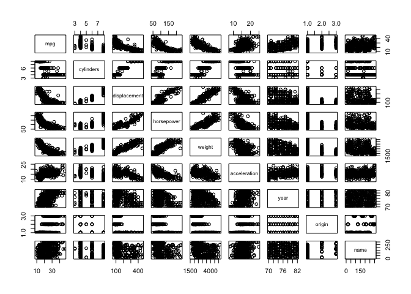<!-- -->

It looks like there are a few non-linear relationships between the variables in the Auto dataset. For instance, mpg vs displacement, horsepower, weight, and acceleration seem to be at least quadratic.

```r
require(boot)
set.seed(1)
cv.error <- rep(0,5)

for (i in 1:5){
glm.fit <- glm(mpg ~ poly(weight,i),data=Auto)
cv.error[i]<- cv.glm(Auto,glm.fit,K=10)$delta[1]
}
cv.error
```

```
## [1] 18.86380 17.50552 17.58858 17.86893 17.76075
```

```r
plot(cv.error, type="b", xlab="Degree", ylab="Test MSE")
points(which.min(cv.error), cv.error[2], col="red", pch=20, cex=2)
```

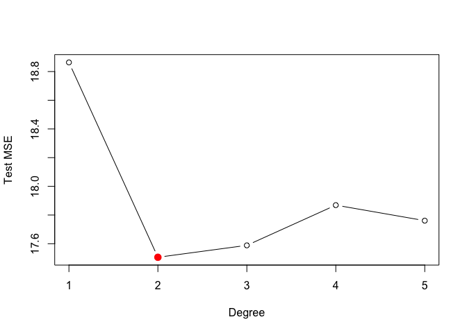<!-- -->


```r
fit.1 <- lm(mpg ~ poly(weight, 5), data=Auto)
summary(fit.1)
```

```
## 
## Call:
## lm(formula = mpg ~ poly(weight, 5), data = Auto)
## 
## Residuals:
##      Min       1Q   Median       3Q      Max 
## -12.8872  -2.7327  -0.3687   1.8744  16.3456 
## 
## Coefficients:
##                   Estimate Std. Error t value Pr(>|t|)    
## (Intercept)        23.4459     0.2114 110.906  < 2e-16 ***
## poly(weight, 5)1 -128.4436     4.1856 -30.687  < 2e-16 ***
## poly(weight, 5)2   23.1589     4.1856   5.533 5.82e-08 ***
## poly(weight, 5)3    0.2204     4.1856   0.053    0.958    
## poly(weight, 5)4   -2.8079     4.1856  -0.671    0.503    
## poly(weight, 5)5    3.8301     4.1856   0.915    0.361    
## ---
## Signif. codes:  0 '***' 0.001 '**' 0.01 '*' 0.05 '.' 0.1 ' ' 1
## 
## Residual standard error: 4.186 on 386 degrees of freedom
## Multiple R-squared:  0.7161,	Adjusted R-squared:  0.7124 
## F-statistic: 194.7 on 5 and 386 DF,  p-value: < 2.2e-16
```

The fit suggests that the relationship between mpg and weight is best described as quadratic.


```r
set.seed(1)
cv.error <- rep(0,10)

for (i in 1:10){
glm.fit <- glm(horsepower ~ poly(acceleration,i),data=Auto)
cv.error[i]<- cv.glm(Auto,glm.fit,K=10)$delta[1]
}
cv.error
```

```
##  [1] 786.9534 673.9428 672.4211 666.9613 635.9822 631.5672 648.8701
##  [8] 644.5880 630.7797 644.8183
```

```r
plot(cv.error, type="b", xlab="Degree", ylab="Test MSE")
points(which.min(cv.error), cv.error[9], col="red", pch=20, cex=2)
```

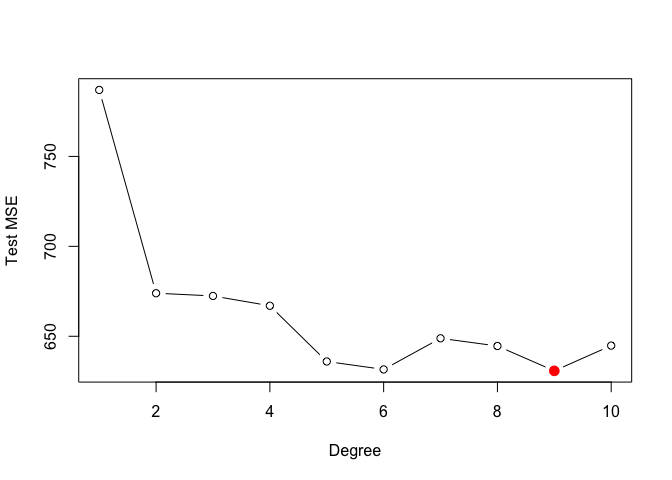<!-- -->

We see that the minimal test MSE occurs at the 9th degree of acceleration, however we can also see that the test MSE is drastically lowered from 1st to 2nd degree, and then further to the 5th degree, where it looks like it's about the same as the 9th degree.


```r
fit.2 <- lm(horsepower ~ poly(acceleration, 10), data=Auto)
summary(fit.2)
```

```
## 
## Call:
## lm(formula = horsepower ~ poly(acceleration, 10), data = Auto)
## 
## Residuals:
##     Min      1Q  Median      3Q     Max 
## -78.073 -16.400  -0.838  13.993 109.740 
## 
## Coefficients:
##                          Estimate Std. Error t value Pr(>|t|)    
## (Intercept)               104.469      1.267  82.469  < 2e-16 ***
## poly(acceleration, 10)1  -524.556     25.081 -20.915  < 2e-16 ***
## poly(acceleration, 10)2   214.646     25.081   8.558 2.85e-16 ***
## poly(acceleration, 10)3   -32.976     25.081  -1.315 0.189377    
## poly(acceleration, 10)4   -91.686     25.081  -3.656 0.000293 ***
## poly(acceleration, 10)5    83.141     25.081   3.315 0.001005 ** 
## poly(acceleration, 10)6     4.627     25.081   0.184 0.853732    
## poly(acceleration, 10)7     5.879     25.081   0.234 0.814790    
## poly(acceleration, 10)8   -22.716     25.081  -0.906 0.365655    
## poly(acceleration, 10)9    37.100     25.081   1.479 0.139906    
## poly(acceleration, 10)10    6.243     25.081   0.249 0.803559    
## ---
## Signif. codes:  0 '***' 0.001 '**' 0.01 '*' 0.05 '.' 0.1 ' ' 1
## 
## Residual standard error: 25.08 on 381 degrees of freedom
## Multiple R-squared:  0.5863,	Adjusted R-squared:  0.5754 
## F-statistic: 53.99 on 10 and 381 DF,  p-value: < 2.2e-16
```

The summary confirms that we see improvement in the model in the 2nd degree, an then in the 4th and 5th. We don't see any significant improvement after that.  

9. This question uses the variables `dis` (the weighted mean of distances to five `Boston` employment centers) and `nox` (nitrogen oxides concen- tration in parts per 10 million) from the `Boston` data. We will treat `dis` as the predictor and `nox` as the response. 


```r
require(MASS)
```

```
## Loading required package: MASS
```

```r
data(Boston)
attach(Boston)
```

```
## The following object is masked from Wage:
## 
##     age
```

(a) Use the `poly()` function to fit a cubic polynomial regression to predict `nox` using `dis`. Report the regression output, and plot the resulting data and polynomial fits.


```r
fit.a <- lm(nox ~ poly(dis, 3), data=Boston)
summary(fit.a)
```

```
## 
## Call:
## lm(formula = nox ~ poly(dis, 3), data = Boston)
## 
## Residuals:
##       Min        1Q    Median        3Q       Max 
## -0.121130 -0.040619 -0.009738  0.023385  0.194904 
## 
## Coefficients:
##                Estimate Std. Error t value Pr(>|t|)    
## (Intercept)    0.554695   0.002759 201.021  < 2e-16 ***
## poly(dis, 3)1 -2.003096   0.062071 -32.271  < 2e-16 ***
## poly(dis, 3)2  0.856330   0.062071  13.796  < 2e-16 ***
## poly(dis, 3)3 -0.318049   0.062071  -5.124 4.27e-07 ***
## ---
## Signif. codes:  0 '***' 0.001 '**' 0.01 '*' 0.05 '.' 0.1 ' ' 1
## 
## Residual standard error: 0.06207 on 502 degrees of freedom
## Multiple R-squared:  0.7148,	Adjusted R-squared:  0.7131 
## F-statistic: 419.3 on 3 and 502 DF,  p-value: < 2.2e-16
```


```r
dis_range <- range(dis)
dis_grid <- seq(from=dis_range[1], to=dis_range[2], by=0.1)
pred <- predict(fit.a, newdata = list(dis=dis_grid), se=TRUE)
se_bands <- cbind(pred$fit + 2*pred$se.fit, pred$fit - 2*pred$se.fit)

plot(dis, nox, xlim=dis_range, cex=0.5, col="darkgrey")
lines(dis_grid, pred$fit, lwd=2, col="blue")
matlines(dis_grid, se_bands, lwd=1, col="blue", lty=3)
```

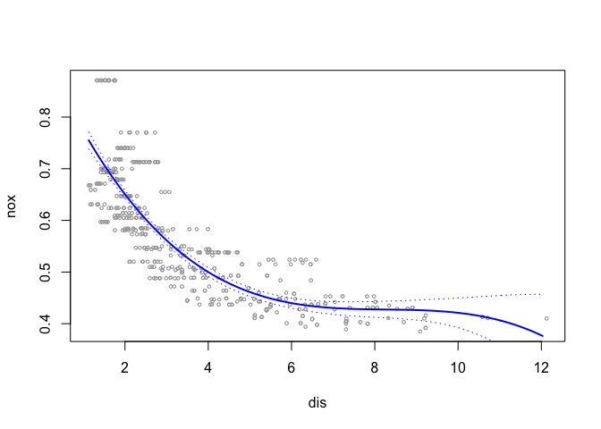<!-- -->

(b) Plot the polynomial fits for a range of different polynomial degrees (say, from 1 to 10), and report the associated residual sum of squares.


```r
rss.errors <- rep(0, 10)

for(i in 1:10){
  fit <- lm(nox ~ poly(dis, i), data=Auto)
  rss.errors[i] <- sum(fit$residuals^2)
}
rss.errors
```

```
##  [1] 2.768563 2.035262 1.934107 1.932981 1.915290 1.878257 1.849484
##  [8] 1.835630 1.833331 1.832171
```

```r
which.min(rss.errors)
```

```
## [1] 10
```


```r
plot(rss.errors, type='b', xlab = 'Degrees', ylab='RSS')
```

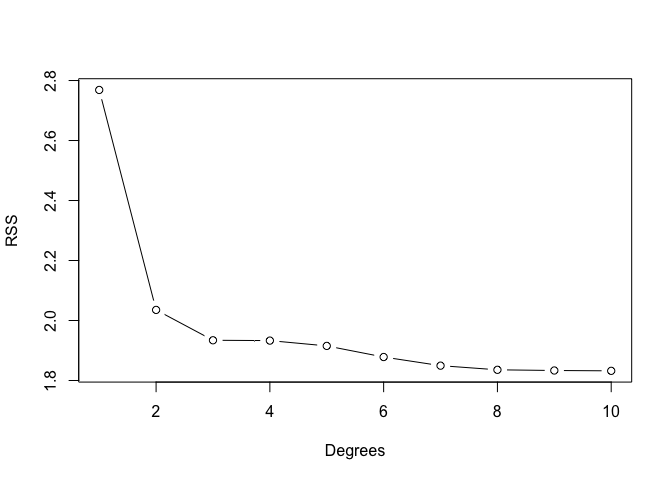<!-- -->

The RSS seems to be decreasing as the degrees increase; the lowest RSS is with a 10 degree polynomial.  

(c) Perform cross-validation or another approach to select the optimal degree for the polynomial, and explain your results.


```r
require(boot)
set.seed(3)
cv.errors <- rep(NA, 10)

for (i in 1:10){
  fit <- glm(nox ~ poly(dis, i), data=Boston)
  cv.errors[i] <- cv.glm(Boston, fit, K=10)$delta[1]
}
cv.errors
```

```
##  [1] 0.005531104 0.004080719 0.003867509 0.003896843 0.004162748
##  [6] 0.004967531 0.011901269 0.005558522 0.023161737 0.004294910
```

```r
which.min(cv.errors)
```

```
## [1] 3
```


```r
plot(cv.errors, type='b')
points(which.min(cv.errors), cv.errors[3], col="red", pch=20, cex=2)
```

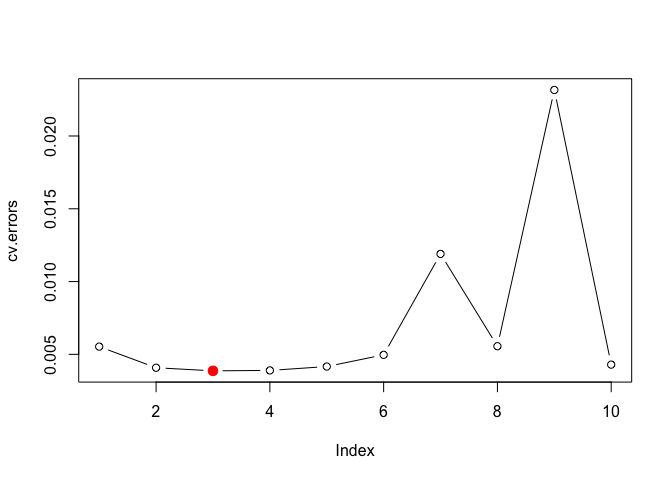<!-- -->

The degree of the polynomial that minimizes test MSE is 3.  

(d) Use the `bs()` function to fit a regression spline to predict nox using dis. Report the output for the fit using four degrees of freedom. How did you choose the knots? Plot the resulting fit.


```r
require(splines)

fit <- lm(nox ~ bs(dis, df=4), data=Boston)
summary(fit)
```

```
## 
## Call:
## lm(formula = nox ~ bs(dis, df = 4), data = Boston)
## 
## Residuals:
##       Min        1Q    Median        3Q       Max 
## -0.124622 -0.039259 -0.008514  0.020850  0.193891 
## 
## Coefficients:
##                  Estimate Std. Error t value Pr(>|t|)    
## (Intercept)       0.73447    0.01460  50.306  < 2e-16 ***
## bs(dis, df = 4)1 -0.05810    0.02186  -2.658  0.00812 ** 
## bs(dis, df = 4)2 -0.46356    0.02366 -19.596  < 2e-16 ***
## bs(dis, df = 4)3 -0.19979    0.04311  -4.634 4.58e-06 ***
## bs(dis, df = 4)4 -0.38881    0.04551  -8.544  < 2e-16 ***
## ---
## Signif. codes:  0 '***' 0.001 '**' 0.01 '*' 0.05 '.' 0.1 ' ' 1
## 
## Residual standard error: 0.06195 on 501 degrees of freedom
## Multiple R-squared:  0.7164,	Adjusted R-squared:  0.7142 
## F-statistic: 316.5 on 4 and 501 DF,  p-value: < 2.2e-16
```

```r
attr(bs(dis,df=4),"knots")
```

```
##     50% 
## 3.20745
```

There is only one knot at dis 3.20745, which is located at 50th percentile of dis.  

(e) Now fit a regression spline for a range of degrees of freedom, and plot the resulting fits and report the resulting RSS. Describe the results obtained.


```r
rss.errors <- rep(NA, 13)

for(i in 3:15){
  fit <- lm(nox ~ bs(dis, df=i), data=Auto)
  rss.errors[i] <- sum(fit$residuals^2)
}
rss.errors
```

```
##  [1]       NA       NA 1.934107 1.922775 1.840173 1.833966 1.829884
##  [8] 1.816995 1.825653 1.792535 1.796992 1.788999 1.782350 1.781838
## [15] 1.782798
```

```r
which.min(rss.errors)
```

```
## [1] 14
```


```r
plot(3:15, rss.errors[3:15], type='b')
points(which.min(rss.errors), rss.errors[14], pch=20, cex=2, col="red")
```

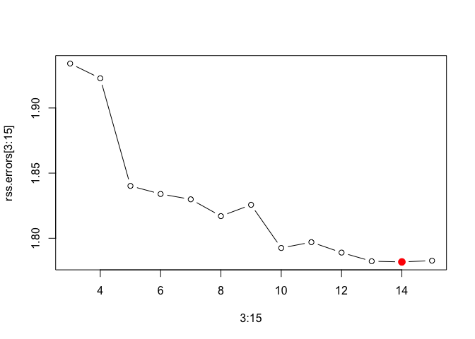<!-- -->

The smallest RSS occurs when df=14.  

(f) Perform cross-validation or another approach in order to select the best degrees of freedom for a regression spline on this data. Describe your results.


```r
require(boot)
set.seed(5)
cv.errors <- rep(NA, 13)

for (i in 3:15){
  fit <- glm(nox ~ bs(dis, df=i), data=Boston)
  cv.errors[i] <- cv.glm(Boston, fit, K=10)$delta[1]
}
cv.errors
```

```
##  [1]          NA          NA 0.003865562 0.003887367 0.003694517
##  [6] 0.003683105 0.003707097 0.003676455 0.003725464 0.003683739
## [11] 0.003799816 0.003688500 0.003749198 0.003743888 0.003732823
```

```r
which.min(cv.errors)
```

```
## [1] 8
```

```r
plot(3:15, cv.errors[3:15], type='b')
points(which.min(cv.errors), cv.errors[8], pch=20, cex=2, col="red")
```

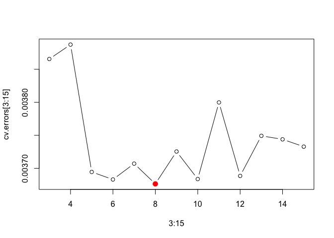<!-- -->

The optimal df selected by cross-validation is 8.  


10. This question relates to the College data set.  


```r
require(ISLR)
data(College)
attach(College)
```

(a) Split the data into a training set and a test set. Using out-of-state tuition as the response and the other variables as the predictors, perform forward stepwise selection on the training set in order to identify a satisfactory model that uses just a subset of the predictors.


```r
# Split into train & test
set.seed(5)
test_sample <- sample(1:nrow(College), nrow(College)/4)
train <- College[-test_sample, ]
test <- College[test_sample, ]
```


```r
# Forward Stepwise Selection
require(leaps)
```

```
## Loading required package: leaps
```

```r
fwd <- regsubsets(Outstate ~ ., data=train, nvmax=17, method='forward')
```


```r
fwd_sum <- summary(fwd)

par(mfrow=c(2,2))
plot(fwd_sum$cp ,xlab="Number of Variables ", ylab="Cp",
type="b")
points(which.min(fwd_sum$cp), fwd_sum$cp[which.min(fwd_sum$cp)], col="red", cex=2, pch=20)

plot(fwd_sum$bic ,xlab="Number of Variables ", 
ylab="BIC",type="b")
points(which.min(fwd_sum$bic), fwd_sum$bic[which.min(fwd_sum$bic)], col="red", cex=2, pch=20)

plot(fwd_sum$adjr2 ,xlab="Number of Variables ", 
ylab="Adjusted R^2^",type="b")
points(which.max(fwd_sum$adjr2), fwd_sum$adjr2[which.max(fwd_sum$adjr2)], col="red", cex=2, pch=20)
```

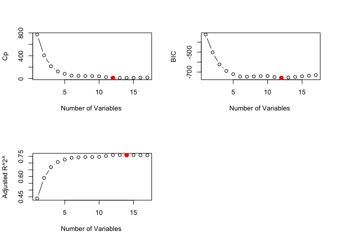<!-- -->

```r
which.min(fwd_sum$cp)
```

```
## [1] 12
```

```r
which.min(fwd_sum$bic)
```

```
## [1] 12
```

```r
which.max(fwd_sum$adjr2)
```

```
## [1] 14
```

```r
test_matrix <- model.matrix(Outstate~., data=test)

val.errors <- rep(NA,17)
for(i in 1:17){
 coefi <- coef(fwd,id=i)
 pred <- test_matrix[,names(coefi)]%*%coefi
 val.errors[i] <- mean((test$Outstate-pred)^2) 
}

which.min(val.errors)
```

```
## [1] 12
```

```r
plot(val.errors, type='b')
points(which.min(val.errors), val.errors[12], col='red', pch=20, cex=2)
```

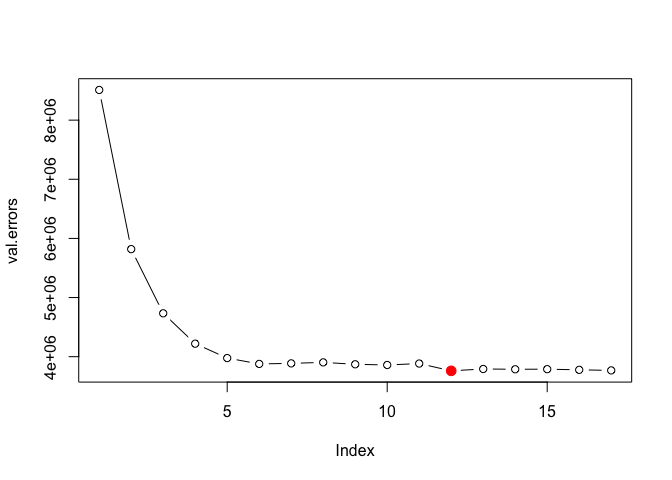<!-- -->

The best model selected using the forward stepwise method is one that has 12 variables, but by looking at the plot, we see that a simpler model could be enough, as the test MSE doesn't decrease significantly after 6 variables.


```r
# Perform Forward Subset Selection on the entire dataset to get an accurate estimate of the variables and coefficients
fwd_full <- regsubsets(Outstate ~ ., data=College, nvmax=17, method='forward')
coef(fwd_full, 6)
```

```
##   (Intercept)    PrivateYes    Room.Board           PhD   perc.alumni 
## -3553.2345268  2768.6347025     0.9679086    35.5283359    48.4221031 
##        Expend     Grad.Rate 
##     0.2210255    29.7119093
```

(b) Fit a GAM on the training data, using out-of-state tuition as the response and the features selected in the previous step as the predictors. Plot the results, and explain your findings.  


```r
require(gam)
require(splines)

gam_fit <- gam(Outstate ~ Private + s(Room.Board, 3) + s(Terminal, 3) + s(perc.alumni, 3) + s(Expend, 3) + s(Grad.Rate, 3), data=train)

par(mfrow=c(2,3))
plot(gam_fit, se=TRUE, col="blue")
```

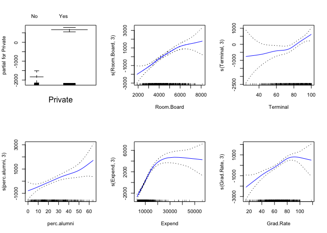<!-- -->

(c) Evaluate the model obtained on the test set, and explain the results obtained.


```r
preds <- predict(gam_fit, newdata = test)
error <- mean((test$Outstate-preds)^2)
```


```r
val.errors[6]-error
```

```
## [1] 314186.6
```

GAM model does better than a simple linear model with 6 variables.

(d) For which variables, if any, is there evidence of a non-linear relationship with the response?

```r
summary(gam_fit)
```

```
## 
## Call: gam(formula = Outstate ~ Private + s(Room.Board, 3) + s(Terminal, 
##     3) + s(perc.alumni, 3) + s(Expend, 3) + s(Grad.Rate, 3), 
##     data = train)
## Deviance Residuals:
##      Min       1Q   Median       3Q      Max 
## -6914.35 -1090.01    64.72  1207.64  8151.41 
## 
## (Dispersion Parameter for gaussian family taken to be 3534957)
## 
##     Null Deviance: 9356462904 on 582 degrees of freedom
## Residual Deviance: 2000785323 on 565.9998 degrees of freedom
## AIC: 10463.83 
## 
## Number of Local Scoring Iterations: 2 
## 
## Anova for Parametric Effects
##                    Df     Sum Sq    Mean Sq F value    Pr(>F)    
## Private             1 2353846993 2353846993  665.88 < 2.2e-16 ***
## s(Room.Board, 3)    1 1877988458 1877988458  531.26 < 2.2e-16 ***
## s(Terminal, 3)      1  602015490  602015490  170.30 < 2.2e-16 ***
## s(perc.alumni, 3)   1  400404106  400404106  113.27 < 2.2e-16 ***
## s(Expend, 3)        1  779863934  779863934  220.61 < 2.2e-16 ***
## s(Grad.Rate, 3)     1  135884476  135884476   38.44 1.089e-09 ***
## Residuals         566 2000785323    3534957                      
## ---
## Signif. codes:  0 '***' 0.001 '**' 0.01 '*' 0.05 '.' 0.1 ' ' 1
## 
## Anova for Nonparametric Effects
##                   Npar Df Npar F   Pr(F)    
## (Intercept)                                 
## Private                                     
## s(Room.Board, 3)        2  2.390 0.09256 .  
## s(Terminal, 3)          2  1.855 0.15741    
## s(perc.alumni, 3)       2  0.604 0.54702    
## s(Expend, 3)            2 45.696 < 2e-16 ***
## s(Grad.Rate, 3)         2  3.803 0.02288 *  
## ---
## Signif. codes:  0 '***' 0.001 '**' 0.01 '*' 0.05 '.' 0.1 ' ' 1
```

The model suggests a strong non-linear relationship between "Outstate" and "Expend", and a moderate non-linear relationship between "Outstate" and "Grad.rate"


tbd


