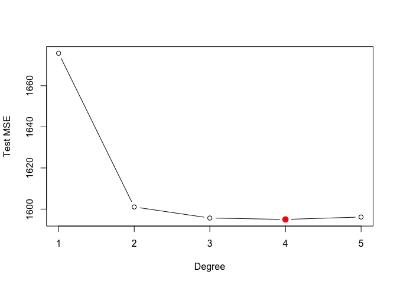
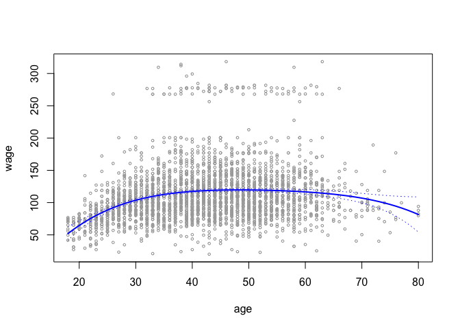
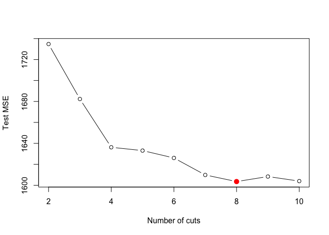
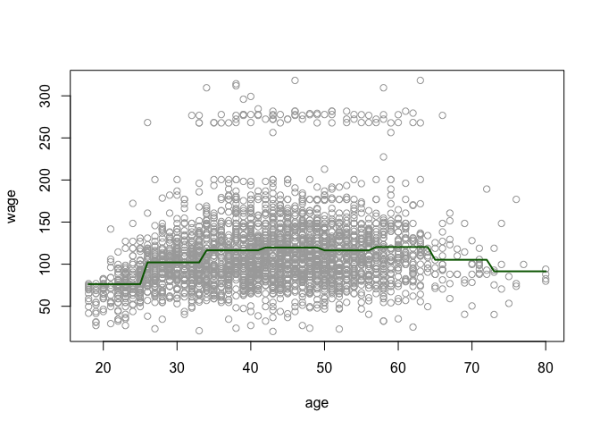
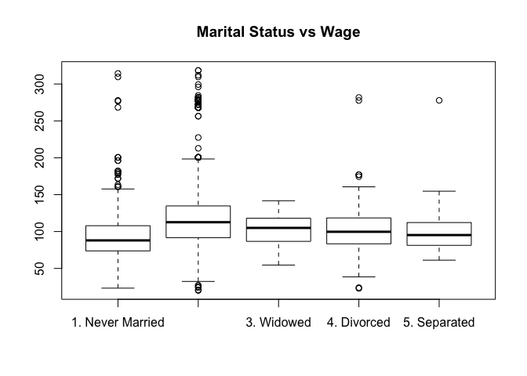
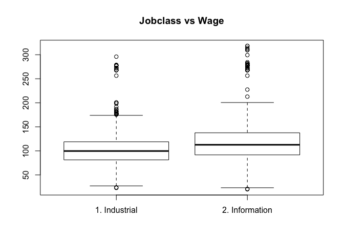
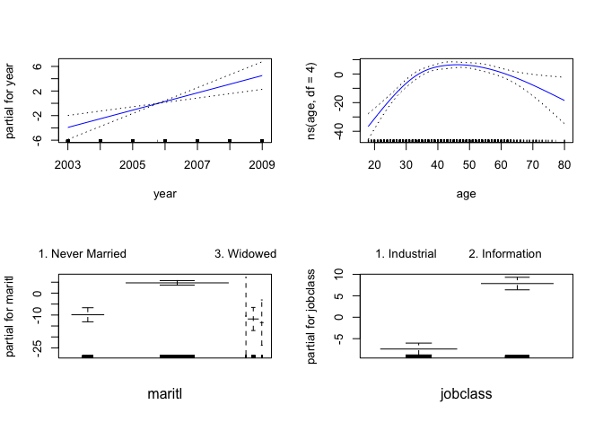

# Ch. 7 Exercises


6. In this exercise, you will further analyze the `Wage` data set considered throughout this chapter.  

```r
require(ISLR) 
attach(Wage)
```

(a) Perform polynomial regression to predict `wage` using `age`. Use cross-validation to select the optimal degree d for the polynomial. What degree was chosen, and how does this compare to the results of hypothesis testing using ANOVA? Make a plot of the resulting polynomial fit to the data.  

#### Picking the optimal degree using cross-validation


```r
require(boot)
set.seed(15)
cv.error <- rep(0,5)

for (i in 1:5){
glm.fit <- glm(wage ~ poly(age,i),data=Wage)
cv.error[i]<- cv.glm(Wage,glm.fit,K=10)$delta[1]
}
cv.error
```

```
## [1] 1675.809 1601.039 1595.649 1594.978 1596.151
```

```r
plot(cv.error, type="b", xlab="Degree", ylab="Test MSE")
points(which.min(cv.error), cv.error[4], col="red", pch=20, cex=2)
```

<!-- -->

The optimal degree chosen by cross-validation is 4.

#### Picking the optimal value using ANOVA


```r
fit_1 <- lm(wage ~ age, data=Wage)
fit_2 <- lm(wage ~ poly(age, 2), data=Wage) 
fit_3 <- lm(wage ~ poly(age, 3), data=Wage) 
fit_4 <- lm(wage ~ poly(age, 4), data=Wage) 
fit_5 <- lm(wage ~ poly(age, 5), data=Wage) 
anova(fit_1, fit_2, fit_3, fit_4, fit_5)
```

```
## Analysis of Variance Table
## 
## Model 1: wage ~ age
## Model 2: wage ~ poly(age, 2)
## Model 3: wage ~ poly(age, 3)
## Model 4: wage ~ poly(age, 4)
## Model 5: wage ~ poly(age, 5)
##   Res.Df     RSS Df Sum of Sq        F    Pr(>F)    
## 1   2998 5022216                                    
## 2   2997 4793430  1    228786 143.5931 < 2.2e-16 ***
## 3   2996 4777674  1     15756   9.8888  0.001679 ** 
## 4   2995 4771604  1      6070   3.8098  0.051046 .  
## 5   2994 4770322  1      1283   0.8050  0.369682    
## ---
## Signif. codes:  0 '***' 0.001 '**' 0.01 '*' 0.05 '.' 0.1 ' ' 1
```

The p-value indicates that either a cubic or quadratic fit provide a reasonable fit to the data.  


```r
# Make a plot

age_lim <- range(age)
age_grid <- seq(from=age_lim[1], to=age_lim[2])
preds <- predict(fit_4, newdata=list(age=age_grid),se=TRUE)
se_bands <- cbind(preds$fit+2*preds$se.fit,preds$fit-2*preds$se.fit)

plot(age, wage, xlim=age_lim, cex=.5, col="darkgrey")
lines(age_grid, preds$fit, lwd=2, col="blue")
matlines(age_grid, se_bands, lwd=1, col="blue", lty=3)
```

<!-- -->


(b) Fit a step function to predict `wage` using `age`, and perform cross- validation to choose the optimal number of cuts. Make a plot of the fit obtained.


```r
require(boot)
set.seed(2)

cv.errors <- rep(NA, 10)

for(i in 2:10){
  Wage$age.cut <- cut(Wage$age,i)
  glm.fit <- glm(wage ~ age.cut, data=Wage)
  cv.errors[i] <- cv.glm(Wage, glm.fit, K=10)$delta[1]
}

cv.errors
```

```
##  [1]       NA 1734.784 1682.323 1636.265 1633.101 1626.087 1609.855
##  [8] 1603.556 1608.339 1603.996
```

```r
plot(2:10, cv.errors[-1], type="b", xlab="Number of cuts", ylab="Test MSE")
points(which.min(cv.errors), cv.errors[which.min(cv.errors)], col="red", pch=20, cex=2)
```

<!-- -->

The optimal number of cuts is 8.


```r
# Make a plot of the fit

fit_step <- glm(wage ~ cut(age, 8), data=Wage)
preds <- predict(fit_step, data.frame(age = age_grid))
plot(age, wage, col="darkgray")
lines(age_grid, preds, col="darkgreen", lwd=2)
```

<!-- -->


7. The `Wage` data set contains a number of other features not explored in this chapter, such as marital status `(maritl)`, job class `(jobclass)`, and others. Explore the relationships between some of these other predictors and `wage`, and use non-linear fitting techniques in order to fit flexible models to the data. Create plots of the results obtained, and write a summary of your findings.


```r
summary(maritl)
```

```
## 1. Never Married       2. Married       3. Widowed      4. Divorced 
##              648             2074               19              204 
##     5. Separated 
##               55
```

```r
plot(maritl, wage)
title("Marital Status vs Wage")
```

<!-- -->

From this plot we can tell that married men have the highest wages of all the groups on average (also it looks like the highest variability as well). 

```r
summary(jobclass)
```

```
##  1. Industrial 2. Information 
##           1544           1456
```

```r
plot(jobclass, wage)
title("Jobclass vs Wage")
```

<!-- -->

Jobs within the Information sector pay more on average than the Industrial sector.

#### Fit a GAM model 


```r
require(gam)

gam.1 <- gam(wage ~ year + ns(age, df=4), data=Wage)
gam.2 <- gam(wage ~ year + ns(age, df=4) + maritl, data=Wage)
gam.3 <- gam(wage ~ year + ns(age, df=4) + jobclass, data=Wage)
gam.4 <- gam(wage ~ year + ns(age, df=4) + maritl + jobclass, data=Wage)
```


```r
anova(gam.1, gam.2, gam.4, test="F")
```

```
## Analysis of Deviance Table
## 
## Model 1: wage ~ year + ns(age, df = 4)
## Model 2: wage ~ year + ns(age, df = 4) + maritl
## Model 3: wage ~ year + ns(age, df = 4) + maritl + jobclass
##   Resid. Df Resid. Dev Df Deviance       F    Pr(>F)    
## 1      2994    4751497                                  
## 2      2990    4627863  4   123634  20.734 < 2.2e-16 ***
## 3      2989    4455744  1   172119 115.461 < 2.2e-16 ***
## ---
## Signif. codes:  0 '***' 0.001 '**' 0.01 '*' 0.05 '.' 0.1 ' ' 1
```


```r
anova(gam.1, gam.3, gam.4, test="F")
```

```
## Analysis of Deviance Table
## 
## Model 1: wage ~ year + ns(age, df = 4)
## Model 2: wage ~ year + ns(age, df = 4) + jobclass
## Model 3: wage ~ year + ns(age, df = 4) + maritl + jobclass
##   Resid. Df Resid. Dev Df Deviance      F    Pr(>F)    
## 1      2994    4751497                                 
## 2      2993    4583227  1   168270 112.88 < 2.2e-16 ***
## 3      2989    4455744  4   127483  21.38 < 2.2e-16 ***
## ---
## Signif. codes:  0 '***' 0.001 '**' 0.01 '*' 0.05 '.' 0.1 ' ' 1
```


```r
par(mfrow=c(2,2))
plot(gam.4, se=TRUE, col='blue')
```

<!-- -->

Both maritl and jobclass are significant variables in a model predicting wage.

