# Ch. 8 Exercises


7. In the lab, we applied random forests to the `Boston` data using `mtry=6` and using `ntree=25` and `ntree=500`. Create a plot displaying the test error resulting from random forests on this data set for a more comprehensive range of values for mtry and ntree. You can model your plot after Figure 8.10. Describe the results obtained.

```r
library(randomForest)
```

```
## randomForest 4.6-12
```

```
## Type rfNews() to see new features/changes/bug fixes.
```

```r
library(MASS)
data(Boston)
attach(Boston)
dim(Boston)
```

```
## [1] 506  14
```


```r
set.seed(134)
#Create train and test samples
train <- sample(1:nrow(Boston), nrow(Boston)/3)

x.train <- Boston[train, -14]
y.train <- Boston[train, 14]
x.test <- Boston[-train, -14]
y.test <- Boston[-train, 14]
```


```r
rf.1 <- randomForest(x=x.train, y=y.train, xtest=x.test, ytest=y.test, mtry=ncol(Boston)-1, ntree=1000)
rf.2 <- randomForest(x=x.train, y=y.train, xtest=x.test, ytest=y.test, mtry=floor((ncol(Boston)-1)/2), ntree=1000)
rf.3 <- randomForest(x=x.train, y=y.train, xtest=x.test, ytest=y.test, mtry=floor(sqrt(ncol(Boston)-1)), ntree=1000)
```


```r
plot(1:1000, rf.1$test$mse, type='l', col='orange', xlab="Number of trees", ylab = "Test MSE", ylim=c(11, 16))
lines(1:1000, rf.2$test$mse, type='l', col="blue")
lines(1:1000, rf.3$test$mse, type='l', col="darkgreen")
legend("topright", legend=c("mtry=p", "mtry=p/2", "mtry=sqrt(p)"), col=c("orange", "blue", "darkgreen"), lty=1, cex=1)
which.min(rf.1$test$mse)
```

```
## [1] 6
```

```r
which.min(rf.2$test$mse)
```

```
## [1] 213
```

```r
which.min(rf.3$test$mse)
```

```
## [1] 52
```

```r
points(which.min(rf.1$test$mse), rf.1$test$mse[6], col="red", cex=2)
points(which.min(rf.2$test$mse), rf.2$test$mse[213], col="red", cex=2)
points(which.min(rf.3$test$mse), rf.3$test$mse[52], col="red", cex=2)
```

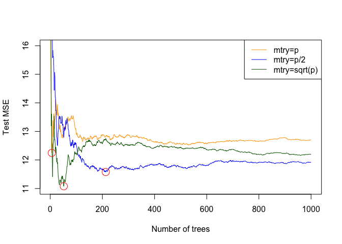<!-- -->

We see that the Test MSE is minimized when the number of variables sampled at each node is sqrt(p), and the number of trees is 52. After that, the test MSE increases. We see that the test MSE for mtry=p/2 decreases and stays low up until around 200 trees, before slightly increasing again. Test MSE is highest when mtry=p, and it reaches its lowest test MSE when ntrees=6.

8. In the lab, a classification tree was applied to the `Carseats` data set after converting `Sales` into a qualitative response variable. Now we will seek to predict `Sales` using regression trees and related approaches, treating the response as a quantitative variable.  

```r
library(ISLR)
library(tree)
attach(Carseats)
```

(a) Split the data set into a training set and a test set.

```r
set.seed(456)
train <- sample(1:nrow(Carseats), nrow(Carseats)/3)
Carseats.train <- Carseats[train, ]
Carseats.test <- Carseats[-train, ]
y.test <- Carseats.test$Sales
```

(b) Fit a regression tree to the training set. Plot the tree, and interpret the results. What test error rate do you obtain?  

```r
car.tree <- tree(Sales ~ ., data=Carseats.train)
summary(car.tree)
```

```
## 
## Regression tree:
## tree(formula = Sales ~ ., data = Carseats.train)
## Variables actually used in tree construction:
## [1] "ShelveLoc"   "Age"         "CompPrice"   "Price"       "Advertising"
## [6] "Population" 
## Number of terminal nodes:  16 
## Residual mean deviance:  1.738 = 203.3 / 117 
## Distribution of residuals:
##    Min. 1st Qu.  Median    Mean 3rd Qu.    Max. 
##  -3.212  -0.780   0.141   0.000   0.894   3.751
```

```r
plot(car.tree)
text(car.tree, pretty=0)
```

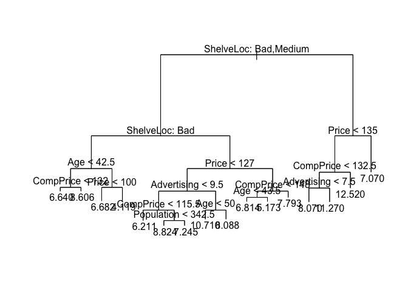<!-- -->


```r
yhat <- predict(car.tree, newdata=Carseats.test)
mean((yhat - y.test)^2)
```

```
## [1] 5.941745
```

The test error is 5.94. 

(c) Use cross-validation in order to determine the optimal level of tree complexity. Does pruning the tree improve the test error rate?  


```r
cv.Carseats <- cv.tree(car.tree)
plot(cv.Carseats$size, cv.Carseats$dev, type='b')
```

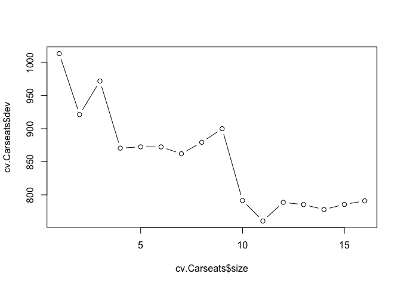<!-- -->

```r
prune.Carseats <- prune.tree(car.tree, best=11)
plot(prune.Carseats)
text(prune.Carseats, pretty=0)
```

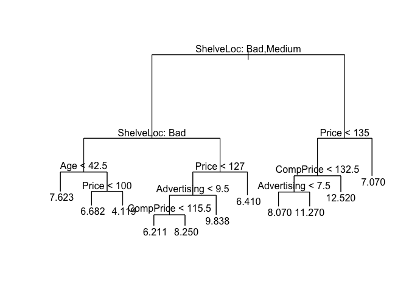<!-- -->

```r
yhat <- predict(prune.Carseats, Carseats.test)
mean((yhat-y.test)^2)
```

```
## [1] 6.033721
```

In this case, pruning resulted in higher test MSE.

(d) Use the bagging approach in order to analyze this data. What test error rate do you obtain? Use the `importance()` function to determine which variables are most important.  

```r
require(randomForest)
bag.Carseats <- randomForest(Sales ~., data=Carseats.train, mtry=10, importance=TRUE)
```


```r
yhat.bag <- predict(bag.Carseats, newdata=Carseats.test)
mean((yhat.bag-y.test)^2)
```

```
## [1] 3.701408
```

Bagging decreases the test MSE to 3.7.

```r
importance(bag.Carseats)
```

```
##               %IncMSE IncNodePurity
## CompPrice   16.899526    104.453513
## Income       4.293574     72.011911
## Advertising 15.612781    135.328747
## Population   1.521859     40.866301
## Price       28.183233    187.087965
## ShelveLoc   34.393343    252.462028
## Age         10.471261     87.497267
## Education    1.044461     24.177085
## Urban        3.689382     10.681987
## US           1.027006      5.914018
```

```r
varImpPlot(bag.Carseats)
```

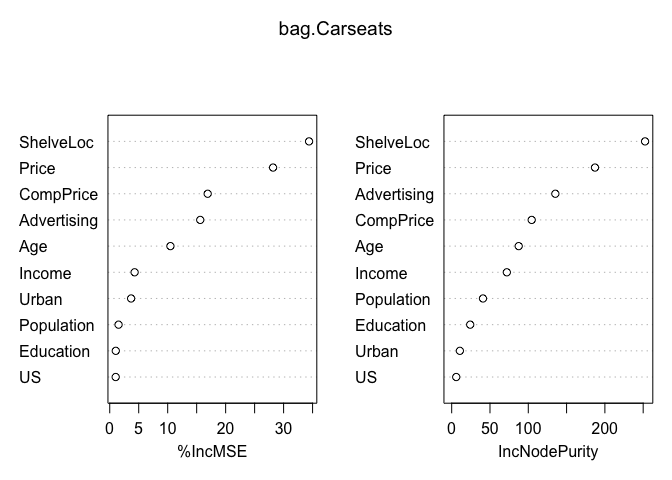<!-- -->

The two most important variables are ShelveLoc and Price.  


(e) Use random forests to analyze this data. What test error rate do you obtain? Use the `importance()` function to determine which variables are most important. Describe the effect of m, the number of variables considered at each split, on the error rate obtained.


```r
rf.Carseats <- randomForest(Sales~., data=Carseats.train, mtry=floor((ncol(Carseats)-1)/3),importance=TRUE)
```

```r
yhat.rf <- predict(rf.Carseats, newdata = Carseats.test)
mean((yhat.rf-y.test)^2)
```

```
## [1] 4.567363
```

When using p/3 variables at each node in random forest, we obtain a higher test MSE (4.43) than by bagging.

```r
importance(rf.Carseats)
```

```
##                %IncMSE IncNodePurity
## CompPrice   11.7871290     108.93962
## Income       3.2014315      83.21027
## Advertising 15.3653181     134.79871
## Population  -0.2806728      67.89261
## Price       20.3176311     143.12869
## ShelveLoc   27.7860892     175.70573
## Age          8.9600635      96.17402
## Education   -0.2472758      38.57338
## Urban        0.1395236      11.52172
## US           5.6386770      19.75942
```

```r
varImpPlot(rf.Carseats)
```

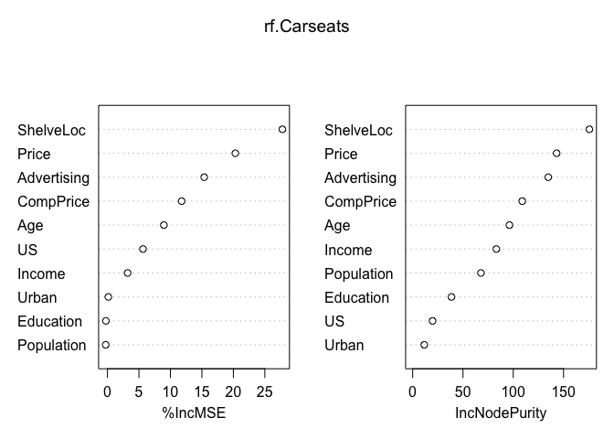<!-- -->

The two most important variables are ShelveLoc and Price - the same variables that were most important in bagging.


9. This problem involves the `OJ` data set which is part of the `ISLR` package.


```r
require(ISLR)
data(OJ)
attach(OJ)
```

(a) Create a training set containing a random sample of 800 observations, and a test set containing the remaining observations.  


```r
set.seed(87)
train_n <- sample(1:nrow(OJ), 800)
train_OJ <- OJ[train_n, ]
test_OJ <- OJ[-train_n, ]
```

(b) Fit a tree to the training data, with `Purchase` as the response and the other variables except for `Buy` as predictors. Use the `summary()` function to produce summary statistics about the tree, and describe the results obtained. What is the training error rate? How many terminal nodes does the tree have?  


```r
require(tree)
tree_OJ <- tree(Purchase ~., data=train_OJ) # There's no variable "Buy" in this dataset
summary(tree_OJ)
```

```
## 
## Classification tree:
## tree(formula = Purchase ~ ., data = train_OJ)
## Variables actually used in tree construction:
## [1] "LoyalCH"     "SalePriceMM" "SpecialCH"   "PriceDiff"  
## Number of terminal nodes:  9 
## Residual mean deviance:  0.7224 = 571.4 / 791 
## Misclassification error rate: 0.15 = 120 / 800
```

There are 9 terminal nodes in this tree. The training error is 0.15.


(c) Type in the name of the tree object in order to get a detailed text output. Pick one of the terminal nodes, and interpret the information displayed.  


```r
tree_OJ
```

```
## node), split, n, deviance, yval, (yprob)
##       * denotes terminal node
## 
##  1) root 800 1076.00 CH ( 0.60125 0.39875 )  
##    2) LoyalCH < 0.48285 305  321.20 MM ( 0.21967 0.78033 )  
##      4) LoyalCH < 0.276142 173  106.70 MM ( 0.09249 0.90751 ) *
##      5) LoyalCH > 0.276142 132  176.10 MM ( 0.38636 0.61364 )  
##       10) SalePriceMM < 2.04 73   76.78 MM ( 0.21918 0.78082 )  
##         20) SpecialCH < 0.5 59   46.83 MM ( 0.13559 0.86441 ) *
##         21) SpecialCH > 0.5 14   19.12 CH ( 0.57143 0.42857 ) *
##       11) SalePriceMM > 2.04 59   79.73 CH ( 0.59322 0.40678 ) *
##    3) LoyalCH > 0.48285 495  441.20 CH ( 0.83636 0.16364 )  
##      6) LoyalCH < 0.737888 223  274.30 CH ( 0.69507 0.30493 )  
##       12) PriceDiff < 0.25 133  182.70 CH ( 0.55639 0.44361 )  
##         24) PriceDiff < -0.165 31   35.40 MM ( 0.25806 0.74194 ) *
##         25) PriceDiff > -0.165 102  132.40 CH ( 0.64706 0.35294 ) *
##       13) PriceDiff > 0.25 90   58.51 CH ( 0.90000 0.10000 ) *
##      7) LoyalCH > 0.737888 272  104.40 CH ( 0.95221 0.04779 )  
##       14) PriceDiff < -0.39 11   14.42 CH ( 0.63636 0.36364 ) *
##       15) PriceDiff > -0.39 261   78.30 CH ( 0.96552 0.03448 ) *
```

The terminal node number 24 is the 4th split at the variable PriceDiff < -0.165, preceded by PriceDiff < 0.25, LoyalCH < 0.737888, and LoyalCH > 0.48285. There are 31 observations in this node, wth a deviance of 35.40. The numbers in parenthesis mean that roughly 26% of observations are misclassified as CH, which means that about 74% are correctly classified as MM.  

(d) Create a plot of the tree, and interpret the results.  

```r
plot(tree_OJ)
text(tree_OJ, pretty=0)
```

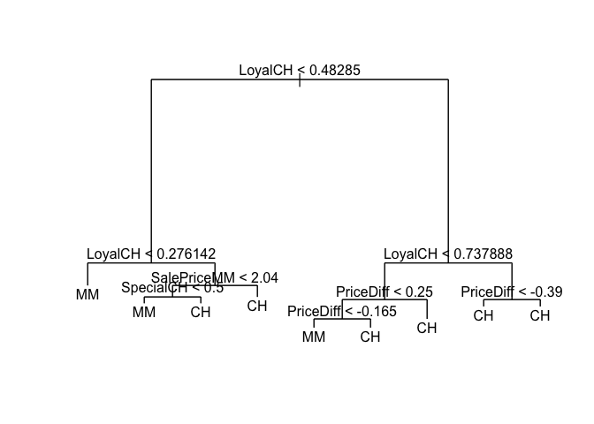<!-- -->

The first split occured at variable LoyalCH < 0.48. LoyalCH seems to be an important predictor, as there are 3 other splits at this variable. The other important indicator is PriceDiff, which occurs at 3 different splits as well.  

(e) Predict the response on the test data, and produce a confusion matrix comparing the test labels to the predicted test labels. What is the test error rate?


```r
y_test_OJ <- test_OJ$Purchase

tree_pred <- predict(tree_OJ, test_OJ, type="class")
table(tree_pred, y_test_OJ)
```

```
##          y_test_OJ
## tree_pred  CH  MM
##        CH 153  33
##        MM  19  65
```


```r
(19+33)/(153+33+19+65)
```

```
## [1] 0.1925926
```

The test error is 19.3%.

(f) Apply the `cv.tree()` function to the training set in order to determine the optimal tree size.


```r
cv_tree <- cv.tree(tree_OJ, FUN=prune.misclass)
cv_tree
```

```
## $size
## [1] 9 8 7 4 2 1
## 
## $dev
## [1] 141 141 141 152 151 319
## 
## $k
## [1]  -Inf   0.0   2.0   5.0   5.5 171.0
## 
## $method
## [1] "misclass"
## 
## attr(,"class")
## [1] "prune"         "tree.sequence"
```

In this case, the optimal tree size is 9 or 8 terminal nodes - they both results in the lowest cross-validation error of 143.   

(g) Produce a plot with tree size on the x-axis and cross-validated classification error rate on the y-axis.  


```r
plot(cv_tree$size, cv_tree$dev, type='b')
```

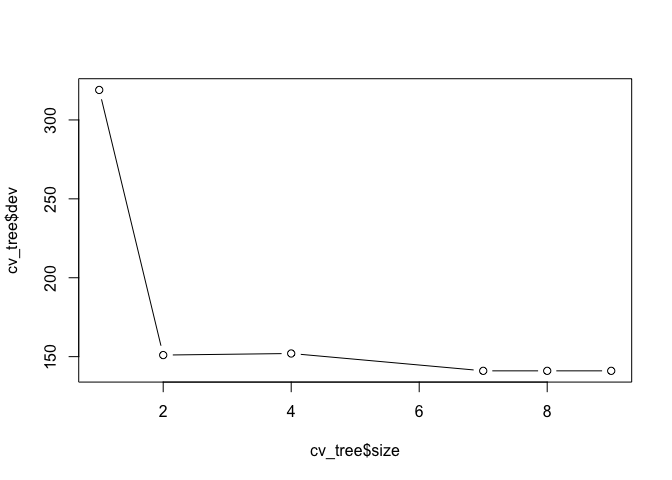<!-- -->

(h) Which tree size corresponds to the lowest cross-validated classification error rate?  
The lowest cross-validated classification error rate occurs when tree size is 8 or 9 - they both result in the same error of 143.  

(i) Produce a pruned tree corresponding to the optimal tree size obtained using cross-validation. If cross-validation does not lead to selection of a pruned tree, then create a pruned tree with five terminal nodes.


```r
prune_OJ <- prune.misclass(tree_OJ, best=5)
summary(prune_OJ)
```

```
## 
## Classification tree:
## snip.tree(tree = tree_OJ, nodes = c(7L, 10L))
## Variables actually used in tree construction:
## [1] "LoyalCH"     "SalePriceMM" "PriceDiff"  
## Number of terminal nodes:  7 
## Residual mean deviance:  0.749 = 594 / 793 
## Misclassification error rate: 0.1525 = 122 / 800
```

The new tree results in a slightly higher training error (0.15 vs 0.1525), and has 7 terminal nodes.


```r
plot(prune_OJ)
text(prune_OJ, pretty=0)
```

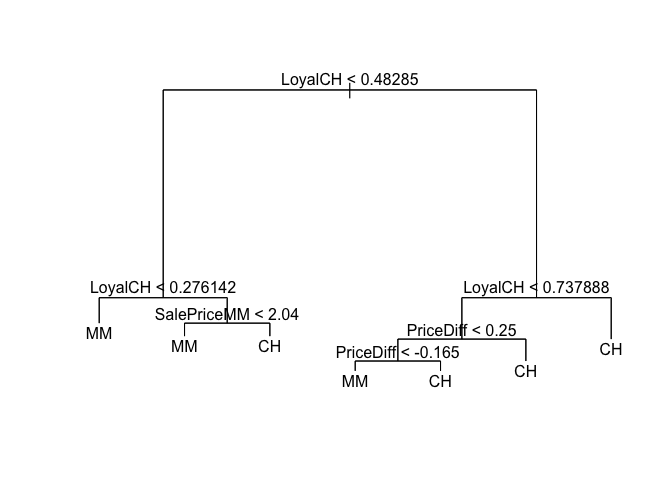<!-- -->

(j) Compare the training error rates between the pruned and un-pruned trees. Which is higher?  

The training error of the pruned tree is higher by 0.0025.  

(k) Compare the test error rates between the pruned and unpruned trees. Which is higher?  


```r
prune_pred <- predict(prune_OJ, test_OJ, type = "class")
table(prune_pred, y_test_OJ)
```

```
##           y_test_OJ
## prune_pred  CH  MM
##         CH 151  33
##         MM  21  65
```

```r
(21+33)/207
```

```
## [1] 0.2608696
```

The test error rate is 26.1% for the pruned tree, while it was 19.3% for the unpruned tree. The test error increased by 6.8%.  

10. We now use boosting to predict `Salary` in the `Hitters` data set.


```r
require(ISLR)
data(Hitters)
attach(Hitters)
```

(a) Remove the observations for whom the salary information is unknown, and then log-transform the salaries.


```r
summary(Hitters$Salary)
```

```
##    Min. 1st Qu.  Median    Mean 3rd Qu.    Max.    NA's 
##    67.5   190.0   425.0   535.9   750.0  2460.0      59
```

```r
Hitters <- na.omit(Hitters)
summary(Hitters$Salary)
```

```
##    Min. 1st Qu.  Median    Mean 3rd Qu.    Max. 
##    67.5   190.0   425.0   535.9   750.0  2460.0
```


```r
Hitters$Salary <- log(Hitters$Salary)
```

(b) Create a training set consisting of the first 200 observations, and a test set consisting of the remaining observations.  


```r
train_Hit <- Hitters[1:200, ]
test_Hit <- Hitters[201:263, ]
```


(c) Perform boosting on the training set with 1,000 trees for a range of values of the shrinkage parameter λ. Produce a plot with different shrinkage values on the x-axis and the corresponding training set MSE on the y-axis.  


```r
library(gbm)
```

```
## Loading required package: survival
```

```
## Loading required package: lattice
```

```
## Loading required package: splines
```

```
## Loading required package: parallel
```

```
## Loaded gbm 2.1.3
```

```r
lambda_vals <- seq(from=0.001, to=1, by=0.05)
train_error <- rep(NA, length(lambda_vals))
for (l in 1:length(lambda_vals)) {
  boost_Hitt <- gbm(Salary~., 
                  data=train_Hit, 
                  distribution = "gaussian",
                  n.trees = 1000,
                  shrinkage=lambda_vals[l])
  train_pred <- predict(boost_Hitt, train_Hit, n.trees=1000)
  train_error[l] <- mean((train_pred- train_Hit$Salary)^2)
}

plot(lambda_vals, train_error, type="b", xlab="Shrinkage values", ylab="Training set MSE")
```

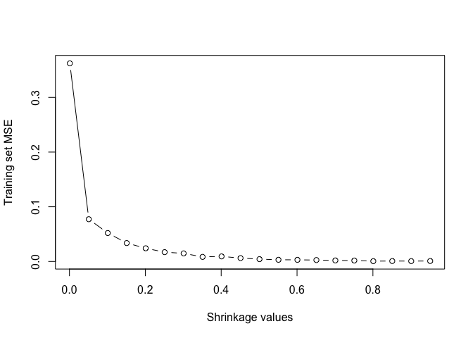<!-- -->


```r
which.min(train_error)
```

```
## [1] 17
```

```r
train_error[18]
```

```
## [1] 0.0007676036
```

```r
lambda_vals[18]
```

```
## [1] 0.851
```

(d) Produce a plot with different shrinkage values on the x-axis and the corresponding test set MSE on the y-axis.


```r
lambda_vals <- seq(from=0.001, to=1, by=0.05)
test_error <- rep(NA, length(lambda_vals))
for (l in 1:length(lambda_vals)) {
  boost_Hitt <- gbm(Salary~., 
                  data=train_Hit, 
                  distribution = "gaussian",
                  n.trees = 1000,
                  shrinkage=lambda_vals[l])
  test_pred <- predict(boost_Hitt, test_Hit, n.trees=1000)
  test_error[l] <- mean((test_pred - test_Hit$Salary)^2)
}


plot(lambda_vals, test_error, type="b", xlab="Shrinkage values", ylab="Test set MSE")
```

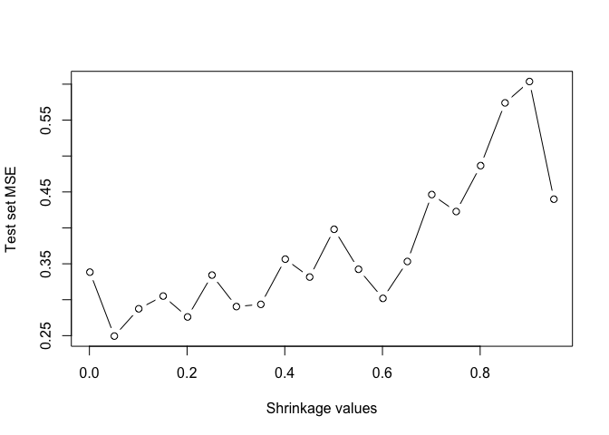<!-- -->


```r
which.min(test_error)
```

```
## [1] 2
```

```r
test_error[2]
```

```
## [1] 0.2493973
```

```r
lambda_vals[2]
```

```
## [1] 0.051
```

We obtain the smallest test MSE of 0.27 by using λ=0.051.  

(e) Compare the test MSE of boosting to the test MSE that results from applying two of the regression approaches seen in Chapters 3 and 6.  

#### Ch. 3 Lm()

```r
lm_fit <- lm(Salary ~., data=train_Hit)
lm_pred <- predict(lm_fit, test_Hit)
mean((lm_pred - test_Hit$Salary)^2)
```

```
## [1] 0.4917959
```

The test MSE for linear regression model is 0.49, which is higher than boosting by 0.22.

#### Ch. 6 Ridge regression

```r
require(glmnet)
```

```
## Loading required package: glmnet
```

```
## Warning: package 'glmnet' was built under R version 3.4.2
```

```
## Loading required package: Matrix
```

```
## Loading required package: foreach
```

```
## Loaded glmnet 2.0-13
```

```r
x_mat <- model.matrix(Salary ~ ., data=Hitters)[,-1]
x_train <- x_mat[1:200, ]
x_test <- x_mat[201:263, ]
y_train <- Hitters$Salary[1:200]
y_test <- Hitters$Salary[201:263]
ridge_fit <- glmnet(x_train, y_train, alpha=0)
cv_ridge <- cv.glmnet(x_train, y_train, alpha=0)
best.lam <- cv_ridge$lambda.min
```

```r
ridge_pred <- predict(ridge_fit, s=best.lam, newx=x_test)
mean((ridge_pred - y_test)^2)
```

```
## [1] 0.452704
```

The test MSE for rodge regression is 0.45, which is slightly lower than linear regression, but still significantly higher than boosting.

(f) Which variables appear to be the most important predictors in the boosted model?  

```r
summary(boost_Hitt)
```

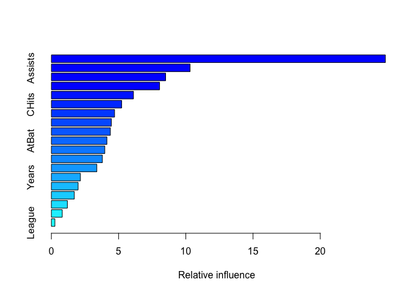<!-- -->

```
##                 var    rel.inf
## CAtBat       CAtBat 24.8455956
## Assists     Assists 10.3187395
## Walks         Walks  8.4994031
## PutOuts     PutOuts  8.0500321
## CRBI           CRBI  6.1074069
## CHits         CHits  5.2267284
## HmRun         HmRun  4.7016992
## CRuns         CRuns  4.4622128
## RBI             RBI  4.3897673
## AtBat         AtBat  4.1293769
## CHmRun       CHmRun  3.9745361
## CWalks       CWalks  3.7955317
## Hits           Hits  3.3814851
## Years         Years  2.1607703
## Errors       Errors  1.9893293
## Runs           Runs  1.7064717
## NewLeague NewLeague  1.1904896
## Division   Division  0.8090122
## League       League  0.2614124
```

The most important variable in the boosted model is CAtBat.


(g) Now apply bagging to the training set. What is the test set MSE for this approach?


```r
require(randomForest)

bag.Hit <- randomForest(Salary ~ .,
                        data=train_Hit,
                        mtry=19,
                        importance=TRUE,
                        n.trees=1000)

bag.pred <- predict(bag.Hit, newdata=test_Hit)
mean((bag.pred-y_test)^2)
```

```
## [1] 0.2319014
```

The test MSE for bagging is 0.23, which is smaller than boosting by 0.04.


