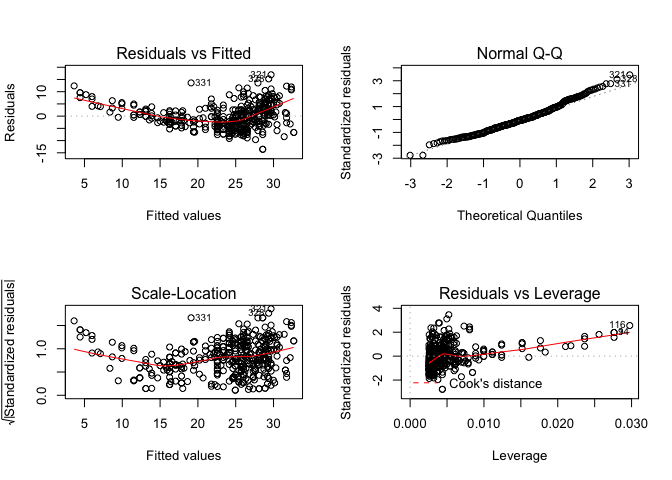
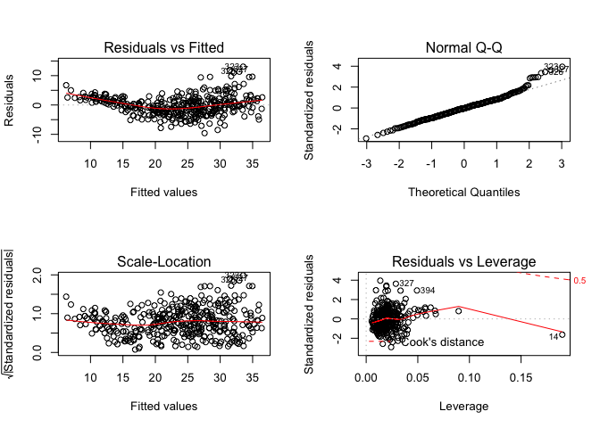

# Ch. 3 Exercises


```r
# Get the Auto dataset
library(ISLR)
data(Auto)
attach(Auto)
```
8.a Use the `lm()` function to perform a simple linear regression with mpg as the response and horsepower as the predictor. Use the `summary()` function to print the results. Comment on the output.


```r
fit <- lm(mpg ~ horsepower)
summary(fit)
```

```
## 
## Call:
## lm(formula = mpg ~ horsepower)
## 
## Residuals:
##      Min       1Q   Median       3Q      Max 
## -13.5710  -3.2592  -0.3435   2.7630  16.9240 
## 
## Coefficients:
##              Estimate Std. Error t value Pr(>|t|)    
## (Intercept) 39.935861   0.717499   55.66   <2e-16 ***
## horsepower  -0.157845   0.006446  -24.49   <2e-16 ***
## ---
## Signif. codes:  0 '***' 0.001 '**' 0.01 '*' 0.05 '.' 0.1 ' ' 1
## 
## Residual standard error: 4.906 on 390 degrees of freedom
## Multiple R-squared:  0.6059,	Adjusted R-squared:  0.6049 
## F-statistic: 599.7 on 1 and 390 DF,  p-value: < 2.2e-16
```
i. Is there a relationship between the predictor and the response?  
The F-statistic is quite large, and the p-value is extremely small. Together, these indicate that there is a relationship between the predictor and the response.

ii. How strong is the relationship between the predictor and the response?  
The R^2^ for this fit is 0.6049, which means that 60.49% of the variability in mpg can be explained by horsepower.

iii. Is the relationship between the predictor and the response positive or negative?  
The relationship is negative, because the intercept of horsepower is negative. 

iv. What is the predicted mpg associated with a horsepower of 98? What are the associated 95 % confidence and prediction intervals?  


```r
predict(fit, data.frame(horsepower = 98), interval="confidence")
```

```
##        fit      lwr      upr
## 1 24.46708 23.97308 24.96108
```

```r
predict(fit, data.frame(horsepower = 98), interval="prediction")
```

```
##        fit     lwr      upr
## 1 24.46708 14.8094 34.12476
```
8.b Plot the response and the predictor. Use the abline() function to display the least squares regression line.


```r
plot(horsepower, mpg, main="Mpg vs Horsepower")
abline(fit, col="red")
```

<!-- -->

8.c Use the plot() function to produce diagnostic plots of the least squares regression fit. Comment on any problems you see with the fit.


```r
par(mfrow=c(2,2))
plot(fit)
```

<!-- -->

There seems to be some non-linearity in the model (top left plot), as well as a few outliers.

9.a Produce a scatterplot matrix which includes all of the variables in the data set.


```r
pairs(Auto)
```

<!-- -->

b. Compute the matrix of correlations between the variables using the function cor(). You will need to exclude the name variable, which is qualitative.


```r
round(cor(Auto[ , -9]), 2)
```

```
##                mpg cylinders displacement horsepower weight acceleration
## mpg           1.00     -0.78        -0.81      -0.78  -0.83         0.42
## cylinders    -0.78      1.00         0.95       0.84   0.90        -0.50
## displacement -0.81      0.95         1.00       0.90   0.93        -0.54
## horsepower   -0.78      0.84         0.90       1.00   0.86        -0.69
## weight       -0.83      0.90         0.93       0.86   1.00        -0.42
## acceleration  0.42     -0.50        -0.54      -0.69  -0.42         1.00
## year          0.58     -0.35        -0.37      -0.42  -0.31         0.29
## origin        0.57     -0.57        -0.61      -0.46  -0.59         0.21
##               year origin
## mpg           0.58   0.57
## cylinders    -0.35  -0.57
## displacement -0.37  -0.61
## horsepower   -0.42  -0.46
## weight       -0.31  -0.59
## acceleration  0.29   0.21
## year          1.00   0.18
## origin        0.18   1.00
```

c. Use the `lm()` function to perform a multiple linear regression with mpg as the response and all other variables except name as the predictors. Use the `summary()` function to print the results. Comment on the output.


```r
fit_2 <- lm(mpg ~ .-name, data=Auto)
summary(fit_2)
```

```
## 
## Call:
## lm(formula = mpg ~ . - name, data = Auto)
## 
## Residuals:
##     Min      1Q  Median      3Q     Max 
## -9.5903 -2.1565 -0.1169  1.8690 13.0604 
## 
## Coefficients:
##                Estimate Std. Error t value Pr(>|t|)    
## (Intercept)  -17.218435   4.644294  -3.707  0.00024 ***
## cylinders     -0.493376   0.323282  -1.526  0.12780    
## displacement   0.019896   0.007515   2.647  0.00844 ** 
## horsepower    -0.016951   0.013787  -1.230  0.21963    
## weight        -0.006474   0.000652  -9.929  < 2e-16 ***
## acceleration   0.080576   0.098845   0.815  0.41548    
## year           0.750773   0.050973  14.729  < 2e-16 ***
## origin         1.426141   0.278136   5.127 4.67e-07 ***
## ---
## Signif. codes:  0 '***' 0.001 '**' 0.01 '*' 0.05 '.' 0.1 ' ' 1
## 
## Residual standard error: 3.328 on 384 degrees of freedom
## Multiple R-squared:  0.8215,	Adjusted R-squared:  0.8182 
## F-statistic: 252.4 on 7 and 384 DF,  p-value: < 2.2e-16
```
i. Is there a relationship between the predictors and the response?  
Yes, there's a relationship between mpg and the predictors. The F-statistic is quite large, and the p-value is extremely small (under 0.01 significance level).

ii. Which predictors appear to have a statistically significant relationship to the response?  
The predictors that have a statistically significant relationship to the response(mpg) are displacement, weight, year, and origin.

iii. What does the coefficient for the year variable suggest?  
The coefficient of the year variable suggests that the variables "year(of the car's model)" and mpg (miles per gallon) are positively correlated. With an increase of 0.75(year), the cars become more efficient by 1 mile per gallon. Basically, every 9 months, overall cars' efficiency increases by 1 mpg.

d. Use the `plot()` function to produce diagnostic plots of the linear regression fit. Comment on any problems you see with the fit. Do the residual plots suggest any unusually large outliers? Does the leverage plot identify any observations with unusually high leverage?


```r
par(mfrow=c(2, 2))
plot(fit_2)
```

<!-- -->

There's some non-linearity in the model, with a few outliers. The Residuals vs Leverage plot suggests a few outliers that have a significant effect on the model.

e. Use the * and : symbols to fit linear regression models with interaction effects. Do any interactions appear to be statistically significant?

```r
fit_3 <- lm(mpg ~. -name + displacement:horsepower, data=Auto)
summary(fit_3)
```

```
## 
## Call:
## lm(formula = mpg ~ . - name + displacement:horsepower, data = Auto)
## 
## Residuals:
##     Min      1Q  Median      3Q     Max 
## -8.7010 -1.6009 -0.0967  1.4119 12.6734 
## 
## Coefficients:
##                           Estimate Std. Error t value Pr(>|t|)    
## (Intercept)             -1.894e+00  4.302e+00  -0.440  0.66007    
## cylinders                6.466e-01  3.017e-01   2.143  0.03275 *  
## displacement            -7.487e-02  1.092e-02  -6.859 2.80e-11 ***
## horsepower              -1.975e-01  2.052e-02  -9.624  < 2e-16 ***
## weight                  -3.147e-03  6.475e-04  -4.861 1.71e-06 ***
## acceleration            -2.131e-01  9.062e-02  -2.351  0.01921 *  
## year                     7.379e-01  4.463e-02  16.534  < 2e-16 ***
## origin                   6.891e-01  2.527e-01   2.727  0.00668 ** 
## displacement:horsepower  5.236e-04  4.813e-05  10.878  < 2e-16 ***
## ---
## Signif. codes:  0 '***' 0.001 '**' 0.01 '*' 0.05 '.' 0.1 ' ' 1
## 
## Residual standard error: 2.912 on 383 degrees of freedom
## Multiple R-squared:  0.8636,	Adjusted R-squared:  0.8608 
## F-statistic: 303.1 on 8 and 383 DF,  p-value: < 2.2e-16
```
In the first model, I added the Interaction between Displacement and Horsepower. The R^2^ increased from 0.8215 to 0.8636, which added a few % to help explain variability in the model. The p-value is extremely small, indicating that the interaction between displacement and horsepower is statistically significant.

```r
fit_4 <- lm(mpg ~ -name + displacement*cylinders + weight*acceleration + horsepower, data=Auto)
summary(fit_4)
```

```
## 
## Call:
## lm(formula = mpg ~ -name + displacement * cylinders + weight * 
##     acceleration + horsepower, data = Auto)
## 
## Residuals:
##      Min       1Q   Median       3Q      Max 
## -13.6032  -2.3777  -0.4371   1.9955  16.2640 
## 
## Coefficients:
##                          Estimate Std. Error t value Pr(>|t|)    
## (Intercept)            51.6550984  7.6291421   6.771 4.82e-11 ***
## displacement           -0.0887001  0.0178811  -4.961 1.06e-06 ***
## cylinders              -2.4454891  0.6027644  -4.057 6.02e-05 ***
## weight                 -0.0007054  0.0023181  -0.304    0.761    
## acceleration            0.4072987  0.3598548   1.132    0.258    
## horsepower             -0.0909323  0.0170375  -5.337 1.62e-07 ***
## displacement:cylinders  0.0125998  0.0025668   4.909 1.36e-06 ***
## weight:acceleration    -0.0001733  0.0001273  -1.361    0.174    
## ---
## Signif. codes:  0 '***' 0.001 '**' 0.01 '*' 0.05 '.' 0.1 ' ' 1
## 
## Residual standard error: 4.005 on 384 degrees of freedom
## Multiple R-squared:  0.7414,	Adjusted R-squared:  0.7366 
## F-statistic: 157.2 on 7 and 384 DF,  p-value: < 2.2e-16
```
In this model, the variables cylinders and displacement are statistically significant, as well as an interaction between them. On the other hand, both weight and acceleration are not significant, nor is an interaction between them.

f. Try a few different transformations of the variables, such as log(X), √X, X2.

```r
d.fit <- lm(mpg ~ displacement)
d.fit_2 <- lm(mpg ~ I(displacement^2))
anova(d.fit, d.fit_2)
```

```
## Analysis of Variance Table
## 
## Model 1: mpg ~ displacement
## Model 2: mpg ~ I(displacement^2)
##   Res.Df     RSS Df Sum of Sq F Pr(>F)
## 1    390  8378.8                      
## 2    390 10336.6  0   -1957.7
```

```r
summary(d.fit)
```

```
## 
## Call:
## lm(formula = mpg ~ displacement)
## 
## Residuals:
##      Min       1Q   Median       3Q      Max 
## -12.9170  -3.0243  -0.5021   2.3512  18.6128 
## 
## Coefficients:
##              Estimate Std. Error t value Pr(>|t|)    
## (Intercept)  35.12064    0.49443   71.03   <2e-16 ***
## displacement -0.06005    0.00224  -26.81   <2e-16 ***
## ---
## Signif. codes:  0 '***' 0.001 '**' 0.01 '*' 0.05 '.' 0.1 ' ' 1
## 
## Residual standard error: 4.635 on 390 degrees of freedom
## Multiple R-squared:  0.6482,	Adjusted R-squared:  0.6473 
## F-statistic: 718.7 on 1 and 390 DF,  p-value: < 2.2e-16
```

```r
summary(d.fit_2)
```

```
## 
## Call:
## lm(formula = mpg ~ I(displacement^2))
## 
## Residuals:
##      Min       1Q   Median       3Q      Max 
## -10.6731  -3.6875  -0.9388   2.9963  18.2246 
## 
## Coefficients:
##                     Estimate Std. Error t value Pr(>|t|)    
## (Intercept)        2.926e+01  3.661e-01   79.92   <2e-16 ***
## I(displacement^2) -1.193e-04  5.289e-06  -22.55   <2e-16 ***
## ---
## Signif. codes:  0 '***' 0.001 '**' 0.01 '*' 0.05 '.' 0.1 ' ' 1
## 
## Residual standard error: 5.148 on 390 degrees of freedom
## Multiple R-squared:  0.566,	Adjusted R-squared:  0.5649 
## F-statistic: 508.7 on 1 and 390 DF,  p-value: < 2.2e-16
```
The linear fit is better than quadratic with the variable Displacement.


```r
l.fit <- lm(mpg ~ log(displacement))
anova(d.fit, l.fit)
```

```
## Analysis of Variance Table
## 
## Model 1: mpg ~ displacement
## Model 2: mpg ~ log(displacement)
##   Res.Df    RSS Df Sum of Sq F Pr(>F)
## 1    390 8378.8                      
## 2    390 7471.2  0    907.63
```

```r
summary(d.fit)
```

```
## 
## Call:
## lm(formula = mpg ~ displacement)
## 
## Residuals:
##      Min       1Q   Median       3Q      Max 
## -12.9170  -3.0243  -0.5021   2.3512  18.6128 
## 
## Coefficients:
##              Estimate Std. Error t value Pr(>|t|)    
## (Intercept)  35.12064    0.49443   71.03   <2e-16 ***
## displacement -0.06005    0.00224  -26.81   <2e-16 ***
## ---
## Signif. codes:  0 '***' 0.001 '**' 0.01 '*' 0.05 '.' 0.1 ' ' 1
## 
## Residual standard error: 4.635 on 390 degrees of freedom
## Multiple R-squared:  0.6482,	Adjusted R-squared:  0.6473 
## F-statistic: 718.7 on 1 and 390 DF,  p-value: < 2.2e-16
```

```r
summary(l.fit)
```

```
## 
## Call:
## lm(formula = mpg ~ log(displacement))
## 
## Residuals:
##      Min       1Q   Median       3Q      Max 
## -16.1204  -2.5843  -0.4217   2.1979  19.9005 
## 
## Coefficients:
##                   Estimate Std. Error t value Pr(>|t|)    
## (Intercept)        85.6906     2.1422   40.00   <2e-16 ***
## log(displacement) -12.1385     0.4155  -29.21   <2e-16 ***
## ---
## Signif. codes:  0 '***' 0.001 '**' 0.01 '*' 0.05 '.' 0.1 ' ' 1
## 
## Residual standard error: 4.377 on 390 degrees of freedom
## Multiple R-squared:  0.6863,	Adjusted R-squared:  0.6855 
## F-statistic: 853.4 on 1 and 390 DF,  p-value: < 2.2e-16
```

```r
s.fit <- lm(mpg ~ sqrt(displacement))
anova(d.fit, s.fit)
```

```
## Analysis of Variance Table
## 
## Model 1: mpg ~ displacement
## Model 2: mpg ~ sqrt(displacement)
##   Res.Df    RSS Df Sum of Sq F Pr(>F)
## 1    390 8378.8                      
## 2    390 7751.1  0    627.77
```

```r
summary(d.fit)
```

```
## 
## Call:
## lm(formula = mpg ~ displacement)
## 
## Residuals:
##      Min       1Q   Median       3Q      Max 
## -12.9170  -3.0243  -0.5021   2.3512  18.6128 
## 
## Coefficients:
##              Estimate Std. Error t value Pr(>|t|)    
## (Intercept)  35.12064    0.49443   71.03   <2e-16 ***
## displacement -0.06005    0.00224  -26.81   <2e-16 ***
## ---
## Signif. codes:  0 '***' 0.001 '**' 0.01 '*' 0.05 '.' 0.1 ' ' 1
## 
## Residual standard error: 4.635 on 390 degrees of freedom
## Multiple R-squared:  0.6482,	Adjusted R-squared:  0.6473 
## F-statistic: 718.7 on 1 and 390 DF,  p-value: < 2.2e-16
```

```r
summary(s.fit)
```

```
## 
## Call:
## lm(formula = mpg ~ sqrt(displacement))
## 
## Residuals:
##      Min       1Q   Median       3Q      Max 
## -14.4034  -2.7367  -0.4956   2.3207  19.3499 
## 
## Coefficients:
##                    Estimate Std. Error t value Pr(>|t|)    
## (Intercept)        47.11839    0.86246   54.63   <2e-16 ***
## sqrt(displacement) -1.75878    0.06186  -28.43   <2e-16 ***
## ---
## Signif. codes:  0 '***' 0.001 '**' 0.01 '*' 0.05 '.' 0.1 ' ' 1
## 
## Residual standard error: 4.458 on 390 degrees of freedom
## Multiple R-squared:  0.6746,	Adjusted R-squared:  0.6738 
## F-statistic: 808.5 on 1 and 390 DF,  p-value: < 2.2e-16
```
The square root transformation is also better than linear model.

Plot all 3 fits.

```r
par(mfrow=c(2,2))
plot(d.fit)
```

<!-- -->

```r
plot(l.fit)
```

<!-- -->

```r
plot(s.fit)
```

<!-- -->

The log transformation seems to give the most linear model out of the three transformations.

tbc
